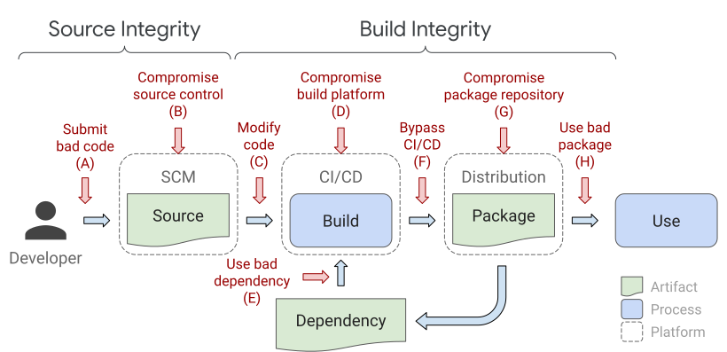
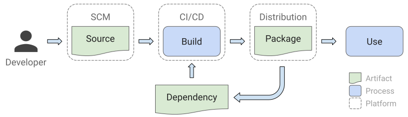

# SLSA: Supply-chain Levels for Software Artifacts

Supply-chain Levels for Software Artifacts (SLSA, pronounced
_[salsa](https://www.google.com/search?q=how+to+pronounce+salsa)_) is an
end-to-end framework for ensuring the integrity of software artifacts throughout
the software supply chain. The requirements are inspired by Google’s internal
"[Binary Authorization for Borg]" that has been in use for the past 8+ years and
that is mandatory for all of Google's production workloads.

The goal of SLSA is to improve the state of the industry, particularly open
source, to defend against the most pressing integrity threats. With SLSA,
consumers can make informed choices about the security posture of the software
they consume.  

**IMPORTANT:** SLSA is an evolving specification and we are looking for
wide-ranging feedback via GitHub issues, [email][mailing list], or
[feedback form]. SLSA is being developed as part of the
[OpenSSF Digital Identity WG](https://github.com/ossf/wg-digital-identity-attestation).

### How to get started

Currently, SLSA Level 1 standards are approaching completion, and developers are invited to
follow the directions linked below to secure their projects at this entry level.
SLSA Levels 2 through 4 are in development, and we welcome feedback as we try to
reach industry consensus on the security requirements mandated for each level.

**Developers:** For instructions on how to produce SLSA-compliant software…[TODO
link]  
For updates about major SLSA developments and instructions on how to meet the
upcoming standards for SLSA Levels 2 through 4, please sign up on this [TODO
list] for release announcements. 

**Consumers**: For instructions on how to verify that software is
SLSA-compliant…. [TODO link]

**Implementers: **For detailed requirements of how source and build systems can
meet higher levels of SLSA-compliance… [TODO link]

## Why SLSA?

Supply chain integrity attacks—unauthorized modifications to software
packages—have been
[on the rise](https://www.sonatype.com/hubfs/Corporate/Software%20Supply%20Chain/2020/SON_SSSC-Report-2020_final_aug11.pdf#page=7)
in the past two years, and are proving to be common and reliable attack vectors
that affect all consumers of software. The software development and deployment
supply chain is quite complicated, with numerous threats along the source ➞
build ➞ publish workflow. While point solutions do exist for some specific
vulnerabilities, there is no comprehensive end-to-end framework that both
defines how to mitigate threats across the software supply chain, and provides
reasonable security guarantees. There is an urgent need for a solution in the
face of the eye-opening, multi-billion dollar attacks in recent months (e.g.
[SolarWinds](https://www.solarwinds.com/sa-overview/securityadvisory),
[Codecov](https://about.codecov.io/security-update/)), some of which could have
been prevented or made more difficult had such a framework been adopted by
software developers and consumers.

Our proposed solution is
[Supply chain Levels for Software Artifacts](https://github.com/slsa-framework/slsa)
(SLSA, pronounced "salsa"), an end-to-end framework for ensuring the integrity
of software artifacts throughout the software supply chain. It is inspired by
Google's internal
"[Binary Authorization for Borg](https://cloud.google.com/security/binary-authorization-for-borg)"
which has been in use for the past 8+ years and is mandatory for all of Google's
production workloads.

SLSA addresses three issues:

-  Software producers want to secure their supply chains but don't know
   exactly how;
-  Software consumers want to understand and limit their exposure to supply
   chain attacks but have no means of doing so;
-  Artifact signatures alone prevent only a subset of the attacks we care about.

### How SLSA helps

SLSA helps to protect against common supply chain attacks. The following image
illustrates a typical software supply chain and includes examples of attacks
that can occur at every link in the chain. Each type of attack has occured over
the past several years and, unfortunately, is increasing as time goes on.

Many recent high-profile attacks were consequences of supply-chain integrity
vulnerabilities, and could have been prevented by SLSA's framework. For
example:

<table>
<thead>
<tr>
<th></th>
<th><strong>Threat</strong></th>
<th><strong>Known example</strong></th>
<th><strong>How SLSA could have helped</strong></th>
</tr>
</thead>
<tbody>
<tr>
<td>A</td>
<td>Submit bad code to the source repository</td>
<td><a
href="https://lore.kernel.org/lkml/202105051005.49BFABCE@keescook/">Linux
hypocrite commits</a>: Researcher attempted to intentionally introduce
vulnerabilities into the Linux kernel via patches on the mailing list.</td>
<td>Two-person review caught most, but not all, of the vulnerabilities.</td>
</tr>
<tr>
<td>B</td>
<td>Compromise source control platform</td>
<td><a href="https://news-web.php.net/php.internals/113838">PHP</a>: Attacker
compromised PHP's self-hosted git server and injected two malicious
commits.</td>
<td>A better-protected source code platform would have been a much harder
target for the attackers. </td>
</tr>
<tr>
<td>C</td>
<td>Build with official process but from code not matching source control</td>
<td><a href="https://www.webmin.com/exploit.html">Webmin</a>: Attacker modified
the build infrastructure to use source files not matching source
control.</td>
<td>A SLSA-compliant build server would have produced provenance identifying
the actual sources used, allowing consumers to detect such tampering.</td>
</tr>
<tr>
<td>D</td>
<td>Compromise build platform</td>
<td><a
href="https://www.crowdstrike.com/blog/sunspot-malware-technical-analysis/">SolarWinds</a>:
Attacker compromised the build platform and installed an implant that
injected malicious behavior during each build.</td>
<td>Higher SLSA levels require <a
href="https://github.com/slsa-framework/slsa/blob/main/build-requirements.md">stronger
security controls for the build platform</a>, making it more difficult to
compromise and gain persistence.</td>
</tr>
<tr>
<td>E</td>
<td>Use bad dependency (i.e. A-H, recursively)</td>
<td><a
href="https://schneider.dev/blog/event-stream-vulnerability-explained/">event-stream</a>:
Attacker added an innocuous dependency and then updated the dependency to
add malicious behavior. The update did not match the code submitted to
GitHub (i.e. attack F).</td>
<td>Applying SLSA recursively to all dependencies would have prevented this
particular vector, because the provenance would have indicated that it
either wasn't built from a proper builder or that the source did not come
from GitHub.</td>
</tr>
<tr>
<td>F</td>
<td>Upload an artifact that was not built by the CI/CD system</td>
<td><a href="https://about.codecov.io/apr-2021-post-mortem/">CodeCov</a>:
Attacker used leaked credentials to upload a malicious artifact to a GCS
bucket, from which users download directly.</td>
<td>Provenance of the artifact in the GCS bucket would have shown that the
artifact was not built in the expected manner from the expected source
repo.</td>
</tr>
<tr>
<td>G</td>
<td>Compromise package repository</td>
<td><a
href="https://theupdateframework.io/papers/attacks-on-package-managers-ccs2008.pdf">Attacks
on Package Mirrors</a>: Researcher ran mirrors for several popular package
repositories, which could have been used to serve malicious packages.</td>
<td>Similar to above (F), provenance of the malicious artifacts would have
shown that they were not built as expected or from the expected source
repo.</td>
</tr>
<tr>
<td>H</td>
<td>Trick consumer into using bad package</td>
<td><a
href="https://blog.sonatype.com/damaging-linux-mac-malware-bundled-within-browserify-npm-brandjack-attempt">Browserify
typosquatting</a>: Attacker uploaded a malicious package with a similar
name as the original.</td>
<td>SLSA does not directly address this threat, but provenance linking back to
source control can enable and enhance other solutions.</td>
</tr>
</tbody>
</table>

A SLSA level gives consumers confidence that software has not been tampered with
and can be securely traced back to source—something that is difficult, if not
impossible, to do with most software today.

## What is SLSA?

SLSA is a set of incrementally adoptable security guidelines, established by
industry consensus. The standards set by SLSA are guiding principles for both
software producers and consumers: producers can follow the guidelines to make
their software more secure, and consumers can make decisions based on a software
package's security posture. SLSA's four levels [four levels](https://github.com/olivekl/slsa/tree/wording-updates#slsa-levels) are designed to be
incremental and actionable, and to protect against specific integrity attacks
[TODO add link to future section on attacks]. SLSA 4 represents the ideal end
state, and the lower levels represent milestones with corresponding integrity
guarantees.  

### Terminology

SLSA's framework addresses every step of the software supply chain—the sequence
of steps resulting in the creation of an artifact. We represent a supply chain
as a [directed acyclic
graph](https://en.wikipedia.org/wiki/Directed_acyclic_graph) of sources, builds,
dependencies, and packages. One artifact's supply chain is a combination of its
dependencies' supply chains plus its own sources and builds.

<table>
 <thead>
  <tr>
   <th>Term
   <th>Description
   <th>Example
  </tr>
 </thead>
 <tbody>
  <tr>
   <th>Artifact
   <td>An immutable blob of data; primarily refers to software, but SLSA can be used for any artifact
   <td>A file, a git commit, a directory of files (serialized in some way), a container image, a firmware image.
  </tr>
  <tr>
   <th>Source
   <td>Artifact that was directly authored or reviewed by persons, without modification. It is the beginning of the supply chain; we do not trace the provenance back any further.
   <td>Git commit (source) hosted on GitHub (platform).
  </tr>
  <tr>
   <th>Build
   <td>Process that transforms a set of input artifacts into a set of output artifacts. The inputs may be sources, dependencies, or ephemeral build outputs.
   <td>.travis.yml (process) run by Travis CI (platform).
  </tr>
  <tr>
   <th>Package
   <td>Artifact that is "published" for use by others. In the model, it is
   always the output of a build process, though that build process can be a
   no-op.
   <td>Docker image (package) distributed on DockerHub (platform).
  </tr>
  <tr>
   <th>Dependency
   <td>Artifact that is an input to a build process but that is not a source. In
   the model, it is always a package.
   <td>Alpine package (package) distributed on Alpine Linux (platform).
  </tr>
 </tbody>
</table>

Special cases:

*   A ZIP file is containing source code is a package, not a source, because it
    is built from some other source, such as a git commit.

### SLSA Levels

There are four SLSA levels. SLSA 4 is the current highest level and represents
the ideal end state. SLSA 1–3 offer lower security guarantees but are easier to
meet. In our experience, achieving SLSA 4 can take many years and significant
effort, so intermediate milestones are important. We also use the term SLSA 0 to
mean the lack of a SLSA level.

**SLSA 1** requires that the build process be fully scripted/automated and
generate provenance. Provenance is metadata about how an artifact was built,
including the build process, top-level source, and dependencies. Knowing the
provenance allows software consumers to make risk-based security decisions.
Though provenance at SLSA 1 does not protect against tampering, it offers a
basic level of code source identification and may aid in vulnerability
management.

**SLSA 2** requires using version control and a hosted build service that
generates authenticated provenance. These additional requirements give the
consumer greater confidence in the origin of the software. At this level, the
provenance prevents tampering to the extent that the build service is trusted.
SLSA 2 also provides an easy upgrade path to SLSA 3.

**SLSA 3** further requires that the source and build platforms meet specific
standards to guarantee the auditability of the source and the integrity of the
provenance, respectively. We envision an accreditation process whereby auditors
certify that platforms meet the requirements, which consumers can then rely on.
SLSA 3 provides much stronger protections against tampering than earlier levels
by preventing specific classes of threats, such as cross-build contamination.

**SLSA 4** is currently the highest level, requiring two-person review of all
changes and a hermetic, reproducible build process. Two-person review is an
industry best practice for catching mistakes and deterring bad behavior.
Hermetic builds guarantee that the provenance's list of dependencies is
complete. Reproducible builds, though not strictly required, provide many
auditability and reliability benefits. Overall, SLSA 4 gives the consumer a high
degree of confidence that the software has not been tampered with.

The SLSA level is not transitive [(see explanation)](https://github.com/olivekl/slsa/tree/wording-updates#q-why-is-slsa-not-transitive). It describes the integrity
protections of an artifact's build process and top-level source, but nothing
about the artifact's dependencies. Dependencies have their own SLSA ratings, and
it is possible for a SLSA 4 artifact to be built from SLSA 0 dependencies.

### Level requirements

The following is a summary. For details, click the links in the table for
corresponding [requirements](requirements.md).

Requirement                          | SLSA 1 | SLSA 2 | SLSA 3 | SLSA 4
------------------------------------ | ------ | ------ | ------ | ------
Source - [Version Controlled]        |        | ✓      | ✓      | ✓
Source - [Verified History]          |        |        | ✓      | ✓
Source - [Retained Indefinitely]     |        |        | 18 mo. | ✓
Source - [Two-Person Reviewed]       |        |        |        | ✓
Build - [Scripted Build]             | ✓      | ✓      | ✓      | ✓
Build - [Build Service]              |        | ✓      | ✓      | ✓
Build - [Ephemeral Environment]      |        |        | ✓      | ✓
Build - [Isolated]                   |        |        | ✓      | ✓
Build - [Parameterless]              |        |        |        | ✓
Build - [Hermetic]                   |        |        |        | ✓
Build - [Reproducible]               |        |        |        | ○
Provenance - [Available]             | ✓      | ✓      | ✓      | ✓
Provenance - [Authenticated]         |        | ✓      | ✓      | ✓
Provenance - [Service Generated]     |        | ✓      | ✓      | ✓
Provenance - [Non-Falsifiable]       |        |        | ✓      | ✓
Provenance - [Dependencies Complete] |        |        |        | ✓
Common - [Security]                  |        |        |        | ✓
Common - [Access]                    |        |        |        | ✓
Common - [Superusers]                |        |        |        | ✓

_○ = required unless there is a justification_

[Access]: requirements.md#access
[Authenticated]: requirements.md#authenticated
[Available]: requirements.md#available
[Build Service]: requirements.md#build-service
[Dependencies Complete]: requirements.md#dependencies-complete
[Ephemeral Environment]: requirements.md#ephemeral-environment
[Hermetic]: requirements.md#hermetic
[Isolated]: requirements.md#isolated
[Non-Falsifiable]: requirements.md#non-falsifiable
[Parameterless]: requirements.md#parameterless
[Reproducible]: requirements.md#reproducible
[Retained Indefinitely]: requirements.md#retained-indefinitely
[Scripted Build]: requirements.md#scripted-build
[Security]: requirements.md#security
[Service Generated]: requirements.md#service-generated
[Superusers]: requirements.md#superusers
[Two-Person Reviewed]: requirements.md#two-person-reviewed
[Verified History]: requirements.md#verified-history
[Version Controlled]: requirements.md#version-controlled

### Frequently Asked Questions

#### Q: Why is SLSA not transitive?

SLSA is not transitive in order to make the problem tractable. If SLSA 4
required dependencies to be SLSA 4, then reaching SLSA 4 would require starting
at the very beginning of the supply chain and working forward. This is
backwards, forcing us to work on the least risky component first and blocking
any progress further downstream. By making each artifact's SLSA rating
independent from one another, it allows parallel progress and prioritization
based on risk. (This is a lesson we learned when deploying other security
controls at scale throughout Google.)  
We expect SLSA ratings to be composed to describe a supply chain's overall
security stance, as described in the case study vision.

#### Q: What about reproducible builds?

When talking about [reproducible builds](https://reproducible-builds.org), 
there are two related but distinct concepts: "reproducible" and
"verified reproducible."

"Reproducible" means that repeating the build with the same inputs results in
bit-for-bit identical output. This property
[provides](https://reproducible-builds.org/docs/buy-in/)
[many](https://wiki.debian.org/ReproducibleBuilds/About)
[benefits](https://static.googleusercontent.com/media/sre.google/en//static/pdf/building_secure_and_reliable_systems.pdf#page=357),
including easier debugging, more confident cherry-pick releases, better build
caching and storage efficiency, and accurate dependency tracking.

For these reasons, SLSA 4 [requires](#level-requirements) reproducible builds
unless there is a justification why the build cannot be made reproducible.
[Example](https://lists.reproducible-builds.org/pipermail/rb-general/2021-January/002177.html)
justifications include profile-guided optimizations or code signing that
invalidates hashes. Note that there is no actual reproduction, just a claim that
reproduction is possible.

"Verified reproducible" means using two or more independent build systems to
corroborate the provenance of a build. In this way, one can create an overall
system that is more trustworthy than any of the individual components. This is
often
[suggested](https://www.linuxfoundation.org/en/blog/preventing-supply-chain-attacks-like-solarwinds/)
as a solution to supply chain integrity. Indeed, this is one option to secure
build steps of a supply chain. When designed correctly, such a system can
satisfy all of the SLSA build requirements.

That said, verified reproducible builds are not a complete solution to supply
chain integrity, nor are they practical in all cases:

*   Reproducible builds do not address source, dependency, or distribution
    threats.
*   Reproducers must truly be independent, lest they all be susceptible to the
    same attack. For example, if all rebuilders run the same pipeline software,
    and that software has a vulnerability that can be triggered by sending a
    build request, then an attacker can compromise all rebuilders, violating the
    assumption above.
*   Some builds cannot easily be made reproducible, as noted above.
*   Closed-source reproducible builds require the code owner to either grant
    source access to multiple independent rebuilders, which is unacceptable in
    many cases, or develop multiple, independent in-house rebuilders, which is
    likely prohibitively expensive.

Therefore, SLSA does not require verified reproducible builds directly. Instead,
verified reproducible builds are one option for implementing the requirements.

For more on reproducibility, see
[Hermetic, Reproducible, or Verifiable?](https://sre.google/static/pdf/building_secure_and_reliable_systems.pdf#page=357)

## Detailed example

For a motivating example and vision, see [detailed example](walkthrough.md).

## Related work

In parallel to the SLSA specification, there is work to develop core formats and
data models. Currently this is joint work between
[Binary Authorization](https://cloud.google.com/binary-authorization) and
[in-toto](https://in-toto.io/) but we invite wider participation.

*   [Standard attestation format](https://github.com/in-toto/attestation#in-toto-attestations)
    to express provenance and other attributes. This will allow sources and
    builders to express properties in a standard way that can be consumed by
    anyone. Also includes reference implementations for generating these
    attestations.
*   Policy data model and reference implementation.

For a broader view of the software supply chain problem:

*   [Know, Prevent, Fix: A framework for shifting the discussion around
    vulnerabilities in open
    source](https://security.googleblog.com/2021/02/know-prevent-fix-framework-for-shifting.html)
*   [Threats, Risks, and Mitigations in the Open Source Ecosystem]

Prior iterations of the ideas presented here:

*   [Building Secure and Reliable Systems, Chapter 14: Deploying Code](https://sre.google/static/pdf/building_secure_and_reliable_systems.pdf#page=339)
*   [Binary Authorization for Borg] - This is how Google implements the SLSA
    idea internally.

Other related work:

*   [CII Best Practices Badge](https://bestpractices.coreinfrastructure.org/en)
*   [Security Scorecards](https://github.com/ossf/scorecard) - Perhaps SLSA
    could be implemented as an aggregation of scorecard entries, for at least
    the checks that can be automated.
*   [Trustmarks](https://trustmark.gtri.gatech.edu/)

Other takes on provenance and CI/CD:

*   [The Path to Code Provenance](https://medium.com/uber-security-privacy/code-provenance-application-security-77ebfa4b6bc5)
*   [How to Build a Compromise-Resilient CI/CD](https://www.youtube.com/watch?v=9hCiHr1f0zM)

## Footnotes

[^1]: "Trusted person" is defined by the organization or developers that
    own/produce the software. A consumer must ultimately trust them to do the
    right thing. The non-unilateral principle protects against individuals
    within the organization subverting the organization's goals.

<!-- Links -->

[Binary Authorization for Borg]: https://cloud.google.com/security/binary-authorization-for-borg
[Threats, Risks, and Mitigations in the Open Source Ecosystem]: https://github.com/Open-Source-Security-Coalition/Open-Source-Security-Coalition/blob/master/publications/threats-risks-mitigations/v1.1/Threats%2C%20Risks%2C%20and%20Mitigations%20in%20the%20Open%20Source%20Ecosystem%20-%20v1.1.pdf
[curl-dev]: https://pkgs.alpinelinux.org/package/edge/main/x86/curl-dev
[curlimages/curl]: https://hub.docker.com/r/curlimages/curl
[feedback form]: https://forms.gle/93QRfUqF7YY2mJDi9
[mailing list]: https://groups.google.com/g/slsa-discussion
