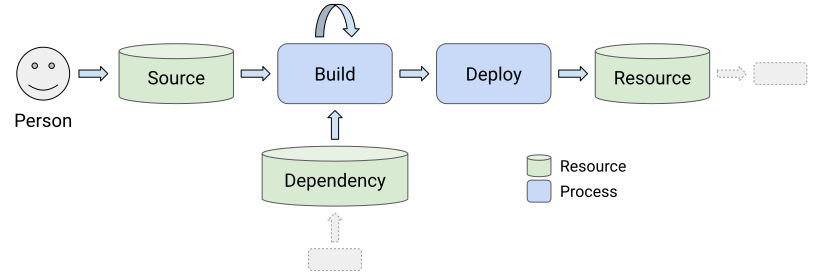
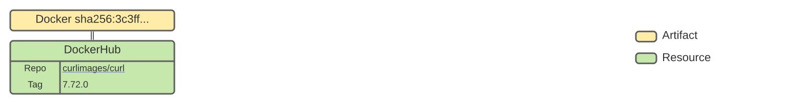
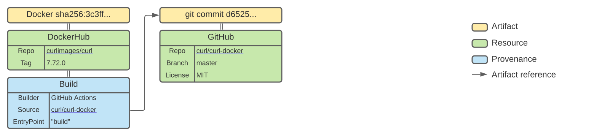
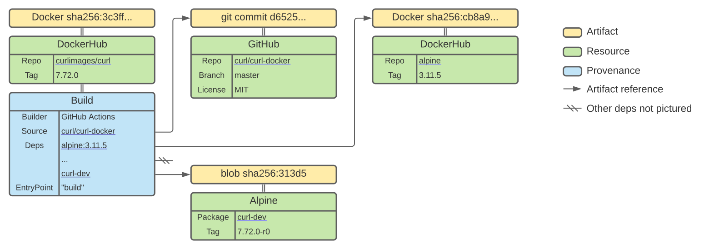
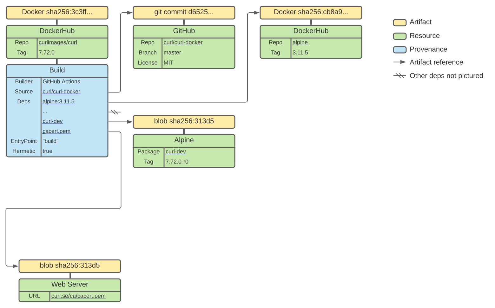
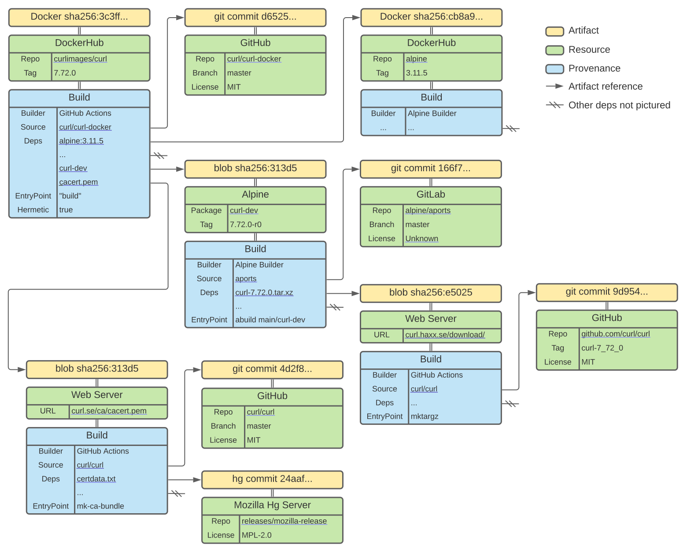

# SLSA: Supply-chain Levels for Software Artifacts, Proposal

## Objective

The objective of this document is to reach industry agreement on the framework
for software supply chain security through standards, accreditation, and
technical controls. This is being developed as part of the
[OpenSSF Digital Identity WG](https://github.com/ossf/wg-digital-identity-attestation).

## Overview

This is just a proposed starting point using one example for discussion. We are
looking for wide-ranging feedback via GitHub issues, [email][mailing list], or
[feedback form].

Our draft proposal is called SLSA: Supply-chain Levels for Software Artifacts,
pronounced _[salsa](https://www.google.com/search?q=how+to+pronounce+salsa)_. It
ensures that software artifacts meet certain minimum end-to-end integrity
standards, inspired by what Google does
[internally][Binary Authorization for Borg]. It consists of:

1.  **Standards:** (this doc) Industry consensus on the definition of a "secure"
    software supply chain. There may be multiple standards to represent multiple
    aspects of security.
2.  **Accreditation:** Process for organizations to certify compliance with
    these standards.
3.  **[Technical controls][slsa-controls]:** To record provenance and detect or
    prevent non-compliance.

Ultimately, the software consumer decides whom to trust and what standards to
enforce. In this light, accreditation is a means to transfer trust across
organizational boundaries. For example, a company may internally "accredit" its
in-house source and build systems while relying on OpenSSF to accredit
third-party ones. Other organizations may trust other accreditation bodies.

This document *only discusses the first part*, Standards. We expect to develop
an accreditation process and technical controls over time. In the interim, these
levels can provide value as guidelines for how to secure a software supply
chain.

[slsa-controls]: https://github.com/slsa-framework/slsa-controls

## Principles

We suggest initially focusing on the following two main principles:

*   **Non-unilateral:** No person can modify the software artifact anywhere in
    the software supply chain without explicit review and approval by at least
    one other "trusted person."[^1] The purpose is prevention, deterrence,
    and/or early detection of risky/bad changes.

*   **Auditable:** The software artifact can be securely and transparently
    traced back to the original, human readable sources and dependencies. The
    primary purpose is for automated analyses of sources and dependencies, as
    well as ad-hoc investigations.

Though not perfect, these two principles provide substantial mitigation for a
wide range of tampering, confusion, and other supply chain attacks.

To measure how well protected a supply chain is according to the two principles
above, we propose the SLSA levels. A higher level means it is better protected.
SLSA 3 is the end goal but may take many years and significant investment for
large organizations. SLSA 1 and SLSA 2 are stepping stones to recognize
meaningful progress.

What sets SLSA 3 apart from simple best practices is its resilience against
determined adversaries. That is, SLSA is a **guarantee** that these practices
have been followed, though still not a guarantee that the software is "safe."

## Background

### Why do we need SLSA?

SLSA addresses three issues:

*   Software producers want to secure their supply chains but don't know exactly
    how.
*   Software consumers want to understand and limit their exposure to supply
    chain attacks but have no means of doing so.
*   Artifact signatures alone only prevent a subset of the attacks we care
    about.

At a minimum, SLSA can be used as a set of guiding principles within an
organization. More importantly, SLSA allows us to talk about supply chain risks
and mitigations in a common language. This allows us to communicate and act on
those risks across organizational boundaries.

Numeric levels, in particular, are useful because they are simple. A decision
maker easily understands that SLSA 3 is better than SLSA 2 without understanding
any of the details. That said, we are not committed to numeric levels and are
open to other options.

Once SLSA is complete it will provide a mapping from requirements that the
supply chain can implement to the attacks they can prevent. Software producers
and consumers will be able to look at the SLSA level of a software artifact and
know what attacks have been defended against in its production.

### Motivating example

Consider the example of using [curl](https://curl.se) through its
[official docker image][curlimages/curl]. What threats are we exposed to in the
software supply chain? (We choose curl simply because it is a popular
open-source package, not to single it out.)

The first problem is figuring out the actual supply chain. This requires
significant manual effort, guesswork, and blind trust. Working backwards:

*   The "latest" tag in Docker Hub points to
    [7.72.0](https://hub.docker.com/layers/curlimages/curl/7.72.0/images/sha256-3c3ff0c379abb1150bb586c7d55848ed4dcde4a6486b6f37d6815aed569332fe?context=explore).
*   It claims to have come from a Dockerfile in the
    [curl/curl-docker](https://github.com/curl/curl-docker/blob/d6525c840a62b398424a78d792f457477135d0cf/alpine/latest/Dockerfile)
    GitHub repository.
*   That Dockerfile reads from the following resources, assuming there are no
    further fetches during build time:
    *   Docker Hub image:
        [registry.hub.docker.com/library/alpine:3.11.5](https://hub.docker.com/layers/alpine/library/alpine/3.11.5/images/sha256-cb8a924afdf0229ef7515d9e5b3024e23b3eb03ddbba287f4a19c6ac90b8d221?context=explore)
    *   Alpine packages: libssh2 libssh2-dev libssh2-static autoconf automake
        build-base groff openssl curl-dev python3 python3-dev libtool curl
        stunnel perl nghttp2
    *   File at URL: https://curl.haxx.se/ca/cacert.pem
*   Each of the dependencies has its own supply chain, but let's look at
    [curl-dev], which contains the actual "curl" source code.
*   The package, like all Alpine packages, has its build script defined in an
    [APKBUILD](https://git.alpinelinux.org/aports/tree/main/curl/APKBUILD?id=166f72b36f3b5635be0d237642a63f39697c848a)
    in the Alpine git repo. There are several build dependencies:
    *   File at URL: https://curl.haxx.se/download/curl-7.72.0.tar.xz.
        *   The APKBUILD includes a sha256 hash of this file. It is not clear
            where that hash came from.
    *   Alpine packages: openssl-dev nghttp2-dev zlib-dev brotli-dev autoconf
        automake groff libtool perl
*   The source tarball was _presumably_ built from the actual upstream GitHub
    repository
    [curl/curl@curl-7_72_0](https://github.com/curl/curl/tree/curl-7_72_0), by
    running the commands `./buildconf && ./configure && make && ./maketgz
    7.72.0`. That command has a set of dependencies, but those are not well
    documented.
*   Finally, there are the systems that actually ran the builds above. We have
    no indication about their software, configuration, or runtime state
    whatsoever.

Suppose some developer's machine is compromised. What attacks could potentially
be performed unilaterally with only that developer's credentials? (None of these
are confirmed.)

*   Directly upload a malicious image to Docker Hub.
*   Point the CI/CD system to build from an unofficial Dockerfile.
*   Upload a malicious Dockerfile (or other file) in the
    [curl/curl-docker](https://github.com/curl/curl-docker/blob/d6525c840a62b398424a78d792f457477135d0cf/alpine/latest/Dockerfile)
    git repo.
*   Upload a malicious https://curl.haxx.se/ca/cacert.pem.
*   Upload a malicious APKBUILD in Alpine's git repo.
*   Upload a malicious [curl-dev] Alpine package to the Alpine repository. (Not
    sure if this is possible.)
*   Upload a malicious https://curl.haxx.se/download/curl-7.72.0.tar.xz. (Won't
    be detected by APKBUILD's hash if the upload happens before the hash is
    computed.)
*   Upload a malicious change to the [curl/curl](https://github.com/curl/curl/)
    git repo.
*   Attack any of the systems involved in the supply chain, as in the
    [SolarWinds attack](https://www.crowdstrike.com/blog/sunspot-malware-technical-analysis/).

SLSA intends to cover all of these threats. When all resources in the supply
chain have a sufficient SLSA level, consumers can gain confidence that most of
these attacks are mitigated, first via self-certification and eventually through
automated verification.

Finally, note that all of this is just for curl's own first-party supply chain
steps. The dependencies, namely the Alpine base image and packages, have their
own similar threats. And they too have dependencies, which have other
dependencies, and so on. Each dependency has its
[own SLSA level](#scope-of-slsa) and the
[composition of SLSA levels](#composition-of-slsa-levels) describes the entire
supply chain's security.

For another look at Docker supply chain security, see
[Who's at the Helm?](https://dlorenc.medium.com/whos-at-the-helm-1101c37bf0f1)
For a much broader look at open source security, including these issues and many
more, see [Threats, Risks, and Mitigations in the Open Source Ecosystem].

### What about reproducible builds?

When talking about [reproducible builds](https://reproducible-builds.org)
builds, there are two related but distinct concepts: "reproducible" and
"verified reproducible."

"Reproducible" means that repeating the build with the same inputs results in
bit-for-bit identical output. This property
[provides](https://reproducible-builds.org/docs/buy-in/)
[many](https://wiki.debian.org/ReproducibleBuilds/About)
[benefits](https://static.googleusercontent.com/media/sre.google/en//static/pdf/building_secure_and_reliable_systems.pdf#page=357),
including easier debugging, more confident cherry-pick releases, better build
caching and storage efficiency, and accurate dependency tracking.

For these reasons, SLSA 3 [requires](#proposed-slsa-definitions) reproducible
builds unless there is a justification why the build cannot be made
reproducible.
[Example](https://lists.reproducible-builds.org/pipermail/rb-general/2021-January/002177.html)
justifications include profile-guided optimizations or code signing that
invalidates hashes. Note that there is no actual reproduction, just a claim that
reproduction is possible.

"Verified reproducible" means using two or more independent build systems to
corroborate the provenance of a build. In this way, one can create an overall
system that is more trustworthy than any of the individual components. This is
often
[suggested](https://www.linuxfoundation.org/en/blog/preventing-supply-chain-attacks-like-solarwinds/)
as a solution to supply chain integrity. Indeed, this is one option to secure
build steps of a supply chain. When designed correctly, such a system can
satisfy all of the SLSA build requirements.

That said, verified reproducible builds are not a complete solution to supply
chain integrity, nor are they practical in all cases:

*   Reproducible builds do not address source, dependency, or deployment
    threats.
*   Reproducers must truly be independent, lest they all be susceptible to the
    same attack. For example, if all rebuilders run the same pipeline software,
    and that software has a vulnerability that can be triggered by sending a
    build request, then an attacker can compromise all rebuilders, violating the
    assumption above.
*   Some builds cannot easily be made reproducible, as noted above.
*   Closed-source reproducible builds require the code owner to either grant
    source access to multiple independent rebuilders, which is unacceptable in
    many cases, or develop multiple, independent in-house rebuilders, which is
    likely prohibitively expensive.

Therefore, SLSA does not require verified reproducible builds directly. Instead,
verified reproducible builds are one option for implementing the requirements.

For more on reproducibility, see
[Hermetic, Reproducible, or Verifiable?](https://sre.google/static/pdf/building_secure_and_reliable_systems.pdf#page=357)

## Terminology

A **resource** is what we are trying to protect: a uniquely identifiable thing
that can be associated with a software artifact. It is often the way that a
consumer retrieves, uses, or verifies the software. An **artifact** is a raw
blob of data, such as a file or a configuration value, identified by its
contents.

A **software supply chain** is a sequence of steps resulting in the assignment
of an artifact to a resource. We represent a supply chain as a
[directed acyclic graph](https://en.wikipedia.org/wiki/Directed_acyclic_graph)
of sources, builds, dependencies, and deployments. A resource's supply chain is
a combination of its dependencies' supply chains plus its own sources, builds,
and deployment.

The following diagram shows the relationship between concepts.



<table>
 <thead>
  <tr>
   <th>Term
   <th>Description
   <th>Examples
  </tr>
 </thead>
 <tbody>
  <tr>
   <th>Source
   <td>Resource containing only artifacts authored or reviewed by persons. It is the beginning of the supply chain; we do not trace the provenance back any further.
   <td>Git repository.
  </tr>
  <tr>
   <th>Dependency
   <td>Resource that either is "imported" software or does not meet the definition of source.
   <td>Debian package.<br>
       Container base image.<br>
       Library git repository.<br>
       Firmware image.
  </tr>
  <tr>
   <th>Build
   <td>Process that transforms a set of input artifacts into a set of output artifacts. The inputs may be sources, dependencies, or ephemeral build outputs.
   <td>Compiling a binary.<br>
       Creating a zip archive.<br>
       Building a docker image.
  </tr>
  <tr>
   <th>Deployment
   <td>Process that associates an artifact with a resource, granting the artifact special privilege.
   <td>Uploading an image to a container registry.<br>
       Code signing a mobile app.
  </tr>
 </tbody>
</table>

## Proposed SLSA definitions

_Reminder: the proposed requirements here are based on what Google currently
uses and has found useful. We expect these requirements—and perhaps even the
concept of levels—to evolve based on community feedback._

There are three SLSA levels. SLSA 3 is the current highest level and represents
the ideal end state. SLSA 1 and 2 offer lower security guarantees but are easier
to meet. In our experience, achieving SLSA 3 can take many years and significant
effort, so intermediate milestones are important.

<table>
 <thead>
  <tr>
   <th>Level
   <th>Meaning
  </tr>
 </thead>
 <tbody>
  <tr>
   <td>SLSA 3
   <td>"Auditable and Non-Unilateral." High confidence that (1) one can correctly and easily trace back to the original source code, its change history, and all dependencies and (2) no single person has the power to make a meaningful change to the software without review.
  </tr>
  <tr>
   <td>SLSA 2
   <td>"Auditable." Moderate confidence that one can trace back to the original source code and change history. However, trusted persons still have the ability to make unilateral changes, and the list of dependencies is likely incomplete.
  </tr>
  <tr>
   <td>SLSA 1
   <td>Stepping stone to higher levels. Moderate confidence that one can determine either who authorized the artifact or what systems produced the artifact. Protects against tampering after the build.
  </tr>
 </tbody>
</table>

Each SLSA level has a set of requirements.

<table>
 <thead>
  <tr><th colspan="2">                       <th colspan="3">Required at   </tr>
  <tr><th colspan="2">Requirement            <th>SLSA 1<th>SLSA 2<th>SLSA 3</tr>
 </thead>
 <tbody>
  <tr><td rowspan="4">Source<td>Readability      <td>✓ <td>✓     <td>✓     </tr>
  <tr>                      <td>Retention        <td>  <td>18 mo.<td>indef </tr>
  <tr>                      <td>Change History   <td>  <td>✓     <td>✓     </tr>
  <tr>                      <td>Two-Person Review<td>  <td>      <td>✓     </tr>
  <tr><td rowspan="6">Build <td>Automation       <td>✓ <td>✓     <td>✓     </tr>
  <tr>                      <td>Isolation        <td>  <td>✓     <td>✓     </tr>
  <tr>                      <td>Hermeticity      <td>  <td>      <td>✓     </tr>
  <tr>                      <td>Reproducibility  <td>  <td>      <td>○     </tr>
  <tr>                      <td>Source Integrity <td>  <td>✓ *   <td>✓     </tr>
  <tr>                      <td>Provenance       <td>↓ <td>✓ *   <td>✓     </tr>
  <tr><td rowspan="4">Deploy<td>Provenance Chain <td>↓ <td>✓     <td>✓     </tr>
  <tr>                      <td>Policy           <td>↓ <td>✓     <td>✓     </tr>
  <tr>                      <td>Enforcement      <td>† <td>†     <td>✓     </tr>
  <tr>                      <td>Logging          <td>✓ <td>✓     <td>✓     </tr>
  <tr><td rowspan="3">Common<td>Security         <td>↓↓<td>↓     <td>✓     </tr>
  <tr>                      <td>Access           <td>↓↓<td>↓     <td>✓     </tr>
  <tr>                      <td>Superusers       <td>↓↓<td>↓     <td>✓     </tr>
 </tbody>
</table>

Legend:

*   ✓ = required at this level
*   ○ = required at this level unless there is a justification
*   ✓ \* = required at this level, but best effort because it depends on
    hermeticity, which is not required at this level
*   † = detection is allowed instead of prevention
*   ↓, ↓↓ = lower requirements (details TBD)

Note: The actual requirements will necessarily be much more detailed and
nuanced. We only provide a brief summary here for clarity.

**[Source]** A source meets SLSA 3 if:

*   **[Readability]** The artifact must be human readable or reviewable.
    (Example: JPEG images are OK, executable ELF files are not.)
*   **[Retention]** The artifact and its change history are retained
    indefinitely and cannot be deleted.
*   **[Change History]** The change history is unforgeable and includes, among
    other things, authenticated uploader and reviewer identities as well as
    trusted review and submission timestamps.
*   **[Two-Person Review]** At least two trusted persons agreed to every change
    in the history.

**[Build]** A build process qualifies for SLSA 3 if:

*   **[Automation]** All build steps were fully automated, i.e. no manual
    commands.
*   **[Isolation]** The build steps ran in an isolated environment free of
    influence from other build instances, whether prior or concurrent.
*   **[Hermeticity]** All build steps, sources, and dependencies were fully
    declared up front and the build steps ran with no network access.
*   **[Reproducibility]** Re-running the build steps with identical input
    artifacts results in bit-for-bit identical output. (Builds that cannot meet
    this must provide a justification.)
*   **[Source Integrity]** All input artifacts were fetched in a manner that
    prevents tampering, such as TLS.
*   **[Provenance]** Signed provenance recorded the input artifacts, output
    artifacts, build environment, and top-level entry point (e.g. `make`) and
    cannot be falsified.

**[Deploy]** An artifact deployed to a resource meets SLSA 3 if:

*   **[Provenance Chain]** There is an unbroken chain of provenance linking the
    artifact back to its original sources and dependencies.
*   **[Policy]** The resource's security policy defines the specific top-level
    resources, build processes, and build entry points that are allowed in its
    provenance chain. The policy itself is a SLSA 3 source.
*   **[Enforcement]** Non-policy-compliant artifacts are prevented at the time
    of deployment and/or use. (Whether to allow break-glass bypassing in case of
    emergency is TBD.)
*   **[Logging]** The history of deployed artifacts and their provenances is
    retained for 18 months and is resistant to tampering.

**[Common]** In addition to the requirements above, every trusted system
involved in the supply chain (source, build, deploy, etc.) must meet the
following requirements:

*   **[Security]** The system meets some TBD baseline security standard to
    prevent compromise. (Patching, vulnerability scanning, user isolation,
    transport security, secure boot, machine identity, etc. Perhaps
    [NIST 800-53](https://nvlpubs.nist.gov/nistpubs/SpecialPublications/NIST.SP.800-53r5.pdf)
    or a subset thereof.)
*   **[Access]** All physical and remote access must be rare, logged, and gated
    behind multi-party approval.
*   **[Superusers]** Only a small number of platform admins may override the
    guarantees listed here. Doing so MUST require approval of a second platform
    admin.

## Scope of SLSA

SLSA applies to a single resource and is not transitive. It describes the
security strength of the resource's own sources, build processes, and deploy
processes. Dependencies have their own SLSA ratings, and it is possible for a
SLSA 3 resource to be built from SLSA 0 dependencies.

The reason for non-transitivity is to make the problem tractable. If SLSA 3
required dependencies to be SLSA 3, then reaching SLSA 3 would require starting
at the very beginning of the supply chain and working forward. This is
backwards, forcing us to work on the least risky component first and blocking
any progress further downstream. By making each resource's SLSA rating
independent from one another, it allows parallel progress and prioritization
based on risk. (This is a lesson we learned when deploying other security
controls at scale throughout Google.)

We expect SLSA ratings to be composed to describe a supply chain's overall
security stance, as described in the [vision](#vision-case-study) below.

## Vision: Case Study

Let's consider how we might secure [curlimages/curl] from the
[motivating example](#motivating-example) using the SLSA framework.

### Incrementally reaching SLSA 3

Let's start by incrementally applying the SLSA principles to the final Docker
image.

#### SLSA 0: Initial state



Initially the Docker image is SLSA 0. There is no provenance and no policy. It
is difficult to determine who built the artifact and what sources and
dependencies were used.

The diagram shows that the (mutable) resource `curlimages/curl:7.72.0` points to
(immutable) artifact `sha256:3c3ff…`.

#### SLSA 1: Provenance



We can reach SLSA 1 by using a build system that generates
[provenance](https://github.com/TomHennen/ITE/blob/ite-6/ITE/6/README.md). The
provenance records at the builder, top-level source, and dependencies, though
not all are required at SLSA 1.

In the updated diagram, the provenance attestation says that the artifact
`sha256:3c3ff…` was built by
[GitHub Actions](https://github.com/features/actions) from
[curl/curl-docker@d6525…](https://github.com/curl/curl-docker/blob/d6525c840a62b398424a78d792f457477135d0cf/alpine/latest/Dockerfile).

At this level, the provenance and security controls are valuable but not
particularly strong. The controls are likely to prevent many classes of mistakes
and to deter attackers who are not significantly motivated or skilled. The
provenance can be useful for doing things like vulnerability scans or license
checks, where tampering is less of a concern.

#### SLSA 2: Additional controls



To reach SLSA 2, the source repo must guarantee accurate change history while
the build process must guarantee isolation, among other things. The provenance
should also include dependencies on a best-effort basis. These features are
implemented by the source and build platforms but may need to be explicitly
enabled.

In the updated diagram, the provenance now lists some dependencies, such as the
base image (`alpine:3.11.5`) and apk packages (e.g. `curl-dev`).

At this level, the provenance is significantly more trustworthy than before.
Only highly skilled adversaries are likely able to forge it.

#### SLSA 3: Hermeticity and two-person review



SLSA 3 [requires](#proposed-slsa-definitions) two-party source control and
hermetic builds. Hermeticity in particular guarantees that the dependencies are
complete. Once these controls are enabled, the Docker image will be SLSA 3.

In the updated diagram, the provenance now attests to its hermeticity and
includes the `cacert.pem` dependency, which was absent before.

At this level, we have high confidence that the provenance is complete and
trustworthy and that no single person can unilaterally change the top-level
source.

### Full graph



We can recursively apply the same steps above to lock down dependencies. Each
non-source dependency gets its own provenance, which in turns lists more
dependencies, and so on.

The final diagram shows a subset of the graph, highlighting the path to the
upstream source repository ([curl/curl](https://github.com/curl/curl)) and the
certificate file ([cacert.pem](https://curl.se/docs/caextract.html)).

In reality, the graph is intractably large due to the fanout of dependencies.
There will need to be some way to trim the graph to focus on the most important
components. While this can reasonably be done by hand, we do not yet have a
solid vision for how best to do this in an scalable, generic, automated way. One
idea is to use ecosystem-specific heuristics. For example, Debian packages are
built and organized in a very uniform way, which may allow Debian-specific
heuristics.

### Composition of SLSA levels

A resource's SLSA level is not transitive, so some aggregate measure of security
risk across the whole supply chain is necessary. In other words, each node in
our graph has its own, independent SLSA level. Just because a resource's level
is N does not imply anything about its dependencies' levels.

In our example, suppose that the final [curlimages/curl] Docker image were SLSA
3 but its [curl-dev] dependency were SLSA 0. Then this would imply a significant
security risk: an adversary could potentially introduce malicious behavior into
the final image by modifying the source code found in the [curl-dev] package.
That said, even being able to _identify_ that it has a SLSA 0 dependency has
tremendous value because it can help focus efforts.

Formation of this aggregate risk measure is left for future work. It is perhaps
too early to develop such a measure without real-world data. Once SLSA becomes
more widely adopted, we expect patterns to emerge and the task to get a bit
easier.

### Deployment policies

Another major component of SLSA is enforcement of security policies based on
provenance. Without policy enforcement, there is no guarantee that future
revisions will not regress.

The following describes how policies might work.

1.  The resource owner writes a **policy** stating the resource's **expected
    SLSA level and provenance**. In many cases the policy can be auto-generated
    based on prior deployments.

    In our example, the policy might look as follows:

    ```bash
    scope: "pkg:docker/curlimages/curl"
    slsa_level: 3
    allow:
      builder: "github_actions"
      source: "https://github.com/curl/curl-docker"
    ```

2.  At deploy/publish time, the uploader **includes provenance** in the request.

    For Docker, perhaps `docker push` gains a command-line flag to upload the
    provenance to the registry and associates it with the image. The API and
    data model would be standardized in the
    [OCI distribution spec](https://github.com/opencontainers/distribution-spec).

3.  The platform **rejects deployments** unless the provenance matches the
    policy.

    In our example, pushes to `curlimages/curl` would be rejected unless they
    were associated with provenance from a SLSA-3 compliant GitHub Actions
    workflow building from the `curl/curl-docker` GitHub repo.

### Accreditation and delegation

Finally, accreditation and delegation will play a large role in the SLSA
framework. It is not practical for every software consumer to fully vet every
platform and fully walk the entire graph of every artifact. Auditors and/or
accreditation bodies can verify and assert that a platform or vendor meets the
SLSA requirements when configured in a certain way. Similarly, there may be some
way to "trust" an artifact without analyzing its dependencies. This may be
particularly valuable for closed source software.

## Next steps

We welcome all comments and suggestions for this document via GitHub issues,
pull requests, [email][mailing list], or [feedback form].

The future SLSA working group will formulate this document. Join the
[mailing list] to follow the discussion and progress. Issues that we must work
out:

*   Agree on the principles, terminology, and high-level strategy.
*   Define a threat model describing specific threats we intend to address.
*   Specify detailed requirements for Source, Build, Deploy, and Common to meet
    those principles.
*   Agree on a leveling system.
*   Document more end-to-end examples to show real threats and mitigations.
*   Examples showing how to use common platforms to achieve SLSA (or an
    approximation) today.

## Related work

In parallel to the SLSA specification, there is work to develop core formats and
data models. Currently this is joint work between
[Binary Authorization](https://cloud.google.com/binary-authorization) and
[in-toto](https://in-toto.io/) but we invite wider participation.

*   [Standard attestation format](https://github.com/in-toto/ITE/pull/15) to
    express provenance and other attributes. This will allow sources and
    builders to express properties in a standard way that can be consumed by
    anyone. Also includes reference implementations for generating these
    attestations.
*   Policy data model and reference implementation.

For a broader view of the software supply chain problem:

*   [Know, Prevent, Fix: A framework for shifting the discussion around
    vulnerabilities in open
    source](https://security.googleblog.com/2021/02/know-prevent-fix-framework-for-shifting.html)
*   [Threats, Risks, and Mitigations in the Open Source Ecosystem]

Prior iterations of the ideas presented here:

*   [Building Secure and Reliable Systems, Chapter 14: Deploying Code](https://sre.google/static/pdf/building_secure_and_reliable_systems.pdf#page=339)
*   [Binary Authorization for Borg] - This is how Google implements the SLSA
    idea internally.

Other related work:

*   [CII Best Practices Badge](https://bestpractices.coreinfrastructure.org/en)
*   [Security Scorecards](https://github.com/ossf/scorecard) - Perhaps SLSA
    could be implemented as an aggregation of scorecard entries, for at least
    the checks that can be automated.
*   [Trustmarks](https://trustmark.gtri.gatech.edu/)

Other takes on provenance and CI/CD:

*   [The Path to Code Provenance](https://medium.com/uber-security-privacy/code-provenance-application-security-77ebfa4b6bc5)
*   [How to Build a Compromise-Resilient CI/CD](https://www.youtube.com/watch?v=9hCiHr1f0zM)

## Footnotes

[^1]: "Trusted person" is defined by the organization or developers that
    own/produce the software. A consumer must ultimately trust them to do the
    right thing. The non-unilateral principle protects against individuals
    within the organization subverting the organization's goals.

<!-- Links -->

[Binary Authorization for Borg]: https://cloud.google.com/security/binary-authorization-for-borg
[Threats, Risks, and Mitigations in the Open Source Ecosystem]: https://github.com/Open-Source-Security-Coalition/Open-Source-Security-Coalition/blob/master/publications/threats-risks-mitigations/v1.1/Threats%2C%20Risks%2C%20and%20Mitigations%20in%20the%20Open%20Source%20Ecosystem%20-%20v1.1.pdf
[curl-dev]: https://pkgs.alpinelinux.org/package/edge/main/x86/curl-dev
[curlimages/curl]: https://hub.docker.com/r/curlimages/curl
[feedback form]: https://forms.gle/93QRfUqF7YY2mJDi9
[mailing list]: https://groups.google.com/g/slsa-discussion
