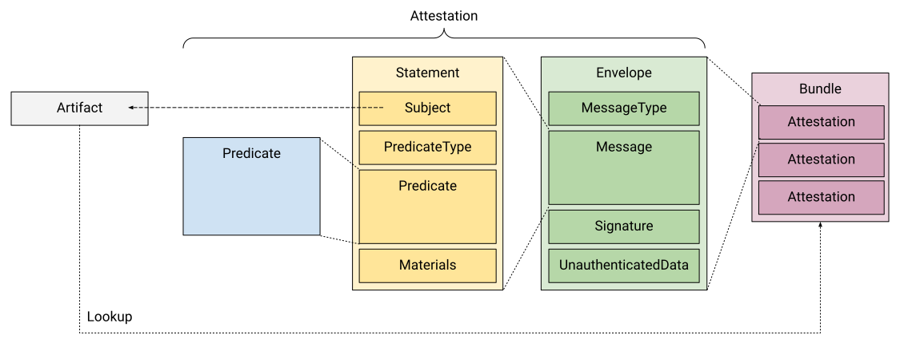
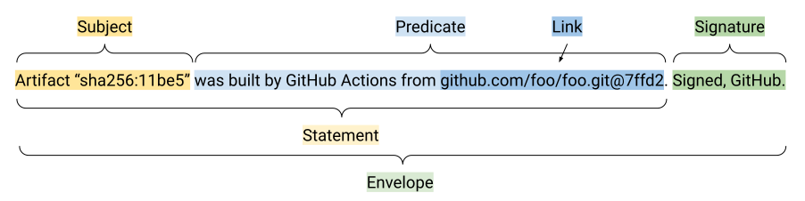

# Software Attestations

Author: lodato@google.com \
Date: March 9, 2021 \
Status: IN REVIEW

## Objective

Standardize the terminology, data model, layers, and conventions for software
artifact metadata.

## Model and Terminology

A software **attestation** is a signed statement (metadata) about a software
**artifact** or collection of software artifacts. (Sometimes called a
"[software bill of materials](https://en.wikipedia.org/wiki/Software_bill_of_materials)"
or SBoM. Not to be confused with
[remote attestation](https://en.wikipedia.org/wiki/Trusted_Computing#Remote_attestation)
in the trusted computing world.)

We define the following model to represent any software attestations, regardless
of format. Not all formats will have all fields or all layers, but to be called
an "attestation" it must fit this general model.

Example in English:

Summary:

-   **Artifact:** Immutable blob of data. Examples: file content, git commit,
    Docker image.
-   **Attestation:** Authenticated message containing metadata about one or more
    software artifacts. It has the following layers:
    -   **Envelope:** Authenticates the message (**Signature**) and
        unambiguously identifies how to interpret the next layer
        (**MessageType**). May also contain unauthenticated data, such as a key
        hint.
        -   Note: The envelope layer is not specific to the attestations model
            and can be used for other types of messages.
    -   **Statement:** Binds the attestation to a specific set of artifacts
        (**Subject**) and identifies what the attestation means
        (**PredicateType**). May also reference other artifacts (**Materials**)
        that influenced the Statement.
    -   **Predicate:** Describes arbitrary properties of the subject using a
        type-specific schema.
-   **Bundle:** A collection of Attestations, which are usually but not
    necessarily related.
    -   Note: The bundle itself is unauthenticated. Authenticating multiple
        attestations as a unit is out of scope of this model. For that, consider
        [TUF](https://theupdateframework.io/).
-   **Storage/Lookup:** Convention for where attestors place Attestations and
    how verifiers find Attestations for a given Artifact.

See [Requirements](#requirements) for details and
[Appendix: Known Attestation Formats](#heading=h.38zmbsgw7uys) for examples.

## Intended Use Case

The primary intended use case is to feed into an
[automated policy framework](policy.md). See that doc for more info.

Other use cases are "nice-to-haves", including ad-hoc analysis.

## Requirements

We define the minimal set of requirements for attestations to fit into this
framework. The key words MUST, MUST NOT, SHOULD, and MAY are to be interpreted
as described in [RFC 2119](https://tools.ietf.org/html/rfc2119).

General requirements:

*   All layers MUST be machine parsable and suitable for processing via an
    [automated policy framework](policy.md).
*   Each layer SHOULD be independent of the layers above.
*   Layers and fields MAY be omitted if implicit or unnecessary. For example,
    traditional "raw artifact signing" uses a fixed, application-specific
    Statement with no explicit MessageType and no PredicateType/Predicate.
*   Field names MAY differ from the model.

Envelope requirements:

*   Envelope MUST include a cryptographic Signature.
*   Envelope MUST include an authenticated Message containing a Statement.
*   Envelope SHOULD include an authenticated MessageType indicating how to
    interpret Message.
*   Envelope MAY contain other authenticated or unauthenticated data.

Statement requirements:

*   Statement MUST include a Subject identifying at least one Artifact.
    *   Subject MUST refer to immutable Artifacts. Identifier SHOULD be a
        cryptographic content digest whenever possible, but MAY be some other
        trusted immutable identifier. Examples: `sha256:dd2f3...`,
        `svn+https://example.com/svn-repo@341`.
    *   Subject SHOULD support crypto agility by specifying multiple alternative
        digests.
    *   Subject MAY include mutable locators for those Artifacts, such as URIs
        or package names. Example: `pkg:docker/alpine`.
*   Statement SHOULD include a PredicateType and/or Predicate indicating what
    the Statement means.
*   Statement MAY include Materials identifying other Artifacts that influenced
    the Statement. Being in this layer allows uniform processing of references
    independent of the predicate type, which may be desirable in some cases.

## Recommended Formats/Conventions

We recommend a single suite of formats and conventions that work well together
and have desirable security properties. Our hope is to align the industry around
this particular suite because it makes everything easier. That said, we
recognize that other choices may be necessary in various cases.

Summary: Use [in-toto](https://in-toto.io).

*   Envelope:
    **[secure-systems-lab/signing-spec](https://github.com/secure-systems-lab/signing-spec/)**
    (TODO: Recommend Crypto/PKI)
*   Statement:
    **[in-toto/attestation-spec](https://github.com/in-toto/attestation-spec/)**
*   Predicate: (TODO link to specific specs)
    *   Provenance
    *   SDPX (TODO)
    *   If none are a good fit, invent a new one.
*   Bundle and Storage/Lookup:
    *   Local Filesystem: TODO
    *   Docker/OCI Registry:
        **[sigstore/cosign](https://github.com/sigstore/cosign)**

## Survey of Known Formats

The following list shows how existing formats map to our model, along with
various properties we think may be valuable.

### Envelope Layer (not specific to Attestations)

[signing-spec]: https://github.com/secure-systems-lab/signing-spec/
[OpenPGP]: https://tools.ietf.org/html/rfc4880
[JWS]: https://tools.ietf.org/html/rfc7515
[JWT]: https://tools.ietf.org/html/rfc7519
[in-toto v1]: https://github.com/in-toto/docs/blob/master/in-toto-spec.md
[PASETO]: https://paseto.io
[JSS]: https://jsonenc.info/jss/1.0/

Property                | [signing-spec] | [OpenPGP] | [JWS]/[JWT] | [PASETO] | [in-toto v1] | [JSS]
----------------------- | -------------- | --------- | ----------- | -------- | ------------ | -----
Authenticated Purpose   | ✓              | ✗         | ✓           | ✗        | ✓            | ✗
Arbitrary Message Type  | ✓              | ✓         | ✗           | ✗        | ✗            | ✗
Simple                  | ✓              | ✗         | ✗           | ✓        | ✓            | ✓
Avoids Canonicalization | ✓              | ✓         | ✓           | ✓        | ✗            | ✓
Pluggable Crypto        | ✓              | ✗         | ✓           | ✗        | ✓            | ✓
Efficient Encoding      | ✓              | ✗         | ✗           | ✗        | ✓            | ✗
Widely Adopted          | ✗ (not yet!)   | ✓         | ✓           | ✗        | ✗            | ✗

Properties:

-   **Authenticated Purpose:** Does the envelope authenticate how the verifier
    should interpret the message in order to prevent confusion attacks?
    -   ✓ signing-spec: `payloadType`, JWS: `typ`, JWT: `aud`, in-toto v1:
        `_type`
-   **Arbitrary Message Type:** Does the envelope support arbitrary message
    types / encodings?
    -   ✗ PASETO, JWS/JWT, in-toto v1, JSS: only supports JSON messages
-   **Simple:** Is the standard simple, easy to understand, and unlikely to be
    implemented incorrectly?
    -   ✗ PGP: Enformous RFC.
    -   ✗ JWS/JWT: Enormous RFC, many vulnerabilities in the past.
-   **Avoids Canonicalization:** Does the protocol avoid relying on
    canonicalization for security, in order to reduce attack surface?
    -   ✗ in-toto v1: Relies on Canonical JSON
-   **Pluggable Crypto:** If desired, can the cryptographic algorithm and key
    management be swapped out if desired? (Not always desirable.)
    -   ✗ OpenPGP: Uses PGP
    -   ✗ PASETO: Mandates very specific algorithms, e.g. ed25519
-   **Efficient Encoding:** Does the standard avoid base64, or can the envelope
    be re-encoded in a more efficient format, such as protobuf or CBOR, without
    invalidating the signature?
-   **Widely Adopted:** Is the standard widely adopted?
    -   ✗ signing-spec: Not yet used, though in-toto and TUF plan to.
    -   ✗ PASETO: Not common.
    -   ✗ in-toto v1: Only by in-toto and TUF.
    -   ✗ JSS: Abandoned, never used.

### Statement Layer

[in-toto v2]: https://github.com/in-toto/attestations
[Simple Signing]: https://github.com/containers/image/blob/master/docs/containers-signature.5.md
[Notary v2]: https://github.com/notaryproject/nv2

Property            | [in-toto v2]  | [in-toto v1] | [Simple Signing] | [Notary v2] | Raw Signing
------------------- | ------------- | ------------ | ---------------- | ----------- | -----------
Envelope            | signing-spec  | in-toto v1   | OpenPGP          | JWT         | (various)
Statement           |               |              |                  |             |
Subject             |               |              |                  |             |
Predicate           |               |              |                  |             | (none)
Supported Artifacts |               |              |                  |             |
Predicate           |               |              |                  |             |

<table>
<thead>
<tr>
<th>Property</th>
<th>Raw Signing</th>
<th><a
href="https://github.com/in-toto/docs/blob/master/in-toto-spec.md">In-toto
Link 1.0</a></th>
<th><a
href="https://github.com/containers/image/blob/master/docs/containers-signature.5.md">"Simple
Signing"</a></th>
<th><a href="https://github.com/notaryproject/nv2">Notary v2</a></th>
<th><a href="https://github.com/spdx/spdx-spec">SPDX</a></th>
</tr>
</thead>
<tbody>
<tr>
<td>Envelope</td>
<td>(various)</td>
<td>Custom</td>
<td>PGP</td>
<td>JWT</td>
<td>(none)</td>
</tr>
<tr>
<td>Statement</td>
<td></td>
<td></td>
<td></td>
<td></td>
<td>(none)</td>
</tr>
<tr>
<td>Subject</td>
<td></td>
<td></td>
<td></td>
<td></td>
<td>n/a</td>
</tr>
<tr>
<td>Typed Predicate</td>
<td></td>
<td>✗</td>
<td></td>
<td></td>
<td>n/a</td>
</tr>
<tr>
<td>Not Specific to One Artifact Type</td>
<td>(depends)</td>
<td>✓</td>
<td>✗ (Docker)</td>
<td>✗ (Docker)</td>
<td>n/a</td>
</tr>
<tr>
<td>Predicate</td>
<td>✗</td>
<td>✓</td>
<td></td>
<td>✗</td>
<td>✓</td>
</tr>
<tr>
<td></td>
<td>n/a</td>
<td></td>
<td></td>
<td>n/a</td>
<td></td>
</tr>
<tr>
<td></td>
<td>n/a</td>
<td></td>
<td></td>
<td>n/a</td>
<td></td>
</tr>
<tr>
<td></td>
<td>n/a</td>
<td></td>
<td></td>
<td>n/a</td>
<td></td>
</tr>
</tbody>
</table>

-   [In-toto Link 1.0](https://github.com/in-toto/docs/blob/master/in-toto-spec.md)
    -   Mapping to our model:
        -   Envelope: Custom - JSON encoding, raw signature over Canonical JSON.
        -   Statement: JSON object with fixed `_type`. Subject is some subset of
            `materials` and/or `products`. No explicit PredicateType.
        -   Predicate: fixed schema.
    -   Problems:
        -   No clear subject.
        -   Predicate schema too constrained.
        -   Nitpicks: Naming is confusing. Does not cleanly separate into the
            layers above. No explicit PredicateType.
-   [RedHat "Simple Signing"](https://github.com/containers/image/blob/master/docs/containers-signature.5.md)
    ([blog post](https://www.redhat.com/en/blog/container-image-signing))
    -   Mapping to our model:
        -   Envelope: PGP Signed Message (suggested but not required)
        -   Statement: JSON object with fixed `critical.type`. Subject is
            `critical.image` + `critical.identity`. No explicit PredicateType.
        -   Predicate: `optional` field (arbitrary JSON object)
    -   Problems:
        -   `critical`+`optional` is simultaneously too brittle and too loose.
            The critical fields can effectively never change because the
            producer and consumer must agree in lock step, while the optional
            fields lack validation, typing, or versioning.
            -   _Suggested solution:_ Explicit MessageType and PredicateType,
                each mapping to a versioned schema.
        -   `critical.image` is too inflexible and ambiguous. Does not specify
            ALL vs ANY semantics when multiple members are present. Does not
            support multiple, alternative digests. Does not support multiple
            artifacts.
            -   _Suggested solution:_ ANY semantics, ignore
                unrecognized/unsupported members.
        -   `critical.identity` is required but does not make sense in all
            contexts. For example, a "provenance" attestation likely does not
            yet know the identity.
            -   _Suggested solution: _Make it optional.
        -   Nitpicks: Naming is too container-centric. Does not cleanly separate
            into the layers above.
-   [Notary v2](https://github.com/notaryproject/nv2)
    -   Mapping to our model:
        -   Envelope: JWT
        -   Statement: JWT
        -   Predicate: None. (Technically you could put predicates in the JWT,
            but the spec does not say anything about that one way or the other,
            and it is not designed to do this.)
    -   Problems:
        -   Docker/OCI-specific, especially `references`.
        -   Does not naturally support multiple digest algorithms.
        -   Does not officially support predicates.
        -   (matter of opinion) Subject does not naturally support multiple
            artifacts, though you can sign an index which in turn lists multiple
            artifacts. But it is awkward and detached.
        -   Nitpicks: Does not cleanly separate into layers above.
-   [Binary Authorization](https://cloud.google.com/sdk/gcloud/reference/beta/container/binauthz/create-signature-payload)
    -   Mapping to our model:
        -   Envelope: (TODO)
        -   Statement: RedHat "Simple Signing"
        -   Predicate: not supported

TODO - Table of the above.

### Predicate types

[SPDX]: https://github.com/spdx/spdx-spec

-   [SPDX](https://github.com/spdx/spdx-spec)
    -   Mapping to our model: just Predicate (AFAICT)
    -   Problems:
        -   Does not specify envelope or statement layer.
        -   Too complex. Trying to be all things to all parties with a fixed
            schema.
        -   Not extensible. Cannot add custom metadata (AFAICT). In particular,
            does not easily support the few fields we care about for provenance.

### Raw artifact signing (Statement ≅ Subject)

-   [Node.js](https://github.com/nodejs/node#verifying-binaries)
    ([example](https://nodejs.org/dist/v14.16.0/SHASUMS256.txt.asc))
    -   Envelope: PGP Signed Message.
    -   Statement: List of (sha256, filename) pairs.

### Policy Engine + Software Distribution

-   [Binary Authorization](https://cloud.google.com/sdk/gcloud/reference/beta/container/binauthz/create-signature-payload)
    -   Envelope

TODO:

-   Secure Boot - Also uses the term "attestation", possibly with a different
    meaning. Need to make sure it's compatible. Ask
    [kmoy](https://moma.corp.google.com/person/kmoy) and
    [arimed](https://moma.corp.google.com/person/arimed).
-   Cosign / SigStore
-   Drydock
-   Docker Content Trust
-   Notary v1
-   "attached" signatures. RPMs, Maven artifacts, Windows drivers, OSX app store
    apps
-   Android APK signatures
-   (Public) transparency ledger?
