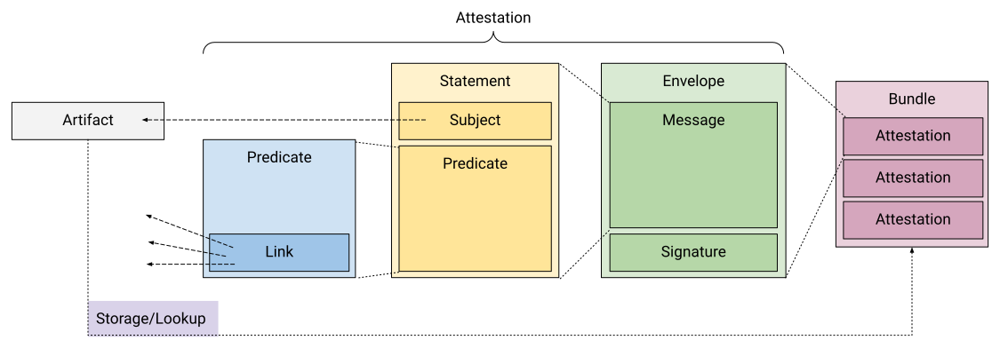
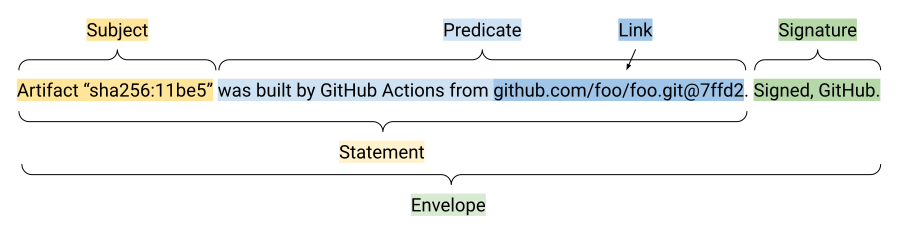

# Software Attestations

Author: lodato@google.com \
Date: March 2021 \
Status: IN REVIEW

## Objective

Standardize the terminology, data model, layers, and conventions for software
artifact metadata.

## Overview

A software attestation is a signed statement (metadata) about a software
artifact or collection of software artifacts. (Sometimes called a
"[software bill of materials](https://en.wikipedia.org/wiki/Software_bill_of_materials)"
or SBoM. Not to be confused with
[remote attestation](https://en.wikipedia.org/wiki/Trusted_Computing#Remote_attestation)
in the trusted computing world.)

An attestation is the generalization of raw artifact/code signing, where the
signature is directly over the artifact or a hash of artifact:

- With raw signing, a signature _implies_ a single bit of metadata about the
  artifact, based on the public key. The exact meaning must be negotiated
  between signer and verifier, and a new keyset must be provisioned for each
  bit of information. For example, a signature might denote who produced an
  artifact, or it might denote fitness for some purpose, or something else
  entirely.

- With an attestation, the metadata is _explicit_ and the signature only
  denotes who created the attestation. A single keyset can express an
  arbitrary amount of information, including things that are not possible with
  raw signing. For example, an attestation might state exactly how an artifact
  was produced, including the build command that was run and all of its
  dependencies.

## Intended Use Case

The primary intended use case is to feed into an
[automated policy framework](policy.md). See that doc for more info.

Other use cases are "nice-to-haves", including ad-hoc analysis.

## Model and Terminology

We define the following model to represent any software attestations, regardless
of format. Not all formats will have all fields or all layers, but to be called
an "attestation" it must fit this general model.

The key words MUST, SHOULD, and MAY are to be interpreted as described in
[RFC 2119](https://tools.ietf.org/html/rfc2119).

Example in English:

Summary:

- **Artifact:** Immutable blob of data, usually identified by cryptographic
  content hash. Examples: file content, git commit, Docker image. May also
  include a mutable locator, such as a package name or URI.
- **Attestation:** Authenticated, machine-readable metadata about one or more
  software artifacts. MUST contain at least:
  - **Envelope:** Authenticates the message. At a minimum, it contains:
    - **Message:** Content (statement) of the attestation. The message
      type SHOULD be authenticated and unambiguous to avoid confusion
      attacks.
    - **Signature:** Denotes the **attester** who created the attestation.
  - **Statement:** Binds the attestation to a particular set of artifacts.
    This is a separate layer is to allow for predicate-agnostic processing
    and storage/lookup. MUST contain at least:
    - **Subject:** Identifies which artifacts the predicate applies to.
    - **Predicate:** Metadata about the subject. The predicate type SHOULD
      be explicit to avoid misinterpretation.
  - **Predicate:** Arbitrary metadata in a predicate-specific schema. MAY
    contain:
    - **Link:** _(repeated)_ Reference to a related artifact, such as
      build dependency. Effectively forms a
      [hypergraph](https://en.wikipedia.org/wiki/Hypergraph) where the
      nodes are artifacts and the hyperedges are attestations. It is
      helpful for the link to be standardized to allow predicate-agnostic
      graph processing.
- **Bundle:** A collection of Attestations, which are usually but not
  necessarily related.
  - Note: The bundle itself is unauthenticated. Authenticating multiple
    attestations as a unit is [TBD](#compound-statement).
- **Storage/Lookup:** Convention for where attesters place attestations and
  how verifiers find attestations for a given artifact.

See [Survey](survey.md) for examples.

## Recommended Suite

We recommend a single suite of formats and conventions that work well together
and have desirable security properties. Our hope is to align the industry around
this particular suite because it makes everything easier. That said, we
recognize that other choices may be necessary in various cases.

Summary: Generate [in-toto](https://in-toto.io) attestations.

- Envelope: **[DSSE](https://github.com/secure-systems-lab/dsse/)** (TODO:
  Recommend Crypto/PKI)
- Statement:
  **[in-toto/attestation](https://github.com/in-toto/attestation/)**
- Predicate: Choose as appropriate.
  - [Provenance](https://github.com/in-toto/attestation/tree/main/spec/provenance.md)
  - [SPDX](https://github.com/in-toto/attestation/tree/main/spec/spdx.md)
  - If none are a good fit, invent a new one.
- Bundle and Storage/Lookup:
  - Local Filesystem: TODO
  - Docker/OCI Registry:
    **[sigstore/cosign](https://github.com/sigstore/cosign)**

See [survey](survey.md) for other options.

## Future Extensions

### Expanded artifact definition

TODO: Can a subject of an attestation be something like "GCP project at time T"?
That is logically immutable since the "at time T" cannot change.

### Compound predicate

TODO: One subject but multiple predicates. Should we offer an opinion on whether
this is represented at the Statement layer (repeated predicate) or Predicate
layer (a "compound" type predicate)?

### Compound statement

TODO: One envelope has multiple statements (separate subject+predicate pairs)
signed as a unit, which are not valid individually. Is this one attestation or
multiple?

TODO: Should we represent this as multiple messages within the envelope (i.e. a
shim) or as a new type of Statement that refers to the other Statements (perhaps
too complicated).

### Attestation as an artifact

TODO: If you have separate signed attestations and want to refer to the
collection (e.g. a signed bundle), you can create a statement referring to all
of them as the subject.

TODO: Figure out serialization. Previously I had been thinking envelopes didn't
have to be serialized deterministically, but now if they are an Artifact it does
have to be deterministic/immutable.

## Appendix: Naming

TODO(lodato) Provide a survey of possible names we considered, along with
pros/cons: Attestation, Testimony, Testament, Claim, Voucher, Statement,
Predicate, Message, Finding.
