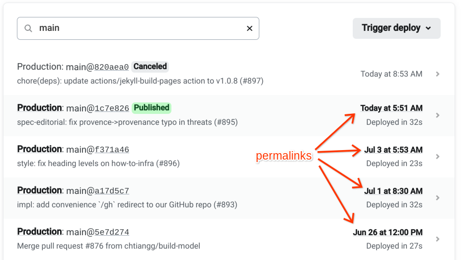
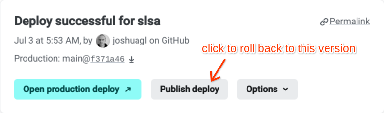

# slsa.dev sources

This directory contains sources for https://slsa.dev, rendered with Jekyll and
served by [Netlify](https://netlify.com).

## Development

### Building and testing locally

1.  Clone this repo and change directory to `/docs`:

    ```bash
    git clone https://github.com/slsa-framework/slsa
    cd slsa/docs
    ```

2.  Install system dependencies:

    -   Ruby, bundler, and the dev headers:

        ```bash
        apt install ruby ruby-dev bundler
        ```

        Alternatively, you can use `rbenv` to use the exact version of Ruby,
        but Debian's versions are likely close enough.

    -   Node and NPM:

        ```bash
        curl -o- https://raw.githubusercontent.com/nvm-sh/nvm/v0.39.3/install.sh | bash
        nvm install 18
        nvm use 18
        ```

        See https://github.com/nvm-sh/nvm for more instructions.

    -   [Netlify CLI](https://docs.netlify.com/cli/get-started/):

        ```bash
        npm install -g netlify-cli
        netlify login
        ```

3.  Install local dependencies:

    ```bash
    bundle config set --local path 'vendor/bundle'
    bundle install
    ```

    You will need to re-run `bundle install` whenever the Gemfile.lock changes.

4.  (optional) To enable `jekyll-github-metadata` to read metadata about the
    slsa repository from the GitHub API, create a GitHub
    [personal access token](https://github.com/settings/tokens/new) and add it
    to your `~/.netrc`, like so:

    ```none
    machine api.github.com
        login github-username
        password 123abc-your-token
    ```

5.  Run the development server locally with
    [Netlify CLI](https://github.com/netlify/cli/blob/main/docs/netlify-dev.md):

    ```bash
    netlify dev
    ```

    If you would like livereload (autorefresh page after every change) and/or
    incremental builds (faster builds but possibly missing some changes), use:

    ```bash
    netlify dev -c 'bundle exec jekyll serve --livereload --incremental'
    ```

6.  Browse to http://localhost:8888 to view the site locally.

### Deploy previews

Netlify automatically builds and deploys previews of every pull request. Shortly
after creating a PR, Netlify will add a comment with a link to a preview. The
URL is of the form `https://deploy-preview-#--slsa.netlify.app` where `#` is the
pull request number. This preview is updated on every push.

### Comparing built versions

The script `../tools/diff_site` allows you to easily compare two different build
results, for example to check that an upgrade to a new version of Jekyll did not
break anything. It works with both locally built versions (`_site`) and archives
downloaded from Netlify (`deploy-*.zip`).

Example 1: comparing two locally built versions of the site

```bash
# Prepare version A 
$ bundle exec jekyll build
$ mv _site _site.A
# Prepare version B
$ bundle exec jekyll build
$ mv _site _site.B
# Run the script
$ ../tools/diff_site _site.A _site.B
```

Example 2: comparing a Netlify pull request preview to the latest production
version

Download the `deploy-*.zip` snapshots from
https://app.netlify.com/sites/slsa
([screenshot](../readme_images/netlify_download_screenshot.png)), one for the
latest production deploy and one for the pull request. **You must be
logged in to Netlify to see the Download link.** Then run:

```bash
../tools/diff_site deploy-latest.zip deploy-preview.zip
```

## Production

### Netlify configuration

Site configuration: https://app.netlify.com/sites/slsa \
Team configuration: https://app.netlify.com/teams/slsa

Prefer to configure the site using `netlify.toml` rather than the web UI, when
possible.

To be added to ACL to allow you to configure the site, contact Mark Lodato or
Joshua Lock via email or Slack. In the event that no SLSA team member has
access, contact OpenSSF.

### Production builds

Netlify automatically builds and deploys the `main` branch to https://slsa.dev.

### DNS

OpenSSF (Linux Foundation) owns the DNS registration for slsa.dev and runs the
DNS server. To request changes, email operations@openssf.org.

It is configured to point to Netlify:

```none
slsa.dev      ALIAS  apex-loadbalancer.netlify.com
www.slsa.dev  CNAME  slsa.netlify.app
```

## Playbooks

### Something is wrong with the site. How do I debug and/or roll back?

Go to https://app.netlify.com/sites/slsa/deploys?filter=main to see recent
deployments. You need to be logged into Netlify to see the list of deployments,
and in the "slsa" team to perform mutations (e.g. Publish).

View a previous version of the site by clicking on a deployment's date:



If you find that a previous version did not have the problem, you may roll back
to that version by clicking on the row (not the date) and then **Publish
deploy**.



This will stay active until the next push to `main`.
