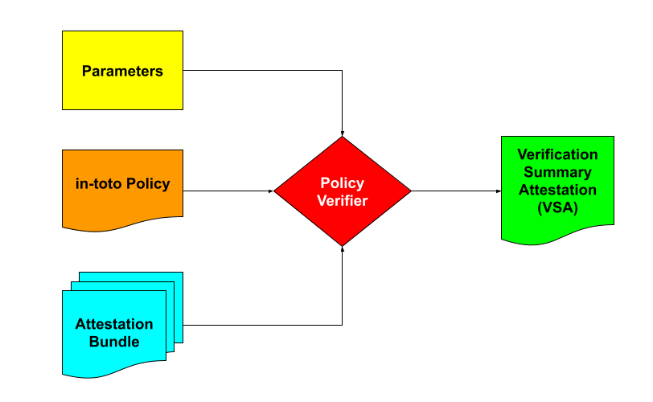

# SLSA E2E Verification with the in-toto Policy Framework 

## 1. Introduction

In this blog post, we introduce [in-toto](https://in-toto.io/) *Policies* and show how they can turn multiple in-toto [Attestations](https://github.com/in-toto/attestation) across different [Supply-chain Levels for Software Artifacts (SLSA)](https://slsa.dev/) tracks into evidence-backed, [end-to-end (E2E)](https://slsa.dev/blog/2025/07/slsa-e2e) narratives about security and compliance.

We begin by walking through a concrete [demo](https://github.com/in-toto/attestation-verifier/pull/92) the reader can fork and run at home that dives deep into a hypothetical yet realistic supply chain in three easy pieces. First, we show how to generate your own signed [Attestations](2-Attestations-a-trail-of-evidence-sigstore-js) about the Source and Build tracks among others. Second, we use a [Policy Verifier](#3-Verifying-Attestations-with-Policies) which checks whether these Attestations meet an E2E Policy that *correlates* information across tracks, and outputs a Policy [Verification Summary Attestation (VSA)](https://slsa.dev/spec/v1.2-rc1/verification_summary) as a result. Third, we show how end-users can verify [Artifacts](#4-Verifying-artifacts-against-Policy-VSAs) using simply these Policy VSAs.

We end by discussing how the new in-toto [Policy Framework](https://docs.google.com/document/d/1Tr6jCtTcTB8KpDMp2I1PFuxP7A2nQa5BeuwOy05iuMw/edit?usp=sharing) is designed to be *flexible* so that implementers and users can use any Policy data format, language, and engine of their choice so long as Policy Verifiers meet a few requirements. Thus, the Policy Framework is able to accommodate a variety of *diverse* Policy Verifiers (including other submissions to the SLSA E2E RFE depending on their conformance). Our goal is that SLSA users will be able to use—and even swap—any one of these Policy Verifiers, and still be *interoperable*.

We assume the reader is familiar with the in-toto Attestation Framework as well as [SLSA v1.2 RC1](https://slsa.dev/spec/v1.2-rc1/) (which introduces the Source track). We define new in-toto concepts as we introduce them in the text.

## 2. Attestations: a trail of evidence [sigstore-js]


Our hypothetical supply chain, as depicted in the figure above, consists of three named Steps: [Source](#21-Source-which-code-was-used-GitHub), [Build](#22-Build-which-code-was-built-where-GitHub-Actions), and [Release](#23-Release-which-artifact-was-released-where-NPM). Each *Step* corresponds to a human or machine role which, in turn, produces a signed Attestation of what happened at that stage of the supply chain—including which inputs and outputs were read and written. Note that while the Attestations here are technically synthetic, they are still realistic (i.e., they use real values from `sigstore-js`).

Specifically, each Attestation has a signed [Statement](https://github.com/in-toto/attestation/blob/main/spec/v1/statement.md). The [subject](https://github.com/in-toto/attestation/blob/main/spec/v1/statement.md) of this Statement precisely identifies one or more Artifacts (either inputs or outputs), while the [predicate](https://github.com/in-toto/attestation/blob/main/spec/v1/predicate.md) is categorized by a predicate type and contains details specific to the Step. This Statement is then enclosed in a [DSSE](https://github.com/secure-systems-lab/dsse) [envelope](https://github.com/in-toto/attestation/blob/main/spec/v1/envelope.md) and digitally signed by a trusted entity.

The reader can generate their own attestations like so:

```shell=
$ go run slsa-e2e-rfp/commands/verify-policy/*.go

Generating the Source Verification Summary Attestation (VSA)...
Key ID: 937101f8dcc7be06fd1f8c35dbbe9855d784c690e9598a5f11c9b70a0bf46f1f / Public Key: cfec494a7cc842d8340f2c33be5ed55334cba63e5515a8c0f30677211cfaced4
...done.

Generating the Build Provenance Attestation...
Key ID: 8c249ff34cddc2181a14e679577a2acf38216dc01b95be2c218a9faa79c4e2d0 / Public Key: 46a4405f239de13e9db05bdd706ccb329c0b19a9e2880c9e52bfe196641cb876
...done.

Generating the Release Attestation...
Key ID: 0973a4a0155ab13d35e3cfdd3476eaba91044a8693c5aa5e017d97313bd9dc84 / Public Key: 7da885ef5c5cc1255a327fa688474ec9baeb25cfcbb47930361da73e52875cd1
...done.
```

### 2.1 Source: which code was used [GitHub]

For the first Step, we suppose GitHub [generates](https://github.com/in-toto/attestation-verifier/pull/92/files#diff-0fbba41689defbe9ff00a2d33d694324ad6c838fb144d25313a594f789aeb19f) using [gittuf](https://gittuf.dev/) a realistic [Source VSA](https://slsa.dev/spec/v1.2-rc1/source-requirements#source-verification-summary-attestation) that records which source code repository and commit were verified, under which source policy, when, and with what result. We construct a Statement whose subject points to the exact repository (`sigstore/sigstore-js`) and git commit (`3a57a741bfb9f7c3bca69b63e170fc28e9432e69`), optionally including branch refs that contain that commit. The predicate type is `https://slsa.dev/verification_summary/v1` and its predicate records the source policy it was checked against, the resource URL, the verification timestamp and the verdict. In our example, the verdict shows the source met SLSA Source Level 3 controls (for e.g., branch protection, mandatory code review, and tamper resistant history).
 
```yaml=
_type: https://in-toto.io/Statement/v1
subject:
- uri: https://github.com/sigstore/sigstore-js/commit/3a57a741bfb9f7c3bca69b63e170fc28e9432e69
  digest:
    gitCommit: 3a57a741bfb9f7c3bca69b63e170fc28e9432e69
  annotations:
    source_refs:
    - refs/heads/main
    - refs/heads/release_1.0
predicateType: https://slsa.dev/verification_summary/v1
predicate:
  policy:
    uri: https://example.com/slsa_source.policy
  resourceUri: git+https://github.com/sigstore/sigstore-js
  timeVerified: '1985-04-12T23:20:50.520Z'
  verificationResult: PASSED
  verifiedLevels:
  - SLSA_SOURCE_LEVEL_3
  verifier:
    id: https://github.com/gittuf/gittuf
```

### 2.2 Build: which code was built where [GitHub Actions]

For the second Step, we suppose GitHub Actions [generates](https://github.com/in-toto/attestation-verifier/pull/92/files#diff-e10c40a614120976127b0c44d4c9b86026f9dad9d6a34c8ea3b6218b3b6c49dd) a [Build Provenance](https://slsa.dev/spec/v1.2-rc1/build-provenance) Attestation that describes how the Artifact(s) were built from the verified source. We construct a  Statement whose `subject` identifies the build Artifact (`sigstore-3.0.0.tgz`) and includes its SHA2-512 digest. The predicate type is `https://slsa.dev/provenance/v1` and the predicate describes the build process including the the Github Actions workflow that ran, the builder that executed it, a link to the exact invocation ID, and most importantly the resolved dependencies pointing back to the precise source commit used to generate the Artifact.
 
```yaml=
_type: https://in-toto.io/Statement/v1
subject:
- name: pkg:npm/sigstore@3.0.0
  digest:
    sha512: 3c73227e187710de25a0c7070b3ea5deffe5bb3813df36bef5ff2cb9b1a078c3636c98f31f8223fd8a17dc6beefa46a8b894489557531c70911000d87fe66d78
predicateType: https://slsa.dev/provenance/v1
predicate:
  buildDefinition:
    buildType: https://slsa-framework.github.io/github-actions-buildtypes/workflow/v1
    externalParameters:
      workflow:
        path: ".github/workflows/release.yml"
        ref: refs/heads/main
        repository: https://github.com/sigstore/sigstore-js
    internalParameters:
      github:
        event_name: push
        repository_id: '495574555'
        repository_owner_id: '71096353'
    resolvedDependencies:
    - digest:
        gitCommit: 3a57a741bfb9f7c3bca69b63e170fc28e9432e69
      uri: git+https://github.com/sigstore/sigstore-js/commit/3a57a741bfb9f7c3bca69b63e170fc28e9432e69
  runDetails:
    builder:
      id: https://github.com/actions/runner/github-hosted
    metadata:
      invocationId: https://github.com/sigstore/sigstore-js/actions/runs/11331290387/attempts/1
```

### 2.3 Release: which Artifact was released where [NPM]

For the third Step, we suppose NPM [generates](https://github.com/in-toto/attestation-verifier/pull/92/files#diff-c444d9bc0db4b51fbae9c547f31ce04c8c8a98768e59fa73f7373657ebe75f44) a [Release](https://github.com/in-toto/attestation/blob/main/spec/predicates/release.md) Attestation that records which Artifact was uploaded to which project on NPM. We construct a Statement whose `subject` identifies the release Artifact (`sigstore-3.0.0.tgz`) with its SHA2-512 digest and the distribution URI. The predicate type is `https://in-toto.io/attestation/release/v0.1` and the predicate captures the release metadata such as the [package URL](https://github.com/package-url/purl-spec) (`pkg:npm/sigstore@3.0.0`).

```yaml=
_type: https://in-toto.io/Statement/v1
subject:
- name: pkg:npm/sigstore@3.0.0
  digest:
    sha512: 3c73227e187710de25a0c7070b3ea5deffe5bb3813df36bef5ff2cb9b1a078c3636c98f31f8223fd8a17dc6beefa46a8b894489557531c70911000d87fe66d78
predicateType: https://in-toto.io/attestation/release/v0.1
predicate:
  releaseId: '1234567890'
```

## 3. Verifying Attestations with Policies



Now we show how to verify the aforementioned Attestations using an in-toto Policy. As illustrated above, a [Policy Verifier](#33-Policy-Verifier) takes a [Policy](#31-Policy) (including optional runtime [Parameters](#32-Parameters)) as well as [Attestation Bundle](https://github.com/in-toto/attestation/blob/main/spec/v1/bundle.md), and produces a [Policy VSA](#34-Policy-Verification-Summary-Attestation-VSA) that indicates whether or not they were successfully verified.

### 3.1 Policy

 

In the Policy Framework, a Policy is the blueprint that connects Steps in the supply chain together, especially how inputs and outputs should flow and transform (or not) between them. In the rest of this section, we describe our [specific](https://github.com/in-toto/attestation-verifier/pull/92/files#diff-90d0088988046106f1d83f459ec398c488620438be4da76798d9ae88648d8ea3) Policy for our hypothetical supply chain as illustrated in the figure above and listed in the code snippet below. This particular policy defines three named Steps (`steps`): `source`, `build`, and `release` corresponding to the three aforementioned [Attestations](#2-Attestations-a-trail-of-evidence-sigstore-js). Each Step prescribes:
* A name (e.g., `source`, `build`, `release`)
* A list of expected inputs (`expectedMaterials`)
* A list of expected outputs (`expectedProducts`)
* An expected predicate type (`expectedPredicates.predicateType`)
* A list of [Predicate Validators](https://docs.google.com/document/d/1Tr6jCtTcTB8KpDMp2I1PFuxP7A2nQa5BeuwOy05iuMw/edit?tab=t.0#bookmark=id.jywedkkcx3d8) that check for expected data inside predicates (`expectedPredicates.expectedAttributes`)
* A threshold of public keys (`functionaries`)

```yaml=
steps:
  - name: "source"
    expectedMaterials:
      - "DISALLOW *"
    expectedProducts:
      - "CREATE https://github.com/{github_repository}/*"
      - "DISALLOW *"
    expectedPredicates:
      - predicateType: "https://slsa.dev/verification_summary/v1"
        expectedAttributes:
          - rule: "predicate.verifier.id == 'https://github.com/gittuf/gittuf'"
  - name: "build"
    expectedMaterials:
      - "MATCH https://github.com/{github_repository}/* IN git+ WITH PRODUCTS FROM source"
      - "DISALLOW *"
    expectedProducts:
      - "CREATE {package_name}-{package_version}.tgz"
      - "DISALLOW *"
    expectedPredicates:
      - predicateType: "https://slsa.dev/provenance/v1"
        expectedAttributes:
          - rule: "predicate.buildDefinition.buildType == 'https://slsa-framework.github.io/github-actions-buildtypes/workflow/v1'"
  - name: "release"
    expectedMaterials:
      - "MATCH * WITH PRODUCTS FROM build"
      - "DISALLOW *"
    expectedPredicates:
      - predicateType: "https://in-toto.io/attestation/release/v0.1"
```

Expected inputs and outputs are defined by [I/O Filters and Connectors](https://docs.google.com/document/d/1Tr6jCtTcTB8KpDMp2I1PFuxP7A2nQa5BeuwOy05iuMw/edit?tab=t.0#bookmark=id.4g7eqaljs29k) that define which patterns of Artifacts are allowed or not. Combining I/O Filters and Connectors with Predicate Validators establishes connectivity within and between Steps:	
1. The `source` Step says that there are no expected inputs (the `DISALLOW` Filter), and the expected outputs are only GitHub URIs to some verified source code somewhere (the `CREATE` followed by `DISALLOW` Filters). Additionally, we check the source code verifier was [gittuf](https://gittuf.dev/) (using `expectedAttributes`).
1. The `build` Step says that the expected input is the GitHub commit referenced by the `source` Step (the `MATCH` Connector followed by the `DISALLOW` Filter), and the expected output is the package that it built (the `CREATE` followed by `DISALLOW` Filters). Additionally, we check that the CI was a Github Actions workflow (using `expectedAttributes`).
1. The `release` Step says that the expected input is the Artifact produced by the `build` Step (the `MATCH` Connector followed by the `DISALLOW` Filter), and there is no expected output.

In other words, our demo tells the E2E story (Source ← Build ← Release) where the `sigstore-js` source code from the Source-L3-compliant [Source Control System](https://slsa.dev/spec/v1.2-rc1/source-requirements#definitions) (GitHub) was what was actually built by the Build-L3-compliant CI (GitHub Actions) and released by the package registry (NPM).

### 3.2 Parameters

Sometimes, you cannot specify in advance all the expected values to a Policy. For example, if you want to use the same Policy for two different repositories, then either you make two separate Policies with slightly different hardcoded values, or you can reuse the same Policy but supply during verification runtime different Parameters (e.g., source code repository names and commit trees, or package names and versions). Therefore, we allow users to supply additional Parameters that the Policy Verifier can use to fill in Policies during runtime.

```yaml=
package_name: sigstore
package_version: 3.0.0
github_ref: refs/heads/main
github_repository: sigstore/sigstore-js
github_repository_id: '495574555'
github_repository_owner_id: '71096353'
github_workflow_ref: "{github_repository}/{entry_point}@{github_ref}"
config_source: git+https://github.com/{github_repository}@{github_ref}
entry_point: ".github/workflows/release.yml"
```

### 3.3 Policy Verifier

Our Policy Verifier is [based](https://github.com/in-toto/attestation-verifier/pull/92/files#diff-45a8a5b631b8977be63629817bb2ac5fa480ad7613794b81ca1d242b2145c5b3) on the [attestation-verifier](https://github.com/in-toto/attestation-verifier), which first substitutes the provided Parameters into the Policy, and checks its expiration as well. If the Policy has expired, it records the error, skips all verification Steps, and the overall result is `FAILED`. Otherwise, it  uses the Policy to verify the Attestations produced by each Step in order (Source ← Build ← Release). For each Step it enforces: (1) cryptographic authenticity by verifying a threshold of signatures, (2) expected inputs and outputs, and (3) expected predicate type and data. If there is no failure, the result is `PASSED`; otherwise, it is `FAILED`.

```shell=
$ go run slsa-e2e-rfp/commands/verify-policy/*.go

Verifying Attestations against Policy...
INFO[0000] Verifying layout expiry...                   
INFO[0000] Done.                                        
INFO[0000] Substituting parameters...                   
INFO[0000] Done.                                        
INFO[0000] Fetching verifiers...                        
INFO[0000] Creating verifier for key 8c249ff34cddc2181a14e679577a2acf38216dc01b95be2c218a9faa79c4e2d0 
INFO[0000] Creating verifier for key 0973a4a0155ab13d35e3cfdd3476eaba91044a8693c5aa5e017d97313bd9dc84 
INFO[0000] Creating verifier for key 937101f8dcc7be06fd1f8c35dbbe9855d784c690e9598a5f11c9b70a0bf46f1f 
INFO[0000] Done.                                        
INFO[0000] Loading attestations as claims...            
INFO[0000] Done.                                        
INFO[0000] Verifying claim for step 'source' of type 'https://slsa.dev/verification_summary/v1' by '937101f8dcc7be06fd1f8c35dbbe9855d784c690e9598a5f11c9b70a0bf46f1f'... 
INFO[0000] Applying material rules...                   
INFO[0000] Evaluating rule `DISALLOW *`...              
INFO[0000] Applying product rules...                    
INFO[0000] Evaluating rule `CREATE https://github.com/sigstore/sigstore-js/*`... 
INFO[0000] Evaluating rule `DISALLOW *`...              
INFO[0000] Applying attribute rules...                  
INFO[0000] Evaluating rule `predicate.verifier.id == 'https://github.com/gittuf/gittuf'`... 
INFO[0000] Done.                                        
INFO[0000] Verifying claim for step 'build' of type 'https://slsa.dev/provenance/v1' by '8c249ff34cddc2181a14e679577a2acf38216dc01b95be2c218a9faa79c4e2d0'... 
INFO[0000] Applying material rules...                   
INFO[0000] Evaluating rule `MATCH https://github.com/sigstore/sigstore-js/* IN git+ WITH PRODUCTS FROM source`... 
INFO[0000] Evaluating rule `DISALLOW *`...              
INFO[0000] Applying product rules...                    
INFO[0000] Evaluating rule `CREATE sigstore-3.0.0.tgz`... 
INFO[0000] Evaluating rule `DISALLOW *`...              
INFO[0000] Applying attribute rules...                  
INFO[0000] Evaluating rule `predicate.buildDefinition.buildType == 'https://slsa-framework.github.io/github-actions-buildtypes/workflow/v1'`... 
INFO[0000] Done.                                        
INFO[0000] Verifying claim for step 'release' of type 'https://in-toto.io/attestation/release/v0.1' by '0973a4a0155ab13d35e3cfdd3476eaba91044a8693c5aa5e017d97313bd9dc84'... 
INFO[0000] Applying material rules...                   
INFO[0000] Evaluating rule `MATCH * WITH PRODUCTS FROM build`... 
INFO[0000] Evaluating rule `DISALLOW *`...              
INFO[0000] Applying product rules...                    
INFO[0000] Applying attribute rules...                  
INFO[0000] Done.                                        
INFO[0000] Verification successful!                     
...done.

Generating the Policy VSA...
Key ID: 64b5e39bbf527b383a758f40501005c470df4d5463c3183486da1a04a0cce755 / Public Key: 1f81c9eedcb9325243706a10cd24cf672e5b6f31cd419a4976ea7b6c166181f9
...done.
```

### 3.4 Policy Verification Summary Attestation (VSA)

Post verification, the Policy Verifier [emits](https://github.com/in-toto/attestation-verifier/pull/92/files#diff-c2cf2933b0b3b0b94f057bd817f4234f4ecb3aba0072cc5d2345c55bd0676a8d) a signed Policy Verification Summary Attestation (VSA) that records:
* The Policy (and any Parameters),
* The Attestation Bundle,
* The final Artifact (`sigstore-3.0.0.tgz`) as the sole `subject`
* The verifier identity,
* The verification timestamp,
* The SLSA levels verified (`SLSA_SOURCE_LEVEL_3` and `SLSA_BUILD_LEVEL_3`), and
* The final verificationResult (`PASSED` or `FAILED`).

```yaml=
_type: https://in-toto.io/Statement/v1
subject:
- name: pkg:npm/sigstore@3.0.0
  digest:
    sha512: 3c73227e187710de25a0c7070b3ea5deffe5bb3813df36bef5ff2cb9b1a078c3636c98f31f8223fd8a17dc6beefa46a8b894489557531c70911000d87fe66d78
predicateType: https://slsa.dev/verification_summary/v1
predicate:
  inputAttestations:
  - digest:
      sha2-256: 1cc9c70f6080b3b5cf09092302301c46852c66c7e1a6d42f840e9809b7975aaa
    uri: slsa-e2e-rfp/attestations/build.8c249ff3.json
  - digest:
      sha2-256: 432046ba94d9d86415fa079a0a120aedb4147c75d027c9799f814feeddaf311c
    uri: slsa-e2e-rfp/attestations/release.0973a4a0.json
  - digest:
      sha2-256: e5585d627a08a6eedd384a4ce799a42e3e9518c8860d738621eaaf5273d67d15
    uri: slsa-e2e-rfp/attestations/source.937101f8.json
  - digest:
      sha2-256: 23d65aaf63e5e79440fbdb25e0145f4629778b397e13f6a5c3bce6a8adf074bc
    uri: slsa-e2e-rfp/parameters/source-build-release.json
  policy:
    digest:
      sha2-256: 373c216d5fe49a0177660152824b0b0e3de87ea292522221cfa088c8dbef5579
    uri: slsa-e2e-rfp/policies/source-build-release.yaml
  timeVerified: '2025-09-23T08:16:36.374263393Z'
  verificationResult: PASSED
  verifiedLevels:
  - SLSA_SOURCE_LEVEL_3
  - SLSA_BUILD_LEVEL_3
  verifier:
    id: https://github.com/in-toto/attestation-verifier
```

This Policy VSA is a portable, auditable record which can be validated on its own. This Policy VSA is implementation-agnostic which means that given the same Policy (including Parameters) and Attestation Bundle, any conformant Policy Verifier must arrive at the same conclusions and produce a semantically equivalent Policy VSA. 

## 4. Verifying Artifacts against Policy VSAs


The end-user uses the Policy VSA Verifier to [check](https://github.com/in-toto/attestation-verifier/pull/92/files#diff-de46bb73a167ce2209202960f07192ac457e1d5ae91bc0aa430cb25f36101144) a given Artifact against the Policy VSA without rerunning the potentially more expensive policy verification. It reads the Artifact (`sigstore-3.0.0.tgz`) and its Policy VSA, verifies the VSA’s signature, confirms its predicate type (`https://slsa.dev/verification_summary/v1`), compares the hash of the Artifact against that in the VSA, checks that the policy verification did indeed pass, and enforces freshness by rejecting VSAs older than a configured max age (for e.g., 24 hrs). 

```shell=
$ go run slsa-e2e-rfp/commands/verify-vsa/main.go

Policy VSA verified by public key with ID 64b5e39bbf527b383a758f40501005c470df4d5463c3183486da1a04a0cce755
Artifact name sigstore-3.0.0.tgz and hash 3c73227e187710de25a0c7070b3ea5deffe5bb3813df36bef5ff2cb9b1a078c3636c98f31f8223fd8a17dc6beefa46a8b894489557531c70911000d87fe66d78 is one of the subjects of the Policy VSA
Policy VSA verification: PASSED
Policy VSA is timely: less than a day old
```

Since the `subject` in the VSA may list multiple [ResourceDescriptors](https://github.com/in-toto/attestation/blob/main/spec/v1/resource_descriptor.md), the local artifact must match at least one `ResourceDescriptor` with the same filename and digest. If there is a `ResourceDescriptor` with the same filename but different digest, or the same digest but different filename, then verification fails.

One can think of Policy Verifiers as "compressing" work on behalf of end-users. However, an end-user may instruct the Policy VSA Verifier to independently try to reproduce the Policy VSA given the recorded Artifact, Policy, Parameters, and Attestation Bundle by running policy verification all over again.

## 5. The big picture: Policy Framework

In summary, we have demonstrated how we can use in-toto Policies to weave E2E stories about software supply chains that connect different Attestations across different SLSA tracks.

We deliberately designed the Policy Framework to be flexible so that implementers and users can use any Policy data format, language, and engine of their choice so long as Policy Verifiers meet a few requirements, namely:
1. Policies MUST be able to correlate information within and between different Attestations;
1. Verifiers MUST output Policy Verification Summary Attestations (VSAs) (or equivalent);
1. Policies MUST be *semantically equivalent* (i.e., a Policy for one Verifier can be rewritten as another Policy for another Verifier without losing meaning);
1. Policy VSAs MUST be *reproducible* (i.e., given an Artifact, Policy, Attestation Bundle, and Policy VSA, the same Verifier or another MUST be able to reproduce essentially the same VSA).


Thus, the Policy Framework is able to accommodate a variety of diverse Policy Verifiers, beginning with `attestation-verifier`, and hopefully more in the near future. This is because different organisations are already using different policy engines of their choice for different applications (e.g., Kubernetes admission controllers) that they would ideally like to reuse for verifying software supply chains. By making the Policy Framework so flexible, SLSA users will be able to use—and even *swap*—any one of many Policy Verifiers, and still be *interoperable*. In other words, as illustrated above, a Policy P1 for Verifier V1 can be rewritten as  semantically equivalent Policy P2 for Verifier V2. Then, when given the same Artifact and Attestation Bundle, each Verifier would output a reproducible Policy VSA which should cause downstream systems to behave the same.

We want to know whether this vision fits your own use cases, so please help us by reviewing the nascent [Policy Framework](https://docs.google.com/document/d/1Tr6jCtTcTB8KpDMp2I1PFuxP7A2nQa5BeuwOy05iuMw/edit?usp=sharing) and sending us feedback there.
