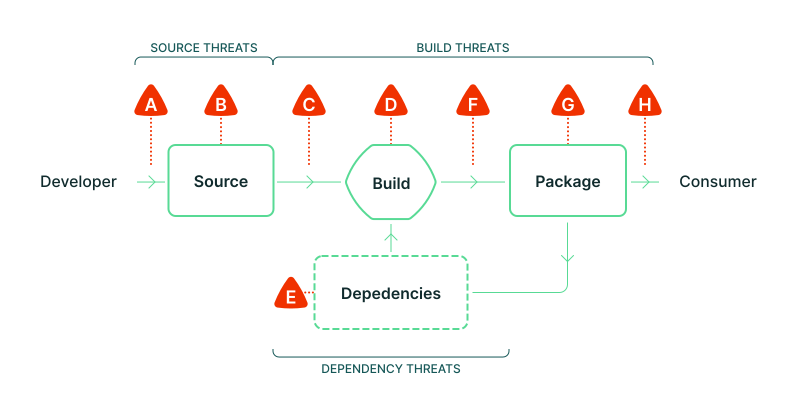

Before diving into the [SLSA Levels](levels.md), we need to establish a core set
of terminology and models to describe what we're protecting.

## Software supply chain

SLSA's framework addresses every step of the software supply chain - the
sequence of steps resulting in the creation of an artifact. We represent a
supply chain as a [directed acyclic graph] of sources, builds, dependencies, and
packages. One artifact's supply chain is a combination of its dependencies'
supply chains plus its own sources and builds.

[directed acyclic graph]: https://en.wikipedia.org/wiki/Directed_acyclic_graph

| Term | Description | Example |
| --- | --- | --- |
| Artifact | An immutable blob of data; primarily refers to software, but SLSA can be used for any artifact. | A file, a git commit, a directory of files (serialized in some way), a container image, a firmware image. |
| Source | Artifact that was directly authored or reviewed by persons, without modification. It is the beginning of the supply chain; we do not trace the provenance back any further. | Git commit (source) hosted on GitHub (platform). |
| Build | Process that transforms a set of input artifacts into a set of output artifacts. The inputs may be sources, dependencies, or ephemeral build outputs. | .travis.yml (process) run by Travis CI (platform). |
| Package | Artifact that is "published" for use by others. In the model, it is always the output of a build process, though that build process can be a no-op. | Docker image (package) distributed on DockerHub (platform). A ZIP file containing source code is a package, not a source, because it is built from some other source, such as a git commit. |
| Dependency | Artifact that is an input to a build process but that is not a source. In the model, it is always a package. | Alpine package (package) distributed on Alpine Linux (platform). |

## Supply chain integrity

SLSA is focused on supply chain integrity. This means protection against
tampering or unauthorized modification at any stage of the software lifecycle.
Within SLSA, we divide integrity into two main areas:

**Source Integrity and Availability:** Ensure that all changes to the source
code reflect the intent of the software producer, and that the code and change
history remain available for investigations and incident response. Intent of an
organization is difficult to define, so we approximate this as approval from two
authorized representatives.

**Build Integrity:** Ensure that packages are built from the correct, unmodified
sources and dependencies according to the build recipe defined by the software
producer, and that artifacts are not modified as they pass between development
stages.

> For a detailed look at integrity, see [Threats and mitigations](threats.md).

