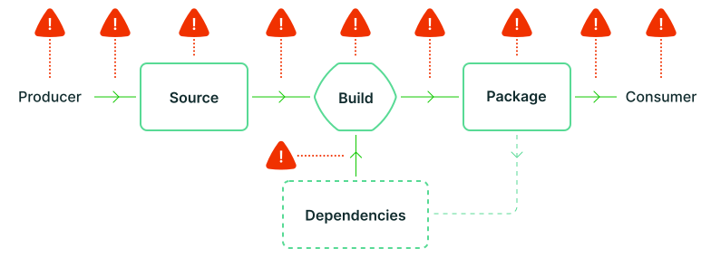

<!-- Hero -->
<section class="hero home flex justify-center items-center relative">
    <video class="absolute object-cover h-full w-full z-0" autoplay muted loop>
      <source src="images/v1.mp4" type="video/mp4">
      Your browser does not support the video tag.
    </video>
    

        <h1 class="md:pr-32">{{ page.subheading }}</h1>
    

</section>

<section class="section intro bg-light-green flex justify-center items-center pt-32 pb-16">
    

        

            

                <h2 class="h2 mb-8">What is SLSA?</h2>
                
<strong>Supply-chain Levels for Software Artifacts, or SLSA ("salsa").</strong>

                
It’s a security framework, a checklist of standards and controls to prevent tampering, improve integrity, and secure packages and infrastructure. It’s how you get from "safe enough" to being as resilient as possible, at any link in the chain.

            

            

                
            

        

    

</section>
<section class="section bg-white flex flex-col justify-center items-center">
    

        

            

                <h3 class="h2 p-0">The supply chain problem</h3>
            

            

                
Any software can introduce vulnerabilities into a supply chain. As a system gets more complex, it’s critical to already have checks and best practices in place to guarantee artifact integrity, that the source code you’re relying on is the code you’re actually using. Without solid foundations and a plan for the system as it grows, it’s difficult to focus your efforts against tomorrow’s next hack, breach or compromise.

                <a href="spec/v1.0/threats-overview" class="cta-link h5 font-semibold mt-8">More about supply chain attacks</a>
            

        

        
    

</section>
<section class="section bg-pastel-green flex flex-col justify-center items-center">
    

        

            

                <h4 class="h2 mb-8">Levels of assurance</h4>
                
SLSA levels are like a common language to talk about how secure software, supply chains and their component parts really are. From source to platform, the levels blend together industry-recognized best practices to create four compliance levels of increasing assurance.
                These look at the builds, sources and dependencies in open source or commercial software. Starting with easy, basic steps at the lower levels to build up and protect against advanced threats later, bringing SLSA into your work means prioritized, practical measures to prevent unauthorized modifications to software, and a plan to harden that security over time.

                <a href="spec/v1.0/levels" class="cta-link h5 font-semibold mt-8">Read the level specifications</a>
            

            

                
            

    

</section>
<section class="section bg-white flex flex-col justify-center items-center">
    

        

            

                <h4 class="h2 p-0">Who is SLSA for?</h4>
            

            

                
SLSA is for everyone involved in producing, consuming, and providing infrastructure for software such as build platforms and package ecosystems.
                SLSA can help create more trust across the entire supply chain. It can be used by producers for protection against tampering and insider threats, by consumers to verify the software they rely on is secure, and by infrastructure providers as a guideline for hardening build platforms and processes.

            

        

    

</section>
<section class="section bg-pastel-green flex flex-col justify-center items-center">
    

        

            
An industry collaboration

            
SLSA is led by an initial cross-organization, vendor-neutral steering group committed to improving the security ecosystem for everyone.

        

        

            
                
                    

                        
                    

                
            
        

    

    

        

            
Part of the Open Source Security Foundation

        

        

            

                
            

        

    

</section>
<section x-data="{swiper: null}" x-init="swiper = new Swiper($refs.container, {
      loop: true,
      slidesPerView: 1,
      spaceBetween: 0,
      dots: true,
      breakpoints: {
        640: {
          slidesPerView: 1,
          spaceBetween: 0,
        },
        768: {
          slidesPerView: 1,
          spaceBetween: 0,
        },
        1024: {
          slidesPerView: 1,
          spaceBetween: 0,
        },
      },
    })"
  class="section bg-white flex flex-col justify-center items-center">
    

        

            
Our ethos

            
Today’s projects, products and services are increasingly complex and open to attack. As that trend continues, we need to scale up our effort to provide more secure, accessible ways to protect the development, distribution and consumption of the software we use, and all the impacted communities behind it.

        

      

        

            <button @click="swiper.slidePrev()"
                class="-ml-2 lg:-ml-12 flex justify-center items-center w-10 h-10 focus:outline-none">
                    <svg width="16" height="17" viewBox="0 0 16 17" fill="none" xmlns="http://www.w3.org/2000/svg"><path d="M15.2033 16.6509C16.2656 11.3624 16.2656 5.93933 15.2033 0.650878C9.66355 2.45134 4.4952 5.16732 3.49691e-07 8.65088C4.4952 12.1344 9.66355 14.8504 15.2033 16.6509Z" fill="#155757"/></svg>
                </button>
        

        

            

              <!-- Slides -->
              
                  
                  

                      
                  

              
            

        

        

            <button @click="swiper.slideNext()"
                    class="-mr-2 lg:-mr-12 flex justify-center items-center w-10 h-10 focus:outline-none">
                    <svg width="16" height="17" viewBox="0 0 16 17" fill="none" xmlns="http://www.w3.org/2000/svg"><path d="M0.796665 16.6509C-0.265559 11.3624 -0.26556 5.93933 0.796663 0.650878C6.33645 2.45134 11.5048 5.16732 16 8.65088C11.5048 12.1344 6.33645 14.8504 0.796665 16.6509Z" fill="#155757"/></svg>
            </button>
        

      

    

</section>
<section class="section bg-light-green flex justify-center items-center">
    

        

            
Get started

        

        

            

              <a href="get-started" class="hover:no-underline">
                  

                      
Start using SLSA

                      
Ready to put your project through its paces? The first on-ramp to SLSA is generating provenance. We’ve put together a walkthrough with the steps you’ll need to take and available tools you can use.

                      
Get started

                  

                </a>
            

            

              <a href="spec/v1.0/" class="hover:no-underline">
                  

                      
Review the specifications

                      
Want to learn about how it fits your organization’s security? Here’s the documentation behind the framework, with use cases, specific threats (and their prevention), provenance and fully detailed requirements.

                      
Learn more

                  

                </a>
            

        

    

</section>
<section class="section bg-green-dark flex justify-center items-center">
    

        

            

## Project status

            

            

                
SLSA v1.0 is available now!

                

                The community has been hard at work since the release of
                <a href="spec/v1.0/">SLSA v1.0</a> in 2023 to expand the breadth
                and depth of the specification with updates and new tracks.
                For more information, see our <a href="/spec/current-activities">current activities</a> page!
                  
Google has been using an internal version of SLSA since 2013 and requires it for all of their production workloads.

            

        

    

</section>
