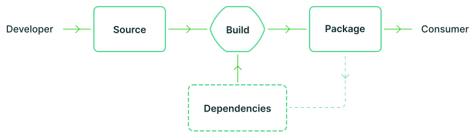

# Requirements

このドキュメントでは、アーティファクトが SLSA を満たすための詳細な要件をすべてカバーしています。
基本的な用語や脅威モデルを含む、より広範な概要については[概要](index.md) 参照。

_注：SLSAは[アルファ版](roadmap.md)です。以下の定義はまだ最終的なものではなく、特にSLSA 3-4については変更される可能性があります。_

| このページについて                   |
| :----------------------------------- |
| [SLSAとは](#what-is-slsa)            |
| [定義](#definitions)                 |
| [ソース要件](#source-requirements)   |
| [ビルド要件](#build-requirements)    |
| [来歴要件](#provenance-requirements) |
| [共通要件](#common-requirements)     |

| 補足説明       |
| :------------- |
| [FAQ](/faq.md) |

## SLSAとは

SLSA は、業界のコンセンサスによって確立された、段階的に採用可能なセキュリティガイドラインのセットです。
SLSA によって設定された基準は、ソフトウェアの生産者と消費者の両方の指針となる原則です。
生産者はガイドラインに従ってソフトウェアをよりセキュアにでき、消費者はソフトウェアパッケージのセキュリティ体制に基づいて決定を下すことができます。
SLSA の[4つのレベル](levels.md)は、段階的かつ実用的であり、特定の整合性攻撃から保護するように設計されています。
SLSA 4 は理想的な最終状態を表し、下位レベルは対応する整合性が保証されたマイルストーンを表します。

### 用語

SLSA のフレームワークは、ソフトウェアサプライチェーンのすべてのステップ（アーティファクトの作成につながる一連のステップ）に対応します。
サプライチェーンは、ソース、ビルド、依存関係、およびパッケージの[有向非巡回グラフ](https://en.wikipedia.org/wiki/Directed_acyclic_graph)として表されます。
1 つのアーティファクトのサプライチェーンは、依存関係のサプライチェーンと生産者自身のソースおよびビルドの組み合わせです。

| 用語             | 説明                                                                                                                                                   | 例                                                                                                                                                                                             |
| ---------------- | ------------------------------------------------------------------------------------------------------------------------------------------------------ | ---------------------------------------------------------------------------------------------------------------------------------------------------------------------------------------------- |
| アーティファクト | 不変のデータの BLOB(Binary Large Object)。主にソフトウェアを指しますが、SLSA は任意のアーティファクトに使用できます。                                  | ファイル、git コミット、ファイルのディレクトリ（何らかの方法でシリアル化されたもの）、コンテナイメージ、ファームウェアイメージ。                                                               |
| ソース           | 変更なしに、人が直接作成またはレビューしたアーティファクト。それはサプライチェーンの始まりです。来歴をこれ以上さかのぼることはありません。             | GitHub（プラットフォーム）でホストされている Git コミット（ソース）。                                                                                                                          |
| ビルド           | 入力アーティファクトのセットを出力アーティファクトのセットに変換するプロセス。入力は、ソース、依存関係、または一時的なビルド出力の場合があります。     | Travis CI（プラットフォーム）によって実行される。travis.yml（プロセス）。                                                                                                                      |
| パッケージ       | 他の人が使用するために「公開」されたアーティファクト。モデルでは、それは常にビルドプロセスの出力ですが、そのビルドプロセスは何もしない場合があります。 | DockerHub（プラットフォーム）で配布される Docker イメージ（パッケージ）。ソースコードを含む ZIP ファイルは、git コミットなどの他のソースから構築されているため、ソースではなくパッケージです。 |
| 依存関係         | ビルドプロセスへの入力であるが、ソースではないアーティファクト。モデルでは、それは常にパッケージです。                                                 | Alpine Linux（プラットフォーム）で配布される Alpine パッケージ（パッケージ）。                                                                                                                 |

## 定義

本文書のキーワード「MUST」、「MUST NOT」、「REQUIRED」、「SHALL」、「SHALL NOT」、「SHOULD」、「SHOULD NOT」、「RECOMMENDED」、「MAY」、「OPTIONAL」は、[RFC 2119](https://www.rfc-editor.org/rfc/rfc2119)に記載されている通りに解釈されます。

 **不変参照:**
常に同じ不変のアーティファクトを指すことが保証されている識別子。
これにより、消費者がアーティファクトを見つけられるようにする必要があり、整合性を確保するためにアーティファクトのコンテンツの暗号化ハッシュを含める必要があります。

例：git URL + branch/tag/ref + commit ID; cloud storage bucket ID + SHA-256 hash; Subversion URL (no hash)

[不変参照]: #immutable-reference

**プラットフォーム:**
ソフトウェアのソース、ビルド、または配布をホストするインフラストラクチャまたはサービス。

例：GitHub、Google Cloud Build、Travis CI、 [Mozilla's self-hosted Mercurial server](https://hg.mozilla.org)。

**来歴:**
アーティファクトがどのように生成されたかに関するメタデータ。

**リビジョン:**
ソースの不変で一貫性のある状態。たとえば、Git では、リビジョンは、特定のリポジトリ内の特定のブランチから到達可能な履歴内のコミットです。
1 つのリポジトリ内の異なるリビジョンは、異なるレベルを持つ場合があります。

例：ブランチの最新のリビジョンは SLSA 4 に適合していますが、カットオフ前の非常に古い履歴リビジョンは適合していません。

**強固な認証:**
アカウントとクレデンシャルの漏洩に強い認証メカニズムを使用して、特定の人物にマッピングする認証。
例えば、2要素認証（2FA）では、1要素がハードウェアセキュリティキー（YubiKeyなど）となります。

**信用できる人:**
ソフトウェアプロジェクトを維持する権限を与えられた人物のセット。

例えば、https://github.com/MarkLodato/dotfiles には信頼された人が一人（MarkLodato）しかいませんが、https://hg.mozilla.org/mozilla-central には mozilla-central リポジトリへの書き込み権限を持つ信頼された人のセットがあります。

## ソース要件

<table>
<tr><th>要件<th>概要<th>L1<th>L2<th>L3<th>L4
<tr id="version-controlled">
<td>バージョン管理
<td>

ソースへのすべての変更は、次の要件を満たすバージョン管理システムで追跡されます。

-   **[変更履歴]** そのリビジョンに至った変更履歴の記録があります。
    各変更には、アップローダーとレビュワーの ID（存在する場合）、レビューのタイムスタンプ（存在する場合）と送信、変更の説明と理由、変更の内容、および親のリビジョンが含まれている必要があります。

-   **\[不変参照]** の特定の不変のリビジョンを無期限に参照する方法があります。
    git では、これは{repository URL + branch/tag/ref + commit ID}。です。

git、Mercurial、Subversion、Perforce など、最も一般的なバージョン管理システムはこの要件を満たしています。

注：これには、コード、アップローダー/レビュワーの ID、または変更履歴を公開する必要はありません。
むしろ、一部の組織はこれらの要件が満たされているという事実を証明する必要があり、この証明が十分であるかどうかは消費者次第です。

"○" = RECOMMENDED.

<td>○<td>✓<td>✓<td>✓
<tr id="verified-history">
<td>履歴の認証
<td>

リビジョン履歴にあるすべての変更には、少なくとも 1 つの強力に認証されたアクターのアイデンティティ（作者、アップロード者、レビューアなど）とタイムスタンプがあります。
どの ID が検証されたかを明確にし、それらの ID には[2段階認証](https://www.google.com/landing/2step/)または同様のものを使用しなければなりません。(以下に例外を記す）)

-   **[最初の親の履歴]** リビジョンが複数の親を持つことができる非線形バージョン管理システムの場合、「最初の親の履歴」のみがスコープに含まれます。
    言い換えると、フューチャーブランチがメインブランチにマージされると、マージ自体のみがスコープ内に含まれます。
-   **[歴史的なカットオフ]** 歴史的なリビジョンが履歴に存在していても、既存のプロジェクトが SLSA 3/4 を満たすことを認める TBD の例外があります。
    現在の考えでは、これは過去 N ヶ月間のものか、今後 N ヶ月間に行われる将来の変更が要件を満たすことを保証するプラットフォームの証明があるものいずれかである。

<td> <td> <td>✓<td>✓
<tr id="retained-indefinitely">
<td>無期限保持
<td>

リビジョンとその変更履歴は無期限に保存され、法的またはポリシー上の要件など、抹消のための確立された透明なポリシーに従う場合を除き、削除することはできません。

-   **[履歴の不変性]** 履歴を削除したり変更したりすることは、たとえ複数の人が承認したとしても、信頼された人以外はできません。
    抹消ポリシーに従った二者間の承認を得た信頼できるプラットフォームの管理者が抹消ポリシーに従って二者間で承認した場合を除きます。
-   **[SLSA 3の限定的な保持]** SLSA 3（SLSA 4 ではない）では、ソースコントロールプラットフォームによって証明されるように、保持期間を 18 か月に限定することが許容されます。
    -   例： 2020-04-05 にコミットして、2021-01-01 に保持証明が生成された場合、そのコミットは少なくとも 2022-07-01 まで保持されなければなりません。

<td> <td> <td>18 ヶ月<td>✓
<tr id="two-person-reviewed">
<td>2者レビュー
<td>

このリビジョン履歴にあるすべての変更は、投稿前に 2 人の信頼できる人物によって合意されており、その 2 人の信頼できる人は強く認証されています。
(ここでは[検証済みの履歴](#verified-history)の例外も適用されます)

-   以下の組み合わせが可能です。
    -   アップローダとレビュアーが 2 人の異なる信頼できる人物である場合
    -   2 人の異なるレビュアーが信頼できる人物である場合
-   **[異なる人物]** プラットフォームは、2 人のレビュー要件を回避するために別の ID を使用できないことを保証します。
    -   例：ある人が ID X でアップロードし、別名 Y でレビューした場合、プラットフォームはこれが同一人物であることを理解し、レビュー要件が満たされているとは考えません。
-   **[情報に基づいたレビュー]** レビュアーは、承認する内容について十分な情報を得た上で決定を下すことができ、またそれが奨励されます。
  レビュアーは、提案された改訂版と以前にレビューされた改訂版との間の完全で意味のある内容の違いを提示されるべきです。
  例えば、ファイルが変更されたことを示すだけで、内容を示さないのは十分ではありません。
-   **[コンテキスト固有の承認]** 承認は、git におけるリポジトリ＋ブランチのような、特定のコンテキストに対して行われます。
  完全にレビューされたコンテンツをあるコンテキストから別のコンテキストに移動させても、レビューは必要です。
  (「コンテキスト」の正確な定義はプロジェクトによって異なります。また、リリースブランチを切るような、よく理解された自動マージやレビューレスマージを排除するものではありません)。
    -   Git の例：あるリポジトリの完全にレビューされたコミットが別のリポジトリにマージされたり、あるブランチのコミットが別のブランチにマージされたりした場合、そのマージにはまだレビューが必要です。

<td> <td> <td> <td>✓
</table>

## ビルド要件

ビルドプロセスに関する要件：

<table>
<tr><th>要件<th>概要<th>L1<th>L2<th>L3<th>L4
<tr id="scripted-build">
<td>ビルドのスクリプト化
<td>
(MUST)

すべてのビルドステップは、開発者のワークステーションではなく、何らかのビルドサービスを使って実行されます。

例: GitHub Actions, Google Cloud Build, Travis CI。

<td> <td>✓<td>✓<td>✓
<tr id="build-as-code">
<td>ビルドのコード管理
<td>

ビルドの定義と構成はソースコントロールで定義され、ビルドサービスによって実行されます。

例: cloudbuild.yaml, .github/workflows/build.yaml, zuul.yaml。
<td> <td> <td>✓<td>✓
<tr id="ephemeral-environment">
<td>エフェメラル環境
<td>

ビルドサービスは、今回のビルドのためだけに用意されたコンテナや VM などのエフェメラル環境でビルドステップが実行され、以前のビルドから再利用されていないことを保証します。

<td> <td> <td>✓<td>✓
<tr id="isolated">
<td>独立性
<td>

ビルドサービスは、前回または並行して実行中の他のビルドインスタンスの影響を受けない独立した環境でビルドステップを実行します。

-   ビルドが、来歴署名鍵のようなビルドサービスのシークレットにアクセスすることはできません(MUST NOT)。
-   時間的にオーバーラップする 2 つのビルドが、互いに影響し合うことはあってはなりません(MUST NOT)。
-   あるビルドが、後続のビルドのビルド環境を持続させたり、影響を与えたりすることはできません(MUST NOT)。
-   ビルドキャッシュを使用する場合は、改ざんを防ぐために純粋にコンテンツにアクセス可能でなければなりません(MUST)。

<td> <td> <td>✓<td>✓
<tr id="parameterless">
<td>パラメータレス
<td>

ビルドの出力は、ビルドのエントリーポイントとトップレベルのソースロケーション以外のユーザーパラメータの影響を受けることはありません。
言い換えれば、ビルドはビルドスクリプトによって完全に定義され、それ以外には何もありません。

例:

-   GitHub Actions:
    [workflow_dispatch](https://docs.github.com/en/actions/reference/events-that-trigger-workflows#workflow_dispatch) `inputs` は空でなければなりません。
-   Google Cloud Build:
    [user-defined substitutions](https://cloud.google.com/build/docs/configuring-builds/substitute-variable-values) は空にしなければなりません(サーバーで定義された値を持つデフォルトの substitutions は許容されます)。

<td> <td> <td> <td>✓
<tr id="hermetic">
<td>密封性
<td>

すべての遷移的なビルドステップ、ソース、依存関係は[不変参照]で前もって完全に宣言されており、ビルドステップはネットワークアクセスなしで実行されました。

ユーザ定義ビルドスクリプト：

-   ビルドサービスが処理できるフォーマットの[不変参照]を使用して、ソースや他のビルドステップを含むすべての依存関係を宣言しなければなりません(MUST)。

ビルドサービス：

-   信頼できるコントロールプレーンですべてのアーティファクトをフェッチしなければなりません(MUST)。
-   変更可能な参照を許可してはならない(MUST NOT)。
-   各アーティファクトの整合性を検証しなければならない(MUST)。
    -   [不変参照] に暗号ハッシュが含まれている場合、サービスはそのハッシュを検証し、検証が失敗した場合は取得を拒否しなければなりません(MUST)。
    -   そうでない場合、サービスは、TLS やコード署名など、トランスポート・インテグリティを保証するチャネルを介してアーティファクトを取得しなければなりません(MUST)。
-   ビルドステップ実行中は、ネットワークアクセスを防止しなければならない(MUST)。
    -   この要件は「ベストエフォート」です。
        合理的なチームが非密封ビルドを行うことを防止すべきですが、決意を持った攻撃者を阻止する必要はありません(SHOULD)。
        例えば、コンテナを使ってネットワークへのアクセスを防止すれば十分です。

<td> <td> <td> <td>✓
<tr id="reproducible">
<td>再現性
<td>

同一の入力アーティファクトを使用してビルドステップを再実行すると、ビットごとに同一の出力が得られます。
これを満たすことができないビルドは、ビルドを再現可能にできない理由を説明する必要があります。

「○」は、この要件が「ベストエフォート」であることを意味します。
ユーザー提供のビルドスクリプトは、ビルドが再現可能であることを意図しているかどうか、またはその理由を正当化することを意図しているかどうかを宣言する必要があります。
ビルドサービスは、再現性を検証せずに、この意図を盲目的に伝播する場合があります。
消費者は、ビルドが再現されない場合、ビルドを拒否する場合があります。

<td> <td> <td> <td>○
</table>

## 来歴要件

来歴が生成および消費されるプロセスの要件：

<table>
<tr><th>要件<th>概要<th>L1<th>L2<th>L3<th>L4
<tr id="available">
<td>可用性
<td>

証明書は、消費者が受け入れるフォーマットで消費者に提供されます。
フォーマットは in-toto [SLSA来歴](provenance/index.html)に準拠すべきです(SHOULD)。
ただし、生産者と消費者の双方が同意し、他のすべての要件を満たす場合は、別のフォーマットを使用してもよいものとします(MAY)。

<td>✓<td>✓<td>✓<td>✓
<tr id="authenticated">
<td>認証済
<td>

来歴の信憑性と完全性は、消費者が検証できます。
これは、来歴を生成するサービスにのみアクセス可能な秘密鍵からのデジタル署名を介して行う必要があります(SHOULD)。

<td> <td>✓<td>✓<td>✓
<tr id="service-generated">
<td>生成のサービス化
<td>

来歴のデータは、ビルドサービスから取得する必要があります(MUST)。
（ジェネレーターがビルドサービスであるか、来歴ジェネレーターがビルドサービスから直接データを読み取るため）。

サービスの通常のユーザーは、以下に記載されている場合を除き、コンテンツを挿入または変更できないようにする必要があります(MUST)。

次の来歴フィールドは、ユーザーが制御するビルドステップによって生成される場合があります(MAY)。

-   [アーティファクトの識別](#identifies-artifact)から出力されたアーティファクトのハッシュです。
    -   理由：これは、「悪い」ビルドが「良い」アーティファクトを生成したと偽ることができるだけです。
        消費者は「良い」ビルドだけを受け入れ、「悪い」ビルドを拒否しなければならない(MUST)ので、これはセキュリティ上の問題ではない。
-   [再現性](#reproducible)による再現性のある真理値とその正当な理由です。

<td> <td>✓<td>✓<td>✓
<tr id="non-falsifiable">
<td>反証不可能性
<td>

ビルドサービスの消費者が来歴を改ざんすることはできない。

注：この要件は、[生成のサービス化](#service-generated)のより厳しいバージョンです。

-   来歴署名鍵は、ビルドサービスアカウントのみがアクセスできるセキュアな鍵管理システムに保存しなければならない(MUST)。
-   来歴署名鍵は、ユーザー定義のビルドステップを実行する環境からはアクセスできないようにしなければならない(MUST)。
-   来歴の各フィールドは、信頼されたコントロールプレーン内のビルドサービスによって生成または検証されなければならない(MUST)。
    ユーザーが制御するビルドステップは、以下に示す場合を除き、コンテンツを注入または変更できてはならない(MUST NOT)。

次の来歴フィールドは、ビルドサービスがその正当性を検証せずに、ユーザーが制御するビルドステップによって生成される場合があります(MAY)。

-   [アーティファクトの識別](#identifies-artifact)から出力されたアーティファクトのハッシュです。
    -   理由：これは、「悪い」ビルドが「良い」アーティファクトを生成したと偽ることができるだけです。
        消費者は「良い」ビルドだけを受け入れ、「悪い」ビルドを拒否しなければならない(MUST)ので、これはセキュリティ上の問題ではない。
-   [再現性](#reproducible)による再現性のある真理値とその正当な理由です。

<td> <td> <td>✓<td>✓
<tr id="dependencies-complete">
<td>依存関係の解消
<td>

来歴は、ビルドステップの実行中に利用可能だったすべてのビルド依存関係を記録します。
これには、ビルドワーカーのマシン、VM、またはコンテナーの初期状態が含まれます。

-   すべてのユーザー定義のビルドステップ、ソース、依存関係を含まなければならない(MUST)。
-   サービスが提供するすべてのアーティファクトを含むべきである(SHOULD)。

<td> <td> <td> <td>✓
</table>

来歴の内容の要件：

<table>
<tr><th>要件<th>概要<th>L1<th>L2<th>L3<th>L4
<tr id="identifies-artifact">
<td>アーティファクトの識別
<td>

来歴は、少なくとも 1 つの暗号化ハッシュを介して出力アーティファクトを識別しなければなりません(MUST)。
来歴は、異なるアルゴリズムを使用して複数の識別暗号化ハッシュを提供する場合があります。
ハッシュが 1 つだけ提供される場合、システム間の互換性のために推奨されるアルゴリズムは SHA-256 です。
別のアルゴリズムを使用する場合は、現像攻撃に耐性がある必要があります(SHOULD)。

<td>✓<td>✓<td>✓<td>✓
<tr id="identifies-builder">
<td>ビルダの識別
<td>

来歴は、ビルドを実行して来歴を生成したエンティティを識別します。
これは、消費者が信頼しなければならないエンティティを表します。
例：「GitHub でホストされているワーカーを使用した GitHub アクション」、「jdoe@example.com のマシン」。

<td>✓<td>✓<td>✓<td>✓
<tr id="identifies-build-instructions">
<td>ビルド命令の識別
<td>

来歴は、ビルドの実行に使用される最上位の命令を識別します。

識別された命令は、ビルドが利用できる最高レベルのものであるべきです(SHOULD)。
(例えば、ビルドが build.sh を実行するように指示された場合、build.sh をリストアップすべきで、build.sh 内の個々の命令をリストアップすべきではありません)

<a href="#build-as-code">ビルドのコード管理<a> が使用される場合、これはソースリポジトリとビルド設定のエントリーポイントであるべきです(SHOULD)（[GitHub Actions の例](https://slsa.dev/provenance/v0.2#github-actions)のように）。

ビルドがコードで定義されていない場合は、何をするように要求されたかの詳細を記載してもよい(MAY)（[Google Cloud Build RPC の例](https://slsa.dev/provenance/v0.2#cloud-build-rpc)や[Explicitly Run Commands の例](https://slsa.dev/provenance/v0.2#explicitly-run-commands)のように）。

<td>✓<td>✓<td>✓<td>✓
<tr id="identifies-source-code">
<td>ソースコードの識別
<td>

来歴は、ビルドで使用されるソースコードのリポジトリの origin を識別します。

識別されたリポジトリには、ビルドで直接使用されるソースのみを含める必要があります(SHOULD)。

依存関係のソースを含めるべきではありません(SHOULD NOT)。

レベル 2 では、この情報はユーザーから取得される場合があり MAY、ビルダーによる認証は必要ありません。

レベル 3 以上では、この情報はビルダーによって認証されなければなりません(MUST)。
(すなわち、ビルダーはソースを自分でフェッチするか、フェッチを _観察_ する必要があります)。

レベル 4 では、この情報は完全である必要があります(MUST)。
（つまり、ビルドで使用されるすべてのソースリポジトリが一覧表示されます）。

<td><td>✓<td>✓ (Authenticated)<td>✓ (Complete)
<tr id="identifies-entry-point">
<td>エントリポイントの識別
<td>

来歴は、どのソースリポジトリから設定が読み込まれたかなど、ビルド実行のために使用されたビルド定義（<a href="#build-as-code">build-as-code</a>を参照）の「エントリーポイント」を特定します。

例：

-   ソースリポジトリ: git URL + branch/tag/ref + commit ID
-   エントリポイント：設定ファイルへのパス（例：./.zuul.yaml）＋設定内のジョブ名
    (例: envoy-build-arm64)

<td><td><td>✓<td>✓
<tr id="includes-all-params">
<td>全ビルドパラメータを含む
<td>

来歴には、ユーザーの管理下にあるすべてのビルドパラメーターが含まれます。
詳細については、 [パラメータレス](#parameterless) を参照してください。
（L3 では、パラメーターをリストする必要があります。L4 では、パラメーターを空にする必要があります）

<td> <td> <td>✓<td>✓
<tr id="includes-all-deps">
<td>全ての推移的依存関係を含む
<td>

来歴には、[依存関係の解消](#dependencies-complete)。にリストされているすべての推移的な依存関係が含まれます 。

<td> <td> <td> <td>✓
<tr id="includes-reproducible-info">
<td>再現性のある情報を含む
<td>

来歴には、ビルドが再現可能であるかどうかを示すブール値が含まれ、再現可能である場合は、ビルドを複製するために必要なすべての情報が含まれます。
詳細については、[再現性](#reproducible)を参照してください。

<td> <td> <td> <td>✓
<tr id="includes-metadata">
<td>メタデータを含む
<td>

来歴には、デバッグと調査を支援するメタデータが含まれています。
これには、少なくとも開始と終了のタイムスタンプ、およびデバッグログへのパーマリンクを含める必要があります(SHOULD)。

"○" = RECOMMENDED.

<td>○<td>○<td>○<td>○
</table>

## 共通要件

サプライチェーンに関与するすべての信頼できるシステムに共通の要件（ソース、ビルド、配布など）

<table>
<tr><th>要件<th>概要<th>L1<th>L2<th>L3<th>L4
<tr id="security">
<td>セキュリティ
<td>

システムは、情報漏洩を防ぐために、いくつかの TBD ベースラインのセキュリティ基準を満たしています。
（パッチ適用、脆弱性スキャン、ユーザー分離、トランスポートセキュリティ、セキュアブート、マシン ID など。おそらく [NIST 800-53](https://nvlpubs.nist.gov/nistpubs/SpecialPublications/NIST.SP.800-53r5.pdf) またはそのサブセット）

<td> <td> <td> <td>✓
<tr id="access">
<td>アクセス
<td>

すべての物理的およびリモートアクセスは、まれであり、ログに記録され、マルチパーティの承認の背後でゲートされている必要があります。

<td> <td> <td> <td>✓
<tr id="superusers">
<td>スーパーユーザー

<td>

ここに記載されている保証を無効にできるのは、少数のプラットフォーム管理者のみです。そのためには、2 番目のプラットフォーム管理者の承認が必要です(MUST)。

<td> <td> <td> <td>✓
</table>
