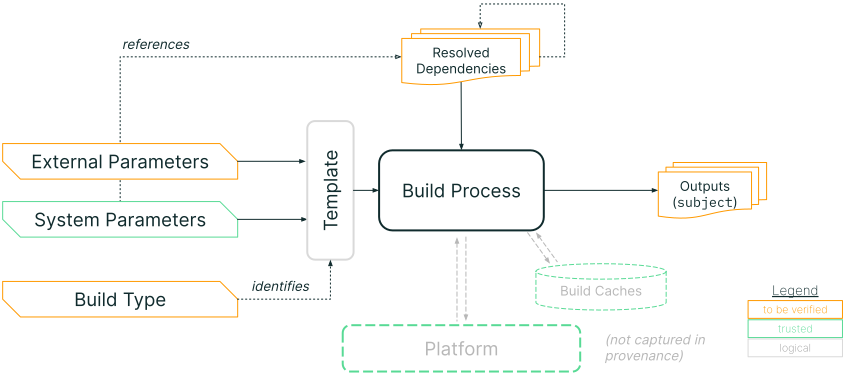
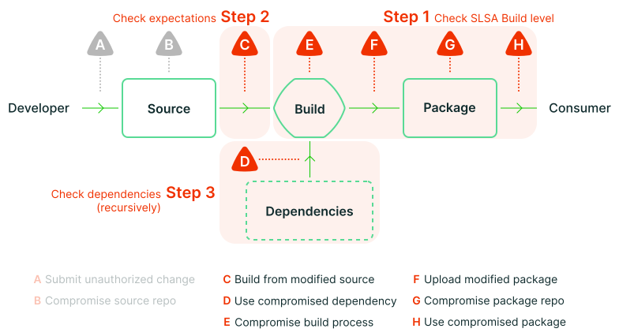

<!-- Note: We only include the major version in the URL, e.g. "v1" instead of
"v1.0", because minor versions are guaranteed to be backwards compatible. We
still include the minor version number in the selector (_data/versions.yml) so
that readers can easily find the current minor version number. -->

To trace software back to the source and define the moving parts in a complex
supply chain, provenance needs to be there from the very beginning. It's the
verifiable information about software artifacts describing where, when and how
something was produced. For higher SLSA levels and more resilient integrity
guarantees, provenance requirements are stricter and need a deeper, more
technical understanding of the predicate.

## Purpose

Describe how an artifact or set of artifacts was produced so that:

-   Consumers of the provenance can verify that the artifact was built according
    to expectations.
-   Others can rebuild the artifact, if desired.

This predicate is the RECOMMENDED way to satisfy the SLSA v1.0 [provenance
requirements](/spec/v1.0-rc1/requirements#provenance-generation).

## Prerequisite

Understanding of SLSA [Software Attestations](/attestation-model)
and the larger [in-toto attestation] framework.

The key words "MUST", "MUST NOT", "REQUIRED", "SHALL", "SHALL NOT", "SHOULD",
"SHOULD NOT", "RECOMMENDED", "MAY", and "OPTIONAL" in this document are to be
interpreted as described in [RFC 2119](https://www.rfc-editor.org/rfc/rfc2119).

## Model

Provenance is an attestation that the `builder` produced the `subject` software
artifacts through execution of the `buildDefinition`.



The model is as follows:

-   Each build runs as an independent process on a multi-tenant platform. The
    `builder.id` identifies this platform, representing the transitive
    closure of all entities that are [trusted] to faithfully run the build and
    record the provenance. (Note: The same model can be used for platform-less
    or single-tenant build systems.)

-   The build process is defined by a parameterized template, identified by
    `buildType`. This encapsulates the process that ran, regardless of what
    system ran it. Often the build type is specific to the build platform
    because most build platforms have their own unique interfaces.

-   All top-level, independent inputs are captured by the parameters to the
    template. There are two types of parameters:

    -   `externalParameters`: the external interface to the build. In SLSA,
        these values are untrusted; they MUST be included in the provenance and
        MUST be verified downstream.

    -   `systemParameters`: set internally by the platform. In SLSA, these
        values are trusted because the platform is trusted; they are OPTIONAL
        and need not be verified downstream. They MAY be included to enable
        reproducible builds, debugging, or incident response.

-   All artifacts fetched during initialization or execution of the build
    process are considered dependencies, including those referenced directly by
    parameters. The `resolvedDependencies` captures these dependencies, if
    known. For example, a build that takes a git repository URI as a parameter
    might record the specific git commit that the URI resolved to as a
    dependency.

-   During execution, the build process might communicate with the build
    platform's control plane and/or build caches. This communication is not
    captured directly in the provenance, but is instead implied by `builder.id`
    and subject to [SLSA Requirements](/spec/v1.0-rc1/requirements). Such
    communication SHOULD NOT influence the definition of the build; if it does,
    it SHOULD go in `resolvedDependencies` instead.

-   Finally, the build process outputs one or more artifacts, identified by
    `subject`.

For concrete examples, see [index of build types](#index-of-build-types).

## Parsing rules

This predicate follows the in-toto attestation [parsing rules]. Summary:

-   Consumers MUST ignore unrecognized fields unless otherwise noted.
-   The `predicateType` URI includes the major version number and will always
    change whenever there is a backwards incompatible change.
-   Minor version changes are always backwards compatible and "monotonic." Such
    changes do not update the `predicateType`.
-   Producers MAY add extension fields using field names that are URIs.
-   Unset, null, and empty field values MUST be interpreted equivalently.

## Schema

*NOTE: This section describes the fields within `predicate`. For a description
of the other top-level fields, such as `subject`, see [Statement].*

<!-- Note: While this happens to be a valid cue file, we're really just using it
as a human-readable summary of the schema. We don't want readers to have to
understand cue. For that reason, we are not using any special cue syntax or
features. -->

```javascript

```

<details>
<summary>Protocol buffer schema</summary>

Link: [provenance.proto](schema/v1-rc1/provenance.proto)

```proto

```

</details>

### Provenance

[Provenance]: #provenance

REQUIRED for SLSA Build L1: `buildDefinition`, `runDetails`

<table>
<tr><th>Field<th>Type<th>Description

<tr id="buildDefinition"><td><code>buildDefinition</code>
<td><a href="#builddefinition">BuildDefinition</a><td>

The input to the build. The accuracy and completeness are implied by
`runDetails.builder.id`.

<tr id="runDetails"><td><code>runDetails</code>
<td><a href="#rundetails">RunDetails</a><td>

Details specific to this particular execution of the build.

</table>

### BuildDefinition

[BuildDefinition]: #builddefinition

REQUIRED for SLSA Build L1: `buildType`, `externalParameters`

<table>
<tr><th>Field<th>Type<th>Description

<tr id="buildType"><td><code>buildType</code>
<td>string (<a href="https://github.com/in-toto/attestation/blob/main/spec/v1.0/field_types.md#typeuri">TypeURI</a>)<td>

Identifies the template for how to perform the build and interpret the
parameters and dependencies.

The URI SHOULD resolve to a human-readable specification that includes: overall
description of the build type; schema for `externalParameters` and
`systemParameters`; unambiguous instructions for how to initiate the build given
this BuildDefinition, and a complete example. Example:
https://slsa-framework.github.io/github-actions-buildtypes/workflow/v1

<tr id="externalParameters"><td><code>externalParameters</code>
<td>object<td>

The parameters that are under external control, such as those set by a user or
tenant of the build system. They MUST be complete at SLSA Build L3, meaning that
that there is no additional mechanism for an external party to influence the
build. (At lower SLSA Build levels, the completeness MAY be best effort.)

The build system SHOULD be designed to minimize the size and complexity of
`externalParameters`, in order to reduce fragility and ease [verification].
Consumers SHOULD have an expectation of what "good" looks like; the more
information that they need to check, the harder that task becomes.

Verifiers SHOULD reject unrecognized or unexpected fields within
`externalParameters`.

<tr id="systemParameters"><td><code>systemParameters</code>
<td>object<td>

The parameters that are under the control of the entity represented by
`builder.id`. The primary intention of this field is for debugging, incident
response, and vulnerability management. The values here MAY be necessary for
reproducing the build. There is no need to [verify][Verification] these
parameters because the build system is already trusted, and in many cases it is
not practical to do so.

***NOTE:** This field is named `internalParameters` in [v1](v1.md) final.*

<tr id="resolvedDependencies"><td><code>resolvedDependencies</code>
<td>array (<a href="#artifactreference">ArtifactReference</a>)<td>

Unordered collection of artifacts needed at build time. Completeness is best
effort, at least through SLSA Build L3. For example, if the build script fetches
and executes "example.com/foo.sh", which in turn fetches
"example.com/bar.tar.gz", then both "foo.sh" and "bar.tar.gz" SHOULD be listed
here.

</table>

The BuildDefinition describes all of the inputs to the build. It SHOULD contain
all the information necessary and sufficient to initialize the build and begin
execution.

The `externalParameters` and `systemParameters` are the top-level inputs to the
template, meaning inputs not derived from another input. Each is an arbitrary
JSON object, though it is RECOMMENDED to keep the structure simple with string
values to aid verification. The same field name SHOULD NOT be used for both
`externalParameters` and `systemParameters`.

The parameters SHOULD only contain the actual values passed in through the
interface to the build system. Metadata about those parameter values,
particularly digests of artifacts referenced by those parameters, SHOULD instead
go in `resolvedDependencies`. The documentation for `buildType` SHOULD explain
how to convert from a parameter to the dependency `uri`. For example:

```json
"externalParameters": {
    "repository": "https://github.com/octocat/hello-world",
    "ref": "refs/heads/main"
},
"resolvedDependencies": [{
    "uri": "git+https://github.com/octocat/hello-world@refs/heads/main",
    "digest": {"sha1": "7fd1a60b01f91b314f59955a4e4d4e80d8edf11d"}
}]
```

Guidelines:

-   Maximize the amount of information that is implicit from the meaning of
    `buildType`. In particular, any value that is boilerplate and the same
    for every build SHOULD be implicit.

-   Reduce parameters by moving configuration to input artifacts whenever
    possible. For example, instead of passing in compiler flags via an external
    parameter that has to be [verified][Verification] separately, require the
    flags to live next to the source code or build configuration so that
    verifying the latter automatically verifies the compiler flags.

-   In some cases, additional external parameters might exist that do not impact
    the behavior of the build, such as a deadline or priority. These extra
    parameters SHOULD be excluded from the provenance after careful analysis
    that they indeed pose no security impact.

-   If possible, architect the build system to use this definition as its
    sole top-level input, in order to guarantee that the information is
    sufficient to run the build.

-   When build configuration is evaluated client-side before being sent to the
    server, such as transforming version-controlled YAML into ephemeral JSON,
    some solution is needed to make [verification] practical. Consumers need a
    way to know what configuration is expected and the usual way to do that is
    to map it back to version control, but that is not possible if the server
    cannot verify the configuration's origins. Possible solutions:

    -   (RECOMMENDED) Rearchitect the build service to read configuration
        directly from version control,  recording the server-verified URI in
        `externalParameters` and the digest in `resolvedDependencies`.

    -   Record the digest in the provenance[^digest-param] and use a separate
        provenance attestation to link that digest back to version control. In
        this solution, the client-side evaluation is considered a separate
        "build" that SHOULD be independently secured using SLSA, though securing
        it can be difficult since it usually runs on an untrusted workstation.

-   The purpose of `resolvedDependencies` is to facilitate recursive analysis of
    the software supply chain. Where practical, it is valuable to record the
    URI and digest of artifacts that, if compromised, could impact the build. At
    SLSA Build L3, completeness is considered "best effort".

[^digest-param]: The `externalParameters` SHOULD reflect reality. If clients
    send the evaluated configuration object directly to the build server, record
    the digest directly in `externalParameters`. If clients upload the
    configuration object to a temporary storage location and send that location
    to the build server, record the location in `externalParameters` as a URI
    and record the `uri` and `digest` in `resolvedDependencies`.

> ⚠ **RFC:** We are particularly looking for feedback on this schema from
> potential implementers. Does this model map cleanly to existing build systems?
> Is it natural to identify and express the external parameters? Is anything
> confusing or ambiguous?

### ArtifactReference

[ArtifactReference]: #artifactreference

REQUIRED: at least one of `uri` or `digest`

<table>
<tr><th>Field<th>Type<th>Description

<tr id="uri"><td><code>uri</code>
<td>string (URI)<td>

URI describing where this artifact came from. When possible, this SHOULD
be a universal and stable identifier, such as a source location or Package
URL ([purl]).

<tr id="digest"><td><code>digest</code>
<td><a href="https://github.com/in-toto/attestation/blob/main/spec/v1.0/digest_set.md">DigestSet</a><td>

One or more cryptographic digests of the contents of this artifact.

<tr id="localName"><td><code>localName</code>
<td>string<td>

The name for this artifact local to the build.

<tr id="downloadLocation"><td><code>downloadLocation</code>
<td>string (URI)<td>

URI identifying the location that this artifact was downloaded from, if
different and not derivable from `uri`.

<tr id="mediaType"><td><code>mediaType</code>
<td>string (<a href="https://developer.mozilla.org/en-US/docs/Web/HTTP/Basics_of_HTTP/MIME_types">MediaType</a>)<td>

Media type (aka MIME type) of this artifact was interpreted.

</table>

Example:

```json
{
    "uri": "pkg:pypi/pyyaml@6.0",
    "digest": {"sha256": "5f0689d54944564971f2811f9788218bfafb21aa20f532e6490004377dfa648f"},
    "localName": "PyYAML-6.0.tar.gz",
    "downloadLocation": "https://files.pythonhosted.org/packages/36/2b/61d51a2c4f25ef062ae3f74576b01638bebad5e045f747ff12643df63844/PyYAML-6.0.tar.gz",
    "mediaType": "application/gzip"
}
```

> ⚠ **RFC:** Do we need all these fields? Is this adding too much complexity?

### RunDetails

[RunDetails]: #rundetails

REQUIRED for SLSA Build L1: `builder`

<table>
<tr><th>Field<th>Type<th>Description

<tr id="builder"><td><code>builder</code>
<td><a href="#builder">Builder</a><td>

Identifies the entity that executed the invocation, which is trusted to have
correctly performed the operation and populated this provenance.

<tr id="metadata"><td><code>metadata</code>
<td><a href="#buildmetadata">BuildMetadata</a><td>

Metadata about this particular execution of the build.

<tr id="byproducts"><td><code>byproducts</code>
<td>array (<a href="#artifactreference">ArtifactReference</a>)<td>

Additional artifacts generated during the build that are not considered
the "output" of the build but that might be needed during debugging or incident
response. For example, this might reference logs generated during the build
and/or a digest of the fully evaluated build configuration.

In most cases, this SHOULD NOT contain all intermediate files generated during
the build. Instead, this SHOULD only contain files that are likely to be useful
later and that cannot be easily reproduced.

</table>

### Builder

[Builder]: #builder

REQUIRED for SLSA Build L1: `id`

<table>
<tr><th>Field<th>Type<th>Description

<tr id="builder.id"><td><code>id</code>
<td>string (<a href="https://github.com/in-toto/attestation/blob/main/spec/v1.0/field_types.md#typeuri">TypeURI</a>)<td>

URI indicating the transitive closure of the trusted builder. This is
[intended][Step 1] to be the sole determiner of the SLSA Build level.

If a build platform has multiple modes of operations that have differing
security attributes or SLSA Build levels, each mode MUST have a different
`builder.id` and SHOULD have a different signer identity. This is to minimize
the risk that a less secure mode compromises a more secure one.

<tr id="builder.version"><td><code>version</code>
<td>map (string→string)<td>

Version numbers of components of the builder.

<tr id="builderDependencies"><td><code>builderDependencies</code>
<td>array (<a href="#artifactreference">ArtifactReference</a>)<td>

Dependencies used by the orchestrator that are not run within the workload and
that do not affect the build, but might affect the provenance generation or
security guarantees.

</table>

The builder represents the transitive closure of all the entities that are, by
necessity, [trusted] to faithfully run the build and record the provenance.

The `id` MUST reflect the trust base that consumers care about. How detailed to
be is a judgement call. For example, GitHub Actions supports both GitHub-hosted
runners and self-hosted runners. The GitHub-hosted runner might be a single
identity because it's all GitHub from the consumer's perspective. Meanwhile,
each self-hosted runner might have its own identity because not all runners are
trusted by all consumers.

Consumers MUST accept only specific signer-builder pairs. For example, "GitHub"
can sign provenance for the "GitHub Actions" builder, and "Google" can sign
provenance for the "Google Cloud Build" builder, but "GitHub" cannot sign for
the "Google Cloud Build" builder.

Design rationale: The builder is distinct from the signer in order to support
the case where one signer generates attestations for more than one builder, as
in the GitHub Actions example above. The field is REQUIRED, even if it is
implicit from the signer, to aid readability and debugging. It is an object to
allow additional fields in the future, in case one URI is not sufficient.

> ⚠ **RFC:** Do we need more explicit guidance on how to choose a URI?

> ⚠ **RFC:** Would it be preferable to allow builders to set arbitrary
> properties, rather than calling out `version` and `builderDependencies`? We
> don't expect verifiers to use any of them, so maybe that's the simpler
> approach? Or have a `properties` that is an arbitrary object? (#319)

> ⚠ **RFC:** Do we want/need to identify the tenant of the build system,
> separately from the build system itself? If so, a single `id`
> that combines both (e.g.
> `https://builder.example/tenants/company1.example/project1`) or two separate
> fields (e.g. `{"id": "https://builder.example", "tenant":
> "https://company1.example/project1"}`)? What would the use case be for this?
> How does [verification] work?

### BuildMetadata

[BuildMetadata]: #buildmetadata

REQUIRED: (none)

<table>
<tr><th>Field<th>Type<th>Description

<tr id="invocationId"><td><code>invocationId</code>
<td>string<td>

Identifies this particular build invocation, which can be useful for finding
associated logs or other ad-hoc analysis. The exact meaning and format is
defined by `builder.id`; by default it is treated as opaque and case-sensitive.
The value SHOULD be globally unique.

<tr id="startedOn"><td><code>startedOn</code>
<td>string (<a href="https://github.com/in-toto/attestation/blob/main/spec/v1.0/field_types.md#timestamp">Timestamp</a>)<td>

The timestamp of when the build started.

<tr id="finishedOn"><td><code>finishedOn</code>
<td>string (<a href="https://github.com/in-toto/attestation/blob/main/spec/v1.0/field_types.md#timestamp">Timestamp</a>)<td>

The timestamp of when the build completed.

</table>

## Verification

[Verification]: #verification

Verification of provenance encompasses the following steps.



### Step 1: Check SLSA Build level

[Step 1]: #step-1-check-slsa-build-level

First, check the SLSA Build level by comparing the artifact to its provenance
and the provenance to a preconfigured root of trust. The goal is to ensure that
the provenance actually applies to the artifact in question and to assess the
trustworthiness of the provenance. This mitigates some or all of [threats] "D",
"F", "G", and "H", depending on SLSA Build level and where verification happens.

Up front:

-   Configure the verifier's roots of trust, meaning the recognized builder
    identities and the maximum SLSA Build level each builder is trusted up to.
    Different verifiers might use different roots of trust, but usually a
    verifier uses the same roots of trust for all packages. This is likely in
    the form of a map from (builder public key identity, `builder.id`) to
    (SLSA Build level).

    <details>
    <summary>Example root of trust configuration</summary>

    The following snippet shows conceptually how a verifier's roots of trust
    might be configured using made-up syntax.

    ```jsonc
    "slsaRootsOfTrust": [
        // A builder trusted at SLSA Build L3, using a fixed public key.
        {
            "publicKey": "HKJEwI...",
            "builderId": "https://somebuilder.example.com/slsa/l3",
            "slsaBuildLevel": 3
        },
        // A different builder that claims to be SLSA Build L3,
        // but this verifier only trusts it to L2.
        {
            "publicKey": "tLykq9...",
            "builderId": "https://differentbuilder.example.com/slsa/l3",
            "slsaBuildLevel": 2
        },
        // A builder that uses Sigstore for authentication, without a builder.id
        {
            "sigstore": {
                "root": "global",  // identifies fulcio/rekor roots
                "subjectAlternativeNamePattern": "https://github.com/slsa-framework/slsa-github-generator/.github/workflows/generator_generic_slsa3.yml@refs/tags/v*.*.*"
            }
            "builderId": "",  // empty for this particular builder
            "slsaBuildLevel": 3,
        }
        ...
    ],
    ```

    </details>

Given an artifact and its provenance:

1.  Verify the envelope's signature using the roots of trust, resulting in a
    list of recognized public keys (or equivalent).
2.  Verify that statement's `subject` matches the digest of the artifact in
    question.
3.  Verify that the `predicateType` is `https://slsa.dev/provenance/v1-rc1`.
4.  Look up the SLSA Build Level in the roots of trust, using the recognized
    public keys and the `builder.id`, defaulting to SLSA Build L1.

Resulting threat mitigation:

-   [Threat "D"]: SLSA Build L3 requires protection against compromise of the
    build process and provenance generation by an external adversary, such as
    persistence between builds or theft of the provenance signing key. In other
    words, SLSA Build L3 establishes that the provenance is accurate and
    trustworthy, assuming you trust the build platform.
    -   IMPORTANT: SLSA Build L3 does **not** cover compromise of the build
        platform itself, such as by a malicious insider. Instead, verifiers
        SHOULD carefully consider which build platforms are added to the roots
        of trust. For advice on establishing trust in build platforms, see
        [Verifying build systems](/spec/v1.0-rc1/verifying-systems).
-   [Threat "F"]: SLSA Build L2 covers tampering of the artifact or provenance
    after the build. This is accomplished by verifying the `subject` and
    signature in the steps above.
-   [Threat "G"]: Verification by the consumer or otherwise outside of the
    package registry covers compromise of the registry itself. (Verifying within
    the registry at publication time is also valuable, but does not cover Threat
    "G" or "H".)
-   [Threat "H"]: Verification by the consumer covers compromise of the package
    in transit. (Many ecosystems also address this threat using package
    signatures or checksums.)
    -   NOTE: SLSA does not cover adversaries tricking a consumer to use an
        unintended package, such as through typosquatting.

[Threat "D"]: /spec/v1.0-rc1/threats#d-compromise-build-process
[Threat "F"]: /spec/v1.0-rc1/threats#f-upload-modified-package
[Threat "G"]: /spec/v1.0-rc1/threats#g-compromise-package-repo
[Threat "H"]: /spec/v1.0-rc1/threats#h-use-compromised-package

### Step 2: Check expectations

[verify-step-2]: #check-expectations

Next, check that the package's provenance meets expectations for that package in
order to mitigate [threat "C"].

In our threat model, the adversary has ability to invoke a build and to publish
to the registry but not to write to the source repository, nor do they have
insider access to any trusted systems. Expectations MUST be sufficient to detect
or prevent this adversary from injecting unofficial behavior into the package.
Example threats in this category include building from an unofficial fork or
abusing a build parameter to modify the build. Usually expectations identify the
canonical source repository (which is the entry in `externalParameters`) and any
other security-relevant external parameters.

The expectations SHOULD cover the following:

| What | Why |
| ---- | --- |
| Builder identity from [Step 1] | To prevent an adversary from building the correct code on an unintended system |
| `buildType` | To ensure that `externalParameters` are interpreted as intended |
| `externalParameters` | To prevent an adversary from injecting unofficial behavior |

Verifiers SHOULD reject unrecognized fields in `externalParameters` to err on
the side of caution. It is acceptable to allow a parameter to have a range of
values (possibly any value) if it is known that any value in the range is safe.
Implementations need not special-case the `buildType` if JSON comparisons are
sufficient.

Possible models for implementing expectation setting in package ecosystems (not
exhaustive):

-   **Trust on first use:** Accept the first version of the package as-is. On
    each version update, compare the old provenance to the new provenance and
    alert on any differences. This can be augmented by having rules about what
    changes are benign, such as a parameter known to be safe or a heuristic
    about safe git refs.

-   **Explicit policy:** Package producer defines the expectations for the
    package and distributes it to the verifier; the verifier uses these
    expectations after verifying their authenticity. In this model, there MUST
    be some protection against an adversary unilaterally modifying the policy.
    For example, this might involve two-party control over policy modifications,
    or having consumers accept each policy change (another form of trust on
    first use).

-   **Immutable policy:** Expectations for a package cannot change. In this
    model, the package name is immutably bound to a source repository and all
    other expectations are defined in the source repository. This is how go
    works, for example, since the package name *is* the source repository
    location.

TIP: Difficulty in setting meaningful expectations for `externalParameters` can
be a sign that the `buildType`'s level of abstraction is too low. For example,
`externalParameters` that record a list of commands to run is likely impractical
to verify because the commands change on every build. Instead, consider a
`buildType` that defines the list of commands in a configuration file in a
source repository, then make put only the source repository in
`externalParameters`. Such a design is easier to verify because the source
repository is constant across builds.

[Threat "C"]: /spec/v1.0-rc1/threats#c-build-from-modified-source

### Step 3: Check dependencies (recursively)

[verify-step-3]: #step-3-check-dependencies-recursively

Finally, recursively check the `resolvedDependencies` as available and to the
extent desired. This mitigates [threat "E"]. While SLSA v1.0 does not have any
requirements on the completeness or verification of `resolvedDependencies`, one
might wish to go beyond SLSA's minimum requirements in order to protect against
threats further up the supply chain.

One possible approach is to recursively [verify][Verification] each entry in
`resolvedDependencies`. A [Verification Summary Attestation (VSA)][VSA] can make
this process more efficient by recording the result of prior verifications. A
trimming heuristic or exception mechanism will almost always be necessary
because there will always be some transitive dependencies that are SLSA Build
L0. (For example, consider the compiler's compiler's compiler's ... compiler.)
If `resolvedDependencies` is incomplete, this can be done on a best-effort
basis.

[Threat "E"]: /spec/v1.0-rc1/threats#e-use-compromised-dependency
[VSA]: /verification_summary

## Index of build types

The following is an partial index of build type definitions. Each contains a
complete example predicate.

-   [GitHub Actions Workflow (community-maintained)](https://slsa-framework.github.io/github-actions-buildtypes/workflow/v1)

**TODO:** Before marking the spec stable, add at least 1-2 other build types to
validate that the design is general enough to apply to other builders.

## Migrating from 0.2

To migrate from [version 0.2](../v0.2) (`old`), use the following pseudocode.
The meaning of each field is unchanged unless otherwise noted.

```javascript
{
    "buildDefinition": {
        // The `buildType` MUST be updated for v1.0 to describe how to
        // interpret `inputArtifacts`.
        "buildType": /* updated version of */ old.buildType,
        "externalParameters":
            old.invocation.parameters + {
            // It is RECOMMENDED to rename "entryPoint" to something more
            // descriptive.
            "entryPoint": old.invocation.configSource.entryPoint,
            // It is OPTIONAL to rename "source" to something more descriptive,
            // especially if "source" is ambiguous or confusing.
            "source": old.invocation.configSource.uri,
        },
        "systemParameters": old.invocation.environment,
        "resolvedDependencies":
            old.materials + [
            {
                "uri": old.invocation.configSource.uri,
                "digest": old.invocation.configSource.digest,
            }
        ]
    },
    "runDetails": {
        "builder": {
            "id": old.builder.id,
            "version": null,  // not in v0.2
            "builderDependencies": null,  // not in v0.2
        },
        "metadata": {
            "invocationId": old.metadata.buildInvocationId,
            "startedOn": old.metadata.buildStartedOn,
            "finishedOn": old.metadata.buildFinishedOn,
        },
        "byproducts": null,  // not in v0.2
    },
}
```

The following fields from v0.2 are no longer present in v1.0:

-   `entryPoint`: Use `externalParameters[<name>]` instead.
-   `buildConfig`: No longer inlined into the provenance. Instead, either:
    -   If the configuration is a top-level input, record its digest in
        `externalParameters["config"]`.
    -   Else if there is a known use case for knowing the exact resolved
        build configuration, record its digest in `byproducts`. An example use
        case might be someone who wishes to parse the configuration to look for
        bad patterns, such as `curl | bash`.
    -   Else omit it.
-   `metadata.completeness`: Now implicit from `builder.id`.
-   `metadata.reproducible`: Now implicit from `builder.id`.

## Change history

### v1.0 RC1

Major refactor to reduce misinterpretation, including a minor change in model.

-   Significantly expanded all documentation.
-   Altered the model slightly to better align with real-world build systems,
    align with reproducible builds, and make verification easier.
-   Grouped fields into `buildDefinition` vs `runDetails`.
-   Renamed, with slight changes in semantics:
    -   `parameters` -> `externalParameters`
    -   `environment` -> `systemParameters`
    -   `materials` -> `resolvedDependencies`
-   Removed:
    -   `configSource`: No longer special-cased. Now represented as
        `externalParameters`  + `resolvedDependencies`.
    -   `buildConfig`: No longer inlined into the provenance. Can be replaced
        with a reference in `externalParameters` or `byproducts`, depending on
        the semantics, or omitted if not needed.
    -   `completeness` and `reproducible`: Now implied by `builder.id`.
-   Added:
    -   `localName`, `downloadLocation`, and `mediaType`
    -   `builder.version`
    -   `byproducts`

### v0.2

Refactored to aid clarity and added `buildConfig`. The model is unchanged.

-   Replaced `definedInMaterial` and `entryPoint` with `configSource`.
-   Renamed `recipe` to `invocation`.
-   Moved `invocation.type` to top-level `buildType`.
-   Renamed `arguments` to `parameters`.
-   Added `buildConfig`, which can be used as an alternative to `configSource`
    to validate the configuration.

### rename: slsa.dev/provenance

Renamed to "slsa.dev/provenance".

### v0.1.1

-   Added `metadata.buildInvocationId`.

### v0.1

Initial version, named "in-toto.io/Provenance"

[Statement]: https://github.com/in-toto/attestation/blob/main/spec/v1.0/statement.md
[in-toto attestation]: https://github.com/in-toto/attestation
[parsing rules]: https://github.com/in-toto/attestation/blob/main/spec/v1.0/README.md#parsing-rules
[purl]: https://github.com/package-url/purl-spec
[threats]: /spec/v1.0-rc1/threats
[trusted]: /spec/v1.0-rc1/principles#trust-systems-verify-artifacts
