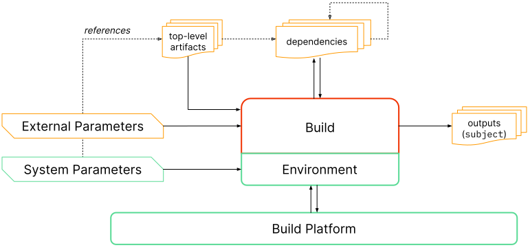

## Purpose

Describe how an artifact or set of artifacts was produced so that:

-   Consumers of the provenance can verify that the artifact was built according
    to expectations.
-   Others can rebuild the artifact, if desired.

This predicate is the recommended way to satisfy the SLSA [provenance
requirements].

## Prerequisite

Understanding of SLSA [Software Attestations](/attestation-model)
and the larger [in-toto attestation] framework.

## Model

Provenance is an attestation that the `builder` produced the `subject` software
artifacts through execution of the `buildDefinition`.



The model is as follows:

-   The build runs on a multi-tenant platform, where each execution is
    independent. The `builder` is the identity of this platform, representing
    the transitive closure of all entities that must be
    [trusted](../spec/v1.0/principles.md#trust-systems-verify-artifacts) to
    faithfully run the build and record the provenance. (Note: The same model
    can be used for platform-less or single-tenant build systems.)

-   The build process is defined by a parameterized template, identified by
    `buildType`. Often a build platform only supports a single template, e.g.
    the GitHub Actions platform only supports executing a GitHub Actions
    workflow file.

-   The external interface to the build is through `externalParameters`, which
    captures the set of top-level (i.e. independent) inputs to the build. Some
    of these parameters are references to artifacts while others are pure
    values. For example, for GitHub Actions, this would be the source repository
    (artifact reference) and path to the workflow file (value).

-   The build runs inside an environment initialized by the platform. The
    `systemParameters` capture the top-level (i.e. independent) parameters to
    this environment. These parameters are set internally by the platform,
    though they may refer to external artifacts. (The build platform may also
    communicate with the build environment through some control plane, but this
    is not captured in the provenance.)

-   Dependent artifacts may be fetched during initialization or execution of the
    build process. The `resolvedDependencies` captures these dependencies, if
    known.

-   Finally, the build process outputs one or more artifacts, identified by
    `subject`.

See [examples](#examples) for concrete examples.

> **TODO:** Align with the [Build model](../spec/v1.0/terminology.md).

> **TODO:** Limit the size of the diagram - it's too big on desktop (but fine on
> mobile). Also reimplement it in Figma so that others can edit it.

## Schema

> **TODO:** Get proper syntax highlighting for cue, and explain that this is a
> cue schema.

```javascript

```

### Parsing rules

This predicate follows the in-toto attestation [parsing rules]. Summary:

-   Consumers MUST ignore unrecognized fields.
-   The `predicateType` URI includes the major version number and will always
    change whenever there is a backwards incompatible change.
-   Minor version changes are always backwards compatible and "monotonic." Such
    changes do not update the `predicateType`.
-   Producers MAY add extension fields using field names that are URIs.
-   Optional fields MAY be unset or null, and should be treated equivalently.
    Both are equivalent to empty for _object_ or _array_ values.

### Fields

_NOTE: This section describes the fields within `predicate`. For a description
of the other top-level fields, such as `subject`, see [Statement]._

> **TODO:** Automatically parse the proto and render it directly here, rather
> than a simple inclusion of the raw schema file.

```proto

```

## Examples

> **TODO:** Move each of these definitions to a separate file that defines
> `buildType`.

> **TODO:** Use the same source repo in all examples for consistency.

> **TODO:** Automatically verify all examples against the cue schema.

### Container-based reproducible build

> **WARNING:** This is not yet finalized. So far this is an idea under
> discussion to have the provenance document the input for reproducible builds,
> where the input is a container image + entry point. We will point to the
> actual documentation once the design is ready.

> **TODO:** Move this to a separate file with a full description.

```jsonc
"predicate": {
    "buildDefinition": {
        "buildType": "https://slsa.dev/container-based-build/v0.1?draft",
        "externalParameters": {
            "artifacts": {
                // The thing to be built.
                "source": {
                    "uri": "git+https://github.com/bcoe/slsa-on-github-test@refs/heads/main",
                    "digest": { "sha1": "deadbeef" }
                },
                // The container image in which to build it.
                "buildImage": {
                    "uri": "pkg:oci/builder-image?repository_url=gcr.io",
                    "digest": { "sha256": "53ca44..." }
                },
            }
            "values": {
                "configFile": "path/to/config.file"
            }
        }
        "systemParameters": null,
        "resolvedDependencies": null,
    },
    "runDetails": {
        "builder": {
            "id":  "..whoever ran the build...",
            "builderDependencies": [
                {
                    "localName": "builderBinary",
                    "uri": "git+https://github.com/slsa-framework/slsa-github-generator@refs/tags/v1.2.0",
                    "digest": { "sha1": "bdd89e60dc5387d8f819bebc702987956bcd4913" }
                }
            ]
        }
    }
}
```

### GitHub Actions

```jsonc
"predicate": {
    "buildDefinition": {
        // TODO: Replace this with a stable URL that points to documentation,
        // not necessarily tied to this "generator".
        "buildType": "https://github.com/slsa-framework/slsa-github-generator/generic@v1",
        "externalParameters": {
            "artifacts": {
                // The repo containing the top-level workflow.
                "source": {
                    "uri": "git+https://github.com/laurentsimon/slsa-verifier-test-gen@refs/heads/main",
                    "digest": {
                        "sha1": "15bf79ea9c89fffbf5dd02c6b5b686b291bfcbd2"
                    }
                }
            },
            "values": {
                "workflow": ".github/workflow/release.yml",
                // For workflow_dispatch events, the `input` field if present.
                "input": null
            }
        },
        "systemParameters": {
            "values": {
                "github_actor": "...",
                "github_event_name": "workflow_dispatch",
                // ... and so on ...
            }
        },
        "resolvedDependencies": [
            {
                "uri": "https://github.com/actions/virtual-environments/releases/tag/ubuntu20/20220515.1"
            }
        ]
    },
    "runDetails": {
        // Provenance generated by the "SLSA GitHub Generator" reusable
        // workflow. If GitHub generated the provenance itself, the
        // buildDefinition would likely stay the same but this builder would
        // identify GitHub rather than this workflow.
        "builder": {
            "id": "https://github.com/slsa-framework/slsa-github-generator/.github/workflows/builder_generic_slsa3.yml@refs/tags/v1.2.0",
            "builderDependencies": [
                {
                    "localName": "builderBinary",
                    "uri": "git+https://github.com/slsa-framework/slsa-github-generator@refs/tags/v1.2.0",
                    "digest": { "sha1": "bdd89e60dc5387d8f819bebc702987956bcd4913" }
                }
            ]
        },
        "metadata": {
            // TODO: supply real example values here
            "invocationId": "...",
            "startedOn": "...",
            "finishedOn": "..."
        },
        "byproducts": null
    }
}
```

### GitLab CI

The GitLab CI team has implemented an [artifact attestation](https://docs.gitlab.com/ee/ci/runners/configure_runners.html#artifact-attestation) capability in their GitLab Runner 15.1 release.

> **TODO**

### Google Cloud Build

> **TODO**

### Tekton

#### Tekton task run

```jsonc
"predicate": {
   "buildDefinition": {
        "buildType": "https://tekton.dev/tekton-task/v0.1?draft",
        "externalParameters": {
            "artifacts": {
                "source": {
                    "uri": "git+https://github.com/tektoncd/catalog.git",
                    "digest": { "sha1": "962f9005350b1acb359558b6c5aafc420e0beb46" }
                }
            },
            "values": {
                "workflow": "path/to/sample_taskrun.yaml",
            }
        },
        "systemParameters": null
        "resolvedDependencies": [
            {
                // The SystemConfiguration that Tekton was configured with.
                "localName": "systemConfiguration",
                "digest": { "sha256": "..." },
                "mediaType": "... some tekton config thing? ..."
            }
        ]
    },
    "runDetails": {
        // Set by the organization running Tekton
    }
}
```

### Explicitly run commands

WARNING: This is just a proof-of-concept. It is not yet standardized.

> **TODO**

## Migrating from 0.2

To migrate from [version 0.2][0.2] (`old`), use the following pseudocode. The
meaning of each field is unchanged unless otherwise noted.

```javascript
{
    "buildDefinition": {
        // The `buildType` MUST be updated for v1.0 to describe how to
        // interpret `inputArtifacts`.
        "buildType": /* updated version of */ old.buildType,
        "externalParameters": {
            "artifacts": {
                // OPTION 1:
                // If the old `configSource` was the sole top-level input,
                // (i.e. containing the source or a pointer to the source):
                "source": {
                    "uri": old.invocation.configSource.uri,
                    "digest": old.invocation.configSource.digest,
                },
                // OPTION 2:
                // If the old `configSource` contained just build configuration
                // and a separate top-level input contained the source:
                "source": old.materials[indexOfSource],
                "config": {
                    "uri": old.invocation.configSource.uri,
                    "digest": old.invocation.configSource.digest,
                },
            },
            "values": old.invocation.parameters + {
                // It is RECOMMENDED to rename "entryPoint" to something more
                // descriptive.
                "entryPoint": old.invocation.configSource.entryPoint,
            },
        },
        "systemParameters": {
            "artifacts": null, // not in v0.2
            "values": old.invocation.environment,
        },
        "resolvedDependencies": old.materials,
    },
    "runDetails": {
        "builder": {
            "id": old.builder.id,
            "version": null,  // not in v0.2
            "builderDependencies": null,  // not in v0.2
        },
        "metadata": {
            "invocationId": old.metadata.buildInvocationId,
            "startedOn": old.metadata.buildStartedOn,
            "finishedOn": old.metadata.buildFinishedOn,
        },
        "byproducts": null,  // not in v0.2
    },
}
```

The following fields from v0.2 are no longer present in v1.0:

-   `entryPoint`: Use `externalParameters.values[<name>]` instead.
-   `buildConfig`: No longer inlined into the provenance. Instead, either:
    -   If the configuration is a top-level input, record its digest in
        `externalParameters.artifacts["config"]`.
    -   Else if there is a known use case for knowing the exact resolved
        build configuration, record its digest in `byproducts`. An example use
        case might be someone who wishes to parse the configuration to look for
        bad patterns, such as `curl | bash`.
    -   Else omit it.
-   `metadata.completeness`: Now implicit from `builder.id`.
-   `metadata.reproducible`: Now implicit from `builder.id`.

## Change history

### v1.0 (DRAFT)

Major refactor to reduce misinterpretation, including a minor change in model.

-   Significantly expanded all documentation.
-   Altered the model slightly to better align with real-world build systems,
    align with reproducible builds, and make verification easier.
-   Grouped fields into `buildDefinition` vs `runDetails`.
-   Further grouped fields into `externalParameters` vs `systemParameters`:
    -   Renamed `parameters` to `externalParameters.values`.
    -   Renamed `environment` to `systemParameters.values`.
    -   Removed `entryPoint`; now one of `externalParameters.values`.
    -   Removed `configSource`; now one of `externalParameters.artifacts`.
-   Replaced `materials` with more specific artifact-reference fields:
    `resolvedDependencies`, `externalParameters.artifacts`,
    `systemParameters.artifacts`, and `builderDependencies`.
-   Added `localName`, `downloadLocation`, and `mediaType` to artifact
    references.
-   Removed `buildConfig`; can be replaced with
    `externalParameters.artifacts["config"]`, `byproducts`, or simply omitted.
-   Removed `completeness` and `reproducible`; now implied by `builder.id`.
-   Added `builder.version`.
-   Added `byproducts`.

### v0.2

Refactored to aid clarity and added `buildConfig`. The model is unchanged.

-   Replaced `definedInMaterial` and `entryPoint` with `configSource`.
-   Renamed `recipe` to `invocation`.
-   Moved `invocation.type` to top-level `buildType`.
-   Renamed `arguments` to `parameters`.
-   Added `buildConfig`, which can be used as an alternative to `configSource`
    to validate the configuration.

### slsa.dev/provenance

Renamed to "slsa.dev/provenance".

### 0.1.1

-   Added `metadata.buildInvocationId`.

### 0.1

Initial version, named "in-toto.io/Provenance"

[0.1]: v0.1.md
[0.2]: v0.2.md
[DigestSet]: https://github.com/in-toto/attestation/blob/main/spec/field_types.md#DigestSet
[ResourceURI]: https://github.com/in-toto/attestation/blob/main/spec/field_types.md#ResourceURI
[Statement]: https://github.com/in-toto/attestation/blob/main/spec/README.md#statement
[Timestamp]: https://github.com/in-toto/attestation/blob/main/spec/field_types.md#Timestamp
[TypeURI]: https://github.com/in-toto/attestation/blob/main/spec/field_types.md#TypeURI
[in-toto attestation]: https://github.com/in-toto/attestation
[parsing rules]: https://github.com/in-toto/attestation/blob/main/spec/README.md#parsing-rules
