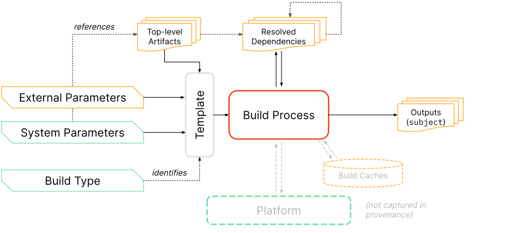

<!-- Note: We only include the major version in the URL, e.g. "v1" instead of
"v1.0", because minor versions are guaranteed to be backwards compatible. We
still include the minor version number in the selector (_data/versions.yml) so
that readers can easily find the current minor version number. -->

## Purpose

Describe how an artifact or set of artifacts was produced so that:

-   Consumers of the provenance can verify that the artifact was built according
    to expectations.
-   Others can rebuild the artifact, if desired.

This predicate is the RECOMMENDED way to satisfy the SLSA [provenance
requirements](/spec/v1.0/requirements#provenance-generation).

## Prerequisite

Understanding of SLSA [Software Attestations](/attestation-model)
and the larger [in-toto attestation] framework.

The key words "MUST", "MUST NOT", "REQUIRED", "SHALL", "SHALL NOT", "SHOULD",
"SHOULD NOT", "RECOMMENDED", "MAY", and "OPTIONAL" in this document are to be
interpreted as described in [RFC 2119](https://www.rfc-editor.org/rfc/rfc2119).

## Model

Provenance is an attestation that the `builder` produced the `subject` software
artifacts through execution of the `buildDefinition`.



The model is as follows:

-   Each build runs as an independent process on a multi-tenant platform. The
    `builder` is the identity of this platform, representing the transitive
    closure of all entities that are [trusted] to faithfully run the build and
    record the provenance. (Note: The same model can be used for platform-less
    or single-tenant build systems.)

-   The build process is defined by a parameterized template, identified by
    `buildType`. Often a build platform only supports a single build type. For
    example, the GitHub Actions platform only supports executing a GitHub
    Actions workflow file.

-   All top-level, independent inputs are captured by the parameters to the
    template. There are two types of parameters:

    -   `externalParameters`: the external interface to the build. In SLSA,
        these values are untrusted; they MUST be included in the provenance and
        MUST be verified downstream.

    -   `systemParameters`: set internally by the platform. In SLSA, these
        values are trusted because the platform is trusted; they are OPTIONAL
        and need not be verified downstream. They MAY be included to enable
        reproducible builds, debugging, or incident response.

-   All artifacts fetched during initialization or execution of the build
    process are considered dependencies, including those referenced directly by
    parameters. The `resolvedDependencies` captures these dependencies, if
    known. For example, a build that takes a git repository URI as a parameter
    might record the specific git commit that the URI resolved to as a
    dependency.

-   During execution, the build process MAY communicate with the build
    platform's control plane and/or build caches. This communication is not
    captured in the provenance but is subject to [SLSA
    Requirements](/spec/v1.0/requirements).

-   Finally, the build process outputs one or more artifacts, identified by
    `subject`.

For concrete examples, see [index of build types](#index-of-build-types).

> **TODO:** Align with the [Build model](/spec/v1.0/terminology#build-model).

## Parsing rules

This predicate follows the in-toto attestation [parsing rules]. Summary:

-   Consumers MUST ignore unrecognized fields.
-   The `predicateType` URI includes the major version number and will always
    change whenever there is a backwards incompatible change.
-   Minor version changes are always backwards compatible and "monotonic." Such
    changes do not update the `predicateType`.
-   Producers MAY add extension fields using field names that are URIs.
-   Optional fields MAY be unset or null, and SHOULD be treated equivalently.
    Both are equivalent to empty for _object_ or _array_ values.

## Schema

_NOTE: This section describes the fields within `predicate`. For a description
of the other top-level fields, such as `subject`, see [Statement]._

<!-- Note: While this happens to be a valid cue file, we're really just using it
as a human-readable summary of the schema. We don't want readers to have to
understand cue. For that reason, we are not using any special cue syntax or
features. -->

```javascript

```

<details>
<summary>Protocol buffer schema</summary>

Link: [provenance.proto](provenance.proto)

```proto

```

</details>

### Provenance

[Provenance]: #provenance

REQUIRED for SLSA Build L1: `buildDefinition`, `runDetails`

<table>
<tr><th>Field<th>Type<th>Description

<tr id="buildDefinition"><td><code>buildDefinition</code>
<td><a href="#builddefinition">BuildDefinition</a><td>

The input to the build. The accuracy and completeness are implied by `runDetails.builder.id`.

<tr id="runDetails"><td><code>runDetails</code>
<td><a href="#rundetails">RunDetails</a><td>

Details specific to this particular execution of the build.

</table>

### BuildDefinition

[BuildDefinition]: #builddefinition

REQUIRED for SLSA Build L1: `buildType`, `externalParameters`

<table>
<tr><th>Field<th>Type<th>Description

<tr id="buildType"><td><code>buildType</code>
<td>string (<a href="https://github.com/in-toto/attestation/blob/main/spec/field_types.md#TypeURI">TypeURI</a>)<td>

Identifies the template for how to perform the build and interpret the
parameters and dependencies.

The URI SHOULD resolve to a human-readable specification that includes: overall
description of the build type; schema for `externalParameters` and
`systemParameters`; unambiguous instructions for how to initiate the build given
this BuildDefinition, and a complete example. Example:
https://slsa.dev/github-actions-workflow/v0.1

<tr id="externalParameters"><td><code>externalParameters</code>
<td>object<td>

The parameters that are under external control, such as those set by a user or
tenant of the build system. They MUST be complete at SLSA Build L3, meaning that
that there is no additional mechanism for an external party to influence the
build. (At lower SLSA Build levels, the completeness MAY be best effort.)

The build system SHOULD be designed to minimize the size and complexity of
`externalParameters`, in order to reduce fragility and ease [verification].
Consumers SHOULD have an expectation of what "good" looks like; the more
information that they need to check, the harder that task becomes.

<tr id="systemParameters"><td><code>systemParameters</code>
<td>object<td>

The parameters that are under the control of the `builder`. The primary
intention of this field is for debugging, incident response, and vulnerability
management. The values here MAY be necessary for reproducing the build. There is
no need to [verify][Verification] these parameters because the build system is
already trusted, and in many cases it is not practical to do so.

<tr id="resolvedDependencies"><td><code>resolvedDependencies</code>
<td>array (<a href="#artifactreference">ArtifactReference</a>)<td>

Unordered collection of artifacts needed at build time. Completeness is best
effort, at least through SLSA Build L3. For example, if the build script fetches
and executes "example.com/foo.sh", which in turn fetches
"example.com/bar.tar.gz", then both "foo.sh" and "bar.tar.gz" SHOULD be listed
here.

</table>

The BuildDefinition describes all of the inputs to the build. It SHOULD contain
all the information necessary and sufficient to initialize the build and begin
execution.

The `externalParameters` and `systemParameters` are the top-level inputs to the
template, meaning inputs not derived from another input. Each is an arbitrary
JSON object, though it is RECOMMENDED to keep the structure simple with string
values to aid verification. The same field name SHOULD NOT be used for both
`externalParameters` and `systemParameters`.

When a parameter is a references to an artifact, such as a git commit, the
parameter SHOULD be a URI and the `resolvedDependencies` SHOULD record the same
`uri` and its resolved `digest`. For example:

```json
"externalParameters": {
    "source": "git+https://github.com/octocat/hello-world@refs/heads/main"
}
"resolvedDependencies": [{
    "uri": "git+https://github.com/octocat/hello-world@refs/heads/main",
    "digest": {"sha1": "7fd1a60b01f91b314f59955a4e4d4e80d8edf11d"}
}]
```

Guidelines:

-   Maximize the amount of information that is implicit from the meaning of
    `buildType`. In particular, any value that is boilerplate and the same
    for every build SHOULD be implicit.

-   Reduce parameters by moving configuration to input artifacts whenever
    possible. For example, instead of passing in compiler flags via an external
    parameter that has to be [verified][Verification] separately, require the
    flags to live next to the source code or build configuration so that
    verifying the latter automatically verifies the compiler flags.

-   In some cases, additional external parameters might exist that do not impact
    the behavior of the build, such as a deadline or priority. These extra
    parameters SHOULD be excluded from the provenance after careful analysis
    that they indeed pose no security impact.

-   If possible, architect the build system to use this definition as its
    sole top-level input, in order to guarantee that the information is
    sufficient to run the build.

-   When build configuration is evaluated client-side before being sent to the
    server, such as transforming version-controlled YAML into ephemeral JSON,
    some solution is needed to make [verification] practical. Consumers need a
    way to know what configuration is expected and the usual way to do that is
    to map it back to version control, but that is not possible if the server
    cannot verify the configuration's origins. Possible solutions:

    -   (RECOMMENDED) Rearchitect the build service to read configuration
        directly from version control,  recording the server-verified URI in
        `externalParameters` and the digest in `resolvedDependencies`.

    -   Record the digest in the provenance[^digest-param] and use a separate
        provenance attestation to link that digest back to version control. In
        this solution, the client-side evaluation is considered a separate
        "build" that SHOULD be independently secured using SLSA, though securing
        it can be difficult since it usually runs on an untrusted workstation.

-   The purpose of `resolvedDependencies` is to facilitate recursive analysis of
    the software supply chain. Where practical, it is valuable to record the
    URI and digest of artifacts that, if compromised, could impact the build. At
    SLSA Build L3, completeness is considered "best effort".

-   It is acceptable for a single build service to have multiple modes of
    operation, only some of which are SLSA-compatible. In this case, each mode
    SHOULD have a separate `builder.id`.

[^digest-param]: The `externalParameters` SHOULD reflect reality. If clients
    send the evaluated configuration object directly to the build server, record
    the digest directly in `externalParameters`. If clients upload the
    configuration object to a temporary storage location and send that location
    to the build server, record the location in `externalParameters` as a URI
    and record the `uri` and `digest` in `resolvedDependencies`.

> ⚠ **RFC:** We are particularly looking for feedback on this schema from
> potential implementers. Does this model map cleanly to existing build systems?
> Is it natural to identify and express the external parameters? Is anything
> confusing or ambiguous?

### ArtifactReference

[ArtifactReference]: #artifactreference

REQUIRED: at least one of `uri` or `digest`

<table>
<tr><th>Field<th>Type<th>Description

<tr id="uri"><td><code>uri</code>
<td>string (URI)<td>

URI describing where this artifact came from. When possible, this SHOULD
be a universal and stable identifier, such as a source location or Package
URL ([purl]).

<tr id="digest"><td><code>digest</code>
<td><a href="https://github.com/in-toto/attestation/blob/main/spec/field_types.md#DigestSet">DigestSet</a><td>

One or more cryptographic digests of the contents of this artifact.

**TODO:** Decide on hex vs base64 in #533 then document it here.

<tr id="localName"><td><code>localName</code>
<td>string<td>

The name for this artifact local to the build.

<tr id="downloadLocation"><td><code>downloadLocation</code>
<td>string (URI)<td>

URI identifying the location that this artifact was downloaded from, if
different and not derivable from `uri`.

<tr id="mediaType"><td><code>mediaType</code>
<td>string (<a href="https://developer.mozilla.org/en-US/docs/Web/HTTP/Basics_of_HTTP/MIME_types">MediaType</a>)<td>

Media type (aka MIME type) of this artifact was interpreted.

</table>

Example:

```json
{
    "uri": "pkg:pypi/pyyaml@6.0",
    "digest": {"sha256": "5f0689d54944564971f2811f9788218bfafb21aa20f532e6490004377dfa648f"},
    "localName": "PyYAML-6.0.tar.gz",
    "downloadLocation": "https://files.pythonhosted.org/packages/36/2b/61d51a2c4f25ef062ae3f74576b01638bebad5e045f747ff12643df63844/PyYAML-6.0.tar.gz",
    "mediaType": "application/gzip"
}
```

> ⚠ **RFC:** Do we need all these fields? Is this adding too much complexity?

### RunDetails

[RunDetails]: #rundetails

REQUIRED for SLSA Build L1: `builder` (unless `id` is implicit from the
attestation envelope)

<table>
<tr><th>Field<th>Type<th>Description

<tr id="builder"><td><code>builder</code>
<td><a href="#builder">Builder</a><td>

Identifies the entity that executed the invocation, which is trusted to have
correctly performed the operation and populated this provenance.

<tr id="metadata"><td><code>metadata</code>
<td><a href="#buildmetadata">BuildMetadata</a><td>

Metadata about this particular execution of the build.

<tr id="byproducts"><td><code>byproducts</code>
<td>array (<a href="#artifactreference">ArtifactReference</a>)<td>

Additional artifacts generated during the build that are not considered
the "output" of the build but that might be needed during debugging or incident
response. For example, this might reference logs generated during the build
and/or a digest of the fully evaluated build configuration.

In most cases, this SHOULD NOT contain all intermediate files generated during
the build. Instead, this SHOULD only contain files that are likely to be useful
later and that cannot be easily reproduced.

**TODO:** Do we need some recommendation for how to distinguish between
byproducts, such as using `localName`?

</table>

### Builder

[Builder]: #builder

REQUIRED for SLSA Build L1: `id` (unless implicit from the attestation envelope)

<table>
<tr><th>Field<th>Type<th>Description

<tr id="builder.id"><td><code>id</code>
<td>string (<a href="https://github.com/in-toto/attestation/blob/main/spec/field_types.md#TypeURI">TypeURI</a>)<td>

URI indicating the transitive closure of the trusted builder.

**TODO:** In most cases this is implicit from the envelope layer (e.g. the
public key or x.509 certificate), which is just one more thing to mess up. Can
we rescope this to avoid the duplication and thus the security concern? For
example, if the envelope identifies the build system, this might identify the
tenant project?

**TODO:** Provide guidance on how to choose a URI, what scope it SHOULD have,
stability, how [verification] works, etc.

<tr id="builder.version"><td><code>version</code>
<td>map (string→string)<td>

Version numbers of components of the builder.

<tr id="builderDependencies"><td><code>builderDependencies</code>
<td>array (<a href="#artifactreference">ArtifactReference</a>)<td>

Dependencies used by the orchestrator that are not run within the workload and
that do not affect the build, but might affect the provenance generation or
security guarantees.

**TODO:** Flesh out this model more.

</table>

The builder represents the transitive closure of all the entities that are, by
necessity, [trusted] to faithfully run the build and record the provenance.

The `id` MUST reflect the trust base that consumers care about. How detailed to
be is a judgement call. For example, GitHub Actions supports both GitHub-hosted
runners and self-hosted runners. The GitHub-hosted runner might be a single
identity because it's all GitHub from the consumer's perspective. Meanwhile,
each self-hosted runner might have its own identity because not all runners are
trusted by all consumers.

Consumers MUST accept only specific signer-builder pairs. For example, "GitHub"
can sign provenance for the "GitHub Actions" builder, and "Google" can sign
provenance for the "Google Cloud Build" builder, but "GitHub" cannot sign for
the "Google Cloud Build" builder.

Design rationale: The builder is distinct from the signer in order to support
the case where one signer generates attestations for more than one builder, as
in the GitHub Actions example above. The field is REQUIRED, even if it is
implicit from the signer, to aid readability and debugging. It is an object to
allow additional fields in the future, in case one URI is not sufficient.

> ⚠ **RFC:** Should we just allow builders to set arbitrary properties, rather
> than calling out `version` and `builderDependencies`? We don't expect
> verifiers to use any of them, so maybe that's the simpler approach? Or have a
> `properties` that is an arbitrary object? (#319)

> ⚠ **RFC:** Do we want/need to identify the tenant of the build system,
> separately from the build system itself? If so, a single `id`
> that combines both (e.g.
> `https://builder.example/tenants/company1.example/project1`) or two separate
> fields (e.g. `{"id": "https://builder.example", "tenant":
> "https://company1.example/project1"}`)? What would the use case be for this?
> How does [verification] work?

### BuildMetadata

[BuildMetadata]: #buildmetadata

REQUIRED: (none)

<table>
<tr><th>Field<th>Type<th>Description

<tr id="invocationId"><td><code>invocationId</code>
<td>string<td>

Identifies this particular build invocation, which can be useful for finding
associated logs or other ad-hoc analysis. The exact meaning and format is
defined by `builder.id`; by default it is treated as opaque and case-sensitive.
The value SHOULD be globally unique.

<tr id="startedOn"><td><code>startedOn</code>
<td>string (<a href="https://github.com/in-toto/attestation/blob/main/spec/field_types.md#Timestamp">Timestamp</a>)<td>

The timestamp of when the build started.

<tr id="finishedOn"><td><code>finishedOn</code>
<td>string (<a href="https://github.com/in-toto/attestation/blob/main/spec/field_types.md#Timestamp">Timestamp</a>)<td>

The timestamp of when the build completed.

</table>

## Verification

[Verification]: #verification

> **TODO:** Describe how clients are expected to verify the provenance.

## Index of build types

The following is an partial index of build type definitions. Each contains a
complete example predicate.

-   [GitHub Actions Workflow]

[GitHub Actions Workflow]: /github-actions-workflow/v0.1/

**TODO:** Before marking the spec stable, add at least 1-2 other build types to
validate that the design is general enough to apply to other builders.

## Migrating from 0.2

To migrate from [version 0.2](../v0.2) (`old`), use the following pseudocode.
The meaning of each field is unchanged unless otherwise noted.

```javascript
{
    "buildDefinition": {
        // The `buildType` MUST be updated for v1.0 to describe how to
        // interpret `inputArtifacts`.
        "buildType": /* updated version of */ old.buildType,
        "externalParameters":
            old.invocation.parameters + {
            // It is RECOMMENDED to rename "entryPoint" to something more
            // descriptive.
            "entryPoint": old.invocation.configSource.entryPoint,
            // It is OPTIONAL to rename "source" to something more descriptive,
            // especially if "source" is ambiguous or confusing.
            "source": old.invocation.configSource.uri,
        },
        "systemParameters": {
            "artifacts": null, // not in v0.2
            "values": old.invocation.environment,
        },
        "resolvedDependencies":
            old.materials + [
            {
                "uri": old.invocation.configSource.uri,
                "digest": old.invocation.configSource.digest,
            }
        ]
    },
    "runDetails": {
        "builder": {
            "id": old.builder.id,
            "version": null,  // not in v0.2
            "builderDependencies": null,  // not in v0.2
        },
        "metadata": {
            "invocationId": old.metadata.buildInvocationId,
            "startedOn": old.metadata.buildStartedOn,
            "finishedOn": old.metadata.buildFinishedOn,
        },
        "byproducts": null,  // not in v0.2
    },
}
```

The following fields from v0.2 are no longer present in v1.0:

-   `entryPoint`: Use `externalParameters[<name>]` instead.
-   `buildConfig`: No longer inlined into the provenance. Instead, either:
    -   If the configuration is a top-level input, record its digest in
        `externalParameters["config"]`.
    -   Else if there is a known use case for knowing the exact resolved
        build configuration, record its digest in `byproducts`. An example use
        case might be someone who wishes to parse the configuration to look for
        bad patterns, such as `curl | bash`.
    -   Else omit it.
-   `metadata.completeness`: Now implicit from `builder.id`.
-   `metadata.reproducible`: Now implicit from `builder.id`.

## Change history

### v1.0 (DRAFT)

Major refactor to reduce misinterpretation, including a minor change in model.

-   Significantly expanded all documentation.
-   Altered the model slightly to better align with real-world build systems,
    align with reproducible builds, and make verification easier.
-   Grouped fields into `buildDefinition` vs `runDetails`.
-   Renamed, with slight changes in semantics:
    -   `parameters` -> `externalParameters`
    -   `environment` -> `systemParameters`
    -   `materials` -> `resolvedDependencies`
-   Removed:
    -   `configSource`: No longer special-cased. Now represented as
        `externalParameters`  + `resolvedDependencies`.
    -   `buildConfig`: No longer inlined into the provenance. Can be replaced
        with a reference in `externalParameters` or `byproducts`, depending on
        the semantics, or omitted if not needed.
    -   `completeness` and `reproducible`: Now implied by `builder.id`.
-   Added:
    -   `localName`, `downloadLocation`, and `mediaType`
    -   `builder.version`
    -   `byproducts`

### v0.2

Refactored to aid clarity and added `buildConfig`. The model is unchanged.

-   Replaced `definedInMaterial` and `entryPoint` with `configSource`.
-   Renamed `recipe` to `invocation`.
-   Moved `invocation.type` to top-level `buildType`.
-   Renamed `arguments` to `parameters`.
-   Added `buildConfig`, which can be used as an alternative to `configSource`
    to validate the configuration.

### rename: slsa.dev/provenance

Renamed to "slsa.dev/provenance".

### v0.1.1

-   Added `metadata.buildInvocationId`.

### v0.1

Initial version, named "in-toto.io/Provenance"

[Statement]: https://github.com/in-toto/attestation/blob/main/spec/README.md#statement
[DigestSet]: https://github.com/in-toto/attestation/blob/main/spec/field_types.md#DigestSet
[in-toto attestation]: https://github.com/in-toto/attestation
[parsing rules]: https://github.com/in-toto/attestation/blob/main/spec/README.md#parsing-rules
[purl]: https://github.com/package-url/purl-spec
[trusted]: /spec/v1.0/principles#trust-systems-verify-artifacts
