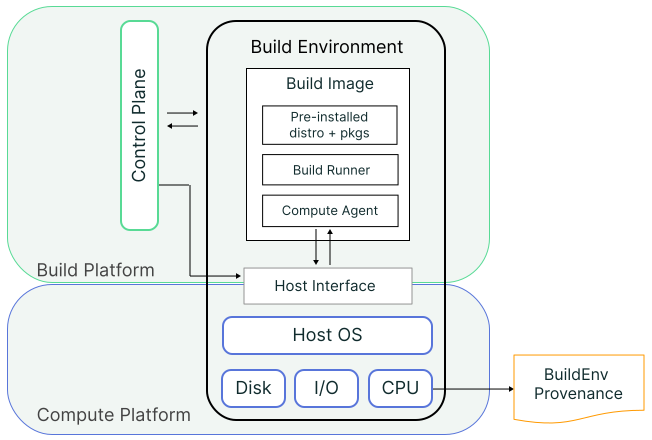

## Rationale

Today's hosted [build platforms] play a central role in an artifact's supply
chain. Whether it's a cloud-hosted service like GitHub Actions or an internal
enterprise CI/CD system, the build platform has a privileged level of access
to artifacts and sensitive operations during a build (e.g., access to
producer secrets, provenance signing).

This central and privileged role makes hosted build platforms an attractive
target for supply chain attackers. But even with strong economic and
reputational incentives to mitigate these risks, it's very challenging to
implement and operate fully secure build platforms because they are made up
of many layers of interconnected components and subsystems.

The SLSA Build Environment track aims to address these issues by making it
possible to validate the integrity and trace the [provenance] of core build
platform components.

## Track overview

The SLSA Build Environment (BuildEnv) track describes increasing levels of
integrity and trustworthiness of the provenance of a build's
execution context. In this track, provenance describes how a build image
was created, how the hosted build platform deployed a build image in its
environment, and the compute platform they used.

| Track/Level   | Requirements | Focus | Trust Root
| ------------- | ------------ | ----- | ----------
| [BuildEnv L0] | (none)       | (n/a) | (n/a)
| [BuildEnv L1] | Signed build image provenance exists | Tampering during build image distribution | Signed build image provenance
| [BuildEnv L2] | Attested build environment instantiation | Tampering via the build platform's control plane | The compute platform's host interface
| [BuildEnv L3] | Hardware-attested build environment | Tampering via the compute platform's host interface | The compute platform's hardware

> :warning:
> The Build Environment track L1+ currently requires a [hosted] build platform.
> A future version of this track may generalize requirements to cover bare-metal
> build environments.

> :grey_exclamation:
> We may consider the addition of an L4 to the Build Environment track, which
> covers hardware-attested runtime integrity checking during a build.

### Build environment model

The Build Environment (BuildEnv) track expands upon the
[build model](terminology#build-model) by explicitly separating the
[build image](terminology#build-image) and [compute platform](#compute-platform) from the
abstract [build environment](#build-environment) and [build platform](terminology#platform).
Specifically, the BuildEnv track defines the following roles, components, and concepts:

| Primary Term | Description
| --- | ---
| Build ID | An immutable identifier assigned uniquely to a specific execution of a tenant's build. In practice, the build ID may be an identifier, such as a UUID, associated with the build execution.
| Build image | The template for a build environment, such as a VM or container image. Individual components of a build image include the root filesystem, pre-installed guest OS and packages, the build executor, and the build agent.
| Build image producer | The party that creates and distributes build images. In practice, the build image producer may be the hosted build platform or a third party in a bring-your-own (BYO) build image setting.
| Build agent | A build platform-provided program that interfaces with the build platform's control plane from within a running build environment. The build agent is also responsible for executing the tenant’s build definition, i.e., running the build. In practice, the build agent may be loaded into the build environment after instantiation, and may consist of multiple components. All build agent components must be measured along with the build image.
| Build dispatch | The process of assigning a tenant's build to a pre-deployed build environment on a hosted build platform.
| Compute platform | The compute system and infrastructure underlying a build platform, i.e., the host system (hypervisor and/or OS) and hardware. In practice, the compute platform and the build platform may be managed by the same or distinct organizations.
| Host interface | The component in the compute platform that the hosted build platform uses to request resources for deploying new build environments, i.e., the VMM/hypervisor or container orchestrator.
| Boot process | In the context of builds, the process of loading and executing the layers of firmware and/or software needed to start up a build environment on the host compute platform.
| Measurement | The cryptographic hash of some component or system state in the build environment, including software binaries, configuration, or initialized run-time data.
| Quote | (Virtual) hardware-signed data that contains one or more (virtual) hardware-generated measurements. Quotes may additionally include nonces for replay protection, firmware information, or other platform metadata. (Based on the definition in [section 9.5.3.1](https://trustedcomputinggroup.org/wp-content/uploads/TPM-2.0-1.83-Part-1-Architecture.pdf) of the TPM 2.0 spec)
| Reference value | A specific measurement used as the good known value for a given build environment component or state.

**TODO:** Disambiguate similar terms (e.g., image, build job, build executor/runner)

#### Build environment lifecycle

A typical build environment will go through the following lifecycle:

1.  *Build image creation*: A [build image producer](#build-image-producer)
    creates different [build images](#build-image) through a dedicated build
 process. For the SLSA BuildEnv track, the build image producer outputs
 [provenance](terminology#provenance) describing this process.
2.  *Build environment instantiation*: The [hosted build platform](terminology#platform)
    calls into the [host interface](#host-interface) to create a new instance
 of a build environment from a given build image. The
 [build agent](#build-agent) begins to wait for an incoming
 [build dispatch](#build-dispatch).
 For the SLSA BuildEnv track, the host interface in the compute platform
 attests to the integrity of the environment's initial state during its
 [boot process](#boot-process).
3.  *Build dispatch*: When the tenant dispatches a new build, the hosted
    build platform assigns the build to a created build environment.
    For the SLSA BuildEnv track, the build platform attests to the binding
 between a build environment and [build ID](#build-id).
4.  *Build execution*: Finally, the build agent within the environment executes
    the tenant's build definition.

### Build environment threats

SLSA [Build track] defines requirements for the provenance that is generated for the build artifacts. Trustworthiness of the build provenance largely depends on the trustworthiness of the [build environment] the build runs in. Build track assumes full trust into the [Build Platform] providing no solutions to verify integrity of the build environment. BuildEnv track intends to close this gap.

Build environment is bootstrapped from a [build image], which is expected to be an artifact of a SLSA build pipeline. Build platform verifies image provenance upon starting up the environment and provides evidence to the tenant.

Bootstrapping the build environment is a complex process, especially at higher SLSA levels. [Build L3] usually requires significant changes to existing build platforms to maintain ephemeral build environments. It is not uncommon for the build platforms to rely on public cloud providers for managing compute resources that power build environments. This in turn might significantly increase attack surface because added build platform dependencies effectively become part of the [TCB].

BuildEnv track addresses TCB size concerns at [BuildEnv L2] and [BuildEnv L3] levels. [BuildEnv L1] level assumes full trust into the Build Platform including underlying [Compute Platform] (eg. public cloud provider). BuildEnv L2 level adds capabilities for verifying Compute Platform. BuildEnv L3 level removes Compute Platform from TCB rooting the trust into the hardware.

This diagram outlines the lifetime of a build image between it being generated and used for creating a build environment. Build Image could be compromised at different times (components). Higher SLSA levels secure the build environment from a larger amount of threats.

flowchart LR    
      BuildImage>Build Image] ---> |L1|BuildPlatform[[Build Platform]]
      BuildPlatform[[Build Platform]] ---> |L2|ComputeProvider[[Compute Provider]]
      ComputeProvider[[Compute Provider]] ---> |L3|BuildEnvironment[(Build Environment)]

[BuildEnv L1] protects from threats that happened to the build image in between generating it and passing to the Build Platform. This covers cases of unauthorized modifications happening to the image as it is distributed (potentially via untrusted channels).

[BuildEnv L2] level protects from threats occurring at the Build Platform side as it interacts with the Compute Platform for actually creating a build environment. [Control plane] is the only Build Platform component that is considered trusted at L2 as it performs remote attestation of the build environment.

[BuildEnv L3] level protects from threats coming from the Compute Platform. It requires build running in a trusted execution environment using technologies like [AMD SEV] and [Intel TDX]. Compute platform is considered untrusted at L3 with the trust rooted into hardware.

NOTE: [Control Plane] is considered trusted at L2 and L3 as it performs remote attestation of the build environment. Build platforms MAY provide capabilities that let tenants perform remote attestation themselves. However, for the Control Plane to be considered untrusted it should have no back-door access to the build environment (e.g. via SSH). Besides, Control Plane provides input data to the build environment (i.e. build request message) and security risks associated with compromising inputs have to be considered as well.

For the example threats refer to the [Build Threats] section

## BuildEnv levels

The primary purpose of the Build Environment (BuildEnv) track is to enable
auditing that a build was run in the expected [execution context].

The lowest level only requires SLSA [Build L2] Provenance to
exist for the [build image], while higher levels provide increasing
auditability of the build environment's properties and integrity of the
generated provenance attestations. The highest levels introduce further
requirements for hardware-assisted hardening of the [compute platform]
aimed at reducing the trusted computing base of a build.

Software producers and third-party auditors can check attestations generated
by the [build image producer] and build platform against the expected
properties for a given build environment. This enables any party to detect
[several classes] of supply chain threats originating in the build
environment.

As in the Build track, the exact implementation of this track is determined
by the build platform implementer, whether they are a commercial CI/CD service
or enterprise organization. While this track describes general minimum
requirements, this track does not dictate the following
implementation-specific details: the type of build environment, accepted
attestation formats, the type of technologies used to meet L3 requirements,
how attestations are distributed, how build environments are identified, and
what happens on failure.

<section id="environment-l0">

### BuildEnv L0: No guarantees

<dl class="as-table">
<dt>Summary<dd>

No requirements---L0 represents the lack of any sort of build environment
provenance.

<dt>Intended for<dd>

Development or test builds of software that are built and run on a local
machine, such as unit tests.

<dt>Requirements<dd>

n/a

<dt>Benefits<dd>

n/a

</dl>
</section>

<section id="buildenv-l1">

### BuildEnv L1: Signed build image provenance exists

<dl class="as-table">
<dt>Summary<dd>

The build image (i.e., VM or container image) used to instantiate the build
environment has SLSA Build Provenance showing how the image was built.

<dt>Intended for<dd>

Build platforms and organizations wanting to ensure a baseline level of
integrity for build environments at the time of build image distribution.

<dt>Requirements<dd>

-   Build Image Producer:
    -   MUST automatically generate SLSA [Build L2] or higher
    Provenance for created build images (i.e., VM or container images).
    -   MUST allow independent automatic verification of a build image's [SLSA
    Build Provenance]. If the build image artifact cannot be published, for
    example due to intellectual property concerns, an attestation asserting the
    expected hash value of the build image MUST be generated and distributed
    instead (e.g., using [SCAI] or a [Release Attestation]). If the full Build
    Provenance document cannot be disclosed, a [VSA] asserting the build
    image's SLSA Provenance MUST be distributed instead.

-   Build Platform:
    -   MUST meet SLSA [Build L2] requirements.
    -   Prior to the instantiation of a new build environment, the SLSA
    Provenance for the selected build image MUST be automatically verified.
    A signed attestation to the result of the SLSA Provenance verification
    MUST be generated and distributed (e.g., via a [VSA]).

<dt>Benefits<dd>

Provides evidence that a build image was built from the advertised
source and build process.

</dl>

</section>
<section id="buildenv-l2">

### BuildEnv L2: Attested build environment instantiation

<dl class="as-table">
<dt>Summary<dd>

The build environment is measured and authenticated by the compute platform
upon instantiation, attesting to the integrity of the initial state
of the environment prior to executing a build.

<dt>Intended for<dd>

Organizations wanting to ensure that their build started from
a clean, known good state.

<dt>Requirements<dd>

All of [BuildEnv L1], plus:

-   Build Image Producer:
    -   Build images MUST be created via a SLSA [Build L3] or higher build
    process.
    -   MUST automatically generate and distribute signed [reference values]
    for the following build image components: bootloader or equivalent,
    guest kernel, [build agent], and root filesystem (e.g., via the image's
    SLSA Provenance, or [SCAI]).
    Additional build image components whose initial state is to be checked
    MAY be also measured.
    -   The build agent MUST be capable of:
        -   Upon completion of the [boot process]: Automatically interfacing
        with the host interface to obtain and transmit a signed quote for the
        build environment's system state.
        -   Upon build dispatch: Automatically generating and distributing
        a signed attestation that binds its boot process quote to the
        assigned build ID (e.g., using [SCAI]).

-   Build Platform Requirements:
    -   MUST meet SLSA [Build L3] requirements.
    -   Prior to dispatching a tenant's build to an instantiated environment,
    a signed [quote] MUST be automatically requested from the build agent,
    and the contained [measurements] verified against their boot process
    reference values. A signed attestation to the result of the verification
    MUST be generated and distributed (e.g., via a [VSA]).

-   Compute Platform Requirements:
    -   The [host interface] MUST be capable of generating signed quotes for
    the build environment's system state.
    In a VM-based environment, this MUST be achieved by enabling a feature
    like [vTPM], or equivalent, in the hypervisor.
    For container-based environments, the container orchestrator MAY need
    modifications to produce these attestations.
    -   The host interface MUST validate the measurements of the build image
    components against their signed references values during the build
    environment's boot process.
    In a VM-based environment, this MUST be achieved by enabling a process
    like [Secure Boot], or equivalent, in the hypervisor.
    For container-based environments, the container orchestrator MAY need
    modifications to perform these checks.[^1]
    -   Prior to instantiating a new build environment, the host interface
    MUST automatically verify the SLSA Provenance for the selected build
    image. A signed attestation to the verification of the build image's
    SLSA Provenance MUST be automatically generated and distributed (e.g.,
    via a [VSA]).

<dt>Benefits<dd>

Provides evidence that a build environment deployed by a hosted build
platform was instantiated from the expected build image and is at the
expected initial state, even in the face of a build platform-level
adversary.

</dl>

</section>
<section id="buildenv-l3">

### BuildEnv L3: Hardware-attested build environment

<dl class="as-table">
<dt>Summary<dd>

The initial state of the build's host environment is measured
and authenticated by trusted hardware, attesting to the integrity
of the build environment's underlying compute stack prior to executing
a build.

<dt>Intended for<dd>

Organizations wanting strong assurances that their build ran on a good
known host environment.

<dt>Requirements<dd>

All of [BuildEnv L2], plus:

-   Build Image Producer:
    -   Upon completion of the boot process: The build agent MUST be capable
    of automatically interfacing with the *trusted hardware* component to
    obtain a signed quote for the host interface's boot process and
    the environment's system state.
    -   Upon build dispatch: The generated dispatch attestation MUST include
    the host interface's boot process quote.

-   Build Platform Requirements:
    -   Prior to dispatching a tenant's build to an instantiated environment,
    the measurements in the *host interface's* boot process quote MUST be
    automatically verified against their reference values.
    A signed attestation to the result of the verification MUST be generated
    and distributed (e.g., via a [VSA]).

-   Compute Platform Requirements:
    -   MUST have trusted hardware capabilities, i.e., built-in physical
    hardware features for generating measurements and quotes for its system
    state. This SHOULD be achieved using a feature like [TPM],
    [confidential computing], or equivalent.
    -   MUST enable validation of the host interface's boot process against
    its reference values. This MUST be achieved by enabling a process
    like [Secure Boot], or equivalent, in the host platform.

<dt>Benefits<dd>

Provides hardware-authenticated evidence that a build ran in the expected
host environment, even in the face of a compromised host interface
(hypervisor/container orchestrator).

</dl>

</section>

## Considerations for Distributed Builds

TODO

<!-- Footnotes -->

[^1]: Since containers are executed as processes on the host platform they do not contain a traditional bootloader that starts up the execution context.

<!-- Link definitions -->

[Build track]: levels.md#build-track
[Build L1]: levels.md#build-l1
[Build L2]: levels.md#build-l2
[Build L3]: levels.md#build-l3
[BuildEnv L0]: #buildenv-l0
[BuildEnv L1]: #buildenv-l1
[BuildEnv L2]: #buildenv-l2
[BuildEnv L3]: #buildenv-l3
[Control plane]: terminology.md#control-plane
[dm-verity]: https://docs.kernel.org/admin-guide/device-mapper/verity.html
[Release Attestation]: https://github.com/in-toto/attestation/blob/main/spec/predicates/release.md
[SCAI]: https://github.com/in-toto/attestation/blob/main/spec/predicates/scai.md
[Secure Boot]: https://wiki.debian.org/SecureBoot#What_is_UEFI_Secure_Boot.3F
[SLSA Build Provenance]: provenance.md
[TPM]: https://trustedcomputinggroup.org/resource/tpm-library-specification/
[VSA]: verification_summary.md
[build image]: #build-image
[confidential computing]: https://confidentialcomputing.io/wp-content/uploads/sites/10/2023/03/Common-Terminology-for-Confidential-Computing.pdf
[execution context]: terminology.md#build-environment
[hosted]: requirements.md#isolation-strength
[boot process]:  #boot-process
[build agent]: #build-agent
[build environment]: terminology.md#build-environment
[build image producer]: #build-image-producer
[build platform]: terminology.md#platform
[build platforms]: terminology.md#platform
[compute platform]: #compute-platform
[host interface]: #host-interface
[measurement]: #measurement
[provenance]: terminology.md#provenance
[quote]: #quote
[reference values]: #reference-value
[several classes]: #build-environment-threats
[vTPM]: https://trustedcomputinggroup.org/about/what-is-a-virtual-trusted-platform-module-vtpm/
[AMD SEV]: https://www.amd.com/en/developer/sev.html
[Intel TDX]: https://www.intel.com/content/www/us/en/developer/tools/trust-domain-extensions/overview.html
[TCB]: https://csrc.nist.gov/glossary/term/trusted_computing_base
[Build Threats]: threats.md#build-threats