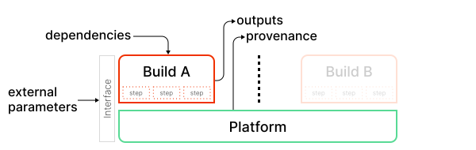

Before diving into the [SLSA Levels](levels.md), we need to establish a core set
of terminology and models to describe what we're protecting.

## TODO: Terms we still need to define

> **TODO:** Define these terms before the v1.0 release.

-   Ecosystem
-   Project

## Software supply chain

SLSA's framework addresses every step of the software supply chain - the
sequence of steps resulting in the creation of an artifact. We represent a
supply chain as a [directed acyclic graph] of sources, builds, dependencies, and
packages. One artifact's supply chain is a combination of its dependencies'
supply chains plus its own sources and builds.

[directed acyclic graph]: https://en.wikipedia.org/wiki/Directed_acyclic_graph

| Term | Description | Example |
| --- | --- | --- |
| Artifact | An immutable blob of data; primarily refers to software, but SLSA can be used for any artifact. | A file, a git commit, a directory of files (serialized in some way), a container image, a firmware image. |
| Attestation | An authenticated statement (metadata) about a software artifact or collection of software artifacts. | A signed [SLSA Provenance] file. |
| Source | Artifact that was directly authored or reviewed by persons, without modification. It is the beginning of the supply chain; we do not trace the provenance back any further. | Git commit (source) hosted on GitHub (platform). |
| [Build] | Process that transforms a set of input artifacts into a set of output artifacts. The inputs may be sources, dependencies, or ephemeral build outputs. | .travis.yml (process) run by Travis CI (platform). |
| Package | Artifact that is "published" for use by others. In the model, it is always the output of a build process, though that build process can be a no-op. | Docker image (package) distributed on DockerHub (platform). A ZIP file containing source code is a package, not a source, because it is built from some other source, such as a git commit. |
| Dependency | Artifact that is an input to a build process but that is not a source. In the model, it is always a package. | Alpine package (package) distributed on Alpine Linux (platform). |

[build]: #build-model
[SLSA Provenance]: /provenance/v1

### Build model

We model a build as running on a multi-tenant platform, where each execution is
independent. A tenant defines the build by specifying parameters through some
sort of external interface, often including a reference to a configuration file
in source control. The platform then runs the build by interpreting the
parameters, fetching some initial set of dependencies, initializing the build
environment, and then starting execution. The build then performs arbitrary
steps, possibly fetching additional dependencies, and outputs one or more
artifacts. Finally, for SLSA Build L2+, the platform outputs provenance
describing this whole process.

| Primary Term | Description
| --- | ---
| Platform | System that allows tenants to run builds. Technically, it is the transitive closure of software and services that must be trusted to faithfully execute the build.
| Build | Process that converts input sources and dependencies into output artifacts, defined by the tenant and executed within a single environment on a platform.
| Steps | The set of actions that comprise a build, defined by the tenant.
| Environment | Machine, container, VM, or similar in which the build runs, initialized by the platform. In the case of a distributed build, this is the collection of all such machines/containers/VMs that run steps.
| External parameters | The set of top-level, independent inputs to the build, specified by a tenant and used by the platform to initialize the build.
| Dependencies | Artifacts fetched during initialization or execution of the build process, such as configuration files, source artifacts, or build tools.
| Outputs | Collection of artifacts produced by the build.
| Provenance | Attestation (metadata) describing how the outputs were produced, including identification of the platform and external parameters.

Notably, there is no formal notion of "source" in the build model, just
parameters and dependencies. Most build platforms have an explicit "source"
artifact to be built, which is often a git repository; in the build model, the
reference to this artifact is a parameter while the artifact itself is a
dependency.

For examples on how this model applies to real-world build systems, see [index
of build types](/provenance/v1#index-of-build-types).

### Verification model

Verification in SLSA is performed in two ways. Firstly, the build system is
certified to ensure conformance with the requirements at the level claimed by
the build system. This certification should happen on a recurring cadence with
the outcomes published by the platform operator for their users to review and
make informed decisions about which builders to trust.

Secondly, artifacts are verified to ensure they meet the producer defined
expectations of where the package source code was retrieved from and on what
build system the package was built.

| Term         | Description |
|--------------|---- |
| Expectations | A set of constraints on the package's provenance metadata. The package producer sets expectations for a package, whether explicitly or implicitly. |
| Provenance verification | Artifacts are verified by the package ecosystem to ensure that the package's expectations are met before the package is used. |
| Build system certification | [Build systems are certified](verifying-systems.md) for their conformance to the SLSA requirements at the stated level. |

The examples below suggest some ways that expectations and verification may be
implemented for different, broadly defined, package ecosystems.

Example: Small software team

| Term | Example |
| ---- | ------- |
| Expectations | Defined by the producer's security personnel and stored in a database. |
| Provenance verification | Performed automatically on cluster nodes before execution by querying the expectations database. |
| Build system certification | The build system implementer follows secure design and development best practices, does annual penetration testing exercises, and self-certifies their conformance to SLSA requirements. |

Example: Open source language distribution

| Term | Example |
| ---- | ------- |
| Expectations | Defined separately for each package and stored in the package registry. |
| Provenance verification | The language distribution registry verifies newly uploaded packages meet expectations before publishing them. Further, the package manager client also verifies expectations prior to installing packages. |
| Build system certification | Performed by the language ecosystem packaging authority. |

