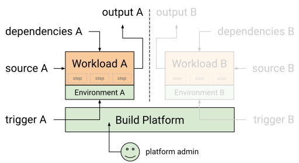

Before diving into the [SLSA Levels](levels.md), we need to establish a core set
of terminology and models to describe what we're protecting.

## TODO: Terms we still need to define

> **TODO:** Define these terms before the v1.0 release.

-   Ecosystem
-   Project
-   Attestation
-   Provenance

## Software supply chain

SLSA's framework addresses every step of the software supply chain - the
sequence of steps resulting in the creation of an artifact. We represent a
supply chain as a [directed acyclic graph] of sources, builds, dependencies, and
packages. One artifact's supply chain is a combination of its dependencies'
supply chains plus its own sources and builds.

[directed acyclic graph]: https://en.wikipedia.org/wiki/Directed_acyclic_graph

| Term | Description | Example |
| --- | --- | --- |
| Attestation | The process of providing a digital signature for a set of measurements securely stored in hardware, and then having the requester validate the signature and the set of measurements. |
| Artifact | An immutable blob of data; primarily refers to software, but SLSA can be used for any artifact. | A file, a git commit, a directory of files (serialized in some way), a container image, a firmware image. |
| [Build] | Process that transforms a set of input artifacts into a set of output artifacts. The inputs may be sources, dependencies, or ephemeral build outputs. | .travis.yml (process) run by Travis CI (platform). |
| Dependency | Artifact that is an input to a build process but that is not a source. In the model, it is always a package. | Alpine package (package) distributed on Alpine Linux (platform). |
| Ecosystem | Environment where the software is tightly integrated with other systems, technologies, infrastructure, and domains (people, organizations and external environments) and where it is configured to support local clinical and business processes. |
| Package | Artifact that is "published" for use by others. In the model, it is always the output of a build process, though that build process can be a no-op. | Docker image (package) distributed on DockerHub (platform). A ZIP file containing source code is a package, not a source, because it is built from some other source, such as a git commit. |
| Project | Endeavor with defined start and finish criteria undertaken to create a product or service in accordance with specified resources and requirements. |
| Provenance | The chronology of the origin, development, ownership, location, and changes to a system or system component and associated data. |
| Source | Artifact that was directly authored or reviewed by persons, without modification. It is the beginning of the supply chain; we do not trace the provenance back any further. | Git commit (source) hosted on GitHub (platform). |

[build]: #build-model

### Build model

We model a build as running on a multi-tenant platform, where each execution is
independent. A tenant defines the build, including the input source artifact and
the steps to execute. In response to an external trigger, the platform runs the
build by initializing the environment, fetching the source and possibly some
dependencies, and then starting execution inside the environment. The build then
performs arbitrary steps, possibly fetching additional dependencies, and outputs
one or more artifacts.

| Term | Description
| --- | ---
| Admin | Person with administrative access to the platform, potentially allowing them to tamper with the build process or access secret material.
| Build | Process that converts input sources and dependencies into output artifacts, defined by the tenant and executed within a single environment.
| Dependencies | Additional input artifacts required by the build.
| Environment | Machine, container, VM, or similar in which the build runs, initialized by the platform. In the case of a distributed build, this is the collection of all such machines/containers/VMs that run steps.
| Outputs | Collection of artifacts produced by the build.
| Platform | System that allows tenants to run build. Technically, it is the transitive closure of software and services that must be trusted to faithfully execute the build.
| Service | A platform that is hosted, not a developer's machine. (Term used in [requirements](requirements.md).)
| Source | Top-level input artifact required by the build.
| Steps | The set of actions that comprise a build, defined by the tenant.
| Trigger | External event or request causing the platform to run the build.

Example: GitHub Actions

| Term         | Example
| ------------ | -------
| Admin        | GitHub personnel
| Build        | Workflow or job (either would be OK)
| Dependencies | any other artifacts fetched during execution
| Environment  | [`runs-on`]
| Platform     | [GitHub Actions] + runner + runner's dependent services
| Source       | git commit defining the workflow
| Steps        | [`steps`]
| Trigger      | [workflow trigger]

[GitHub Actions]: https://docs.github.com/en/actions
[`runs-on`]: https://docs.github.com/en/actions/using-workflows/workflow-syntax-for-github-actions#jobsjob_idruns-on
[`steps`]: https://docs.github.com/en/actions/using-workflows/workflow-syntax-for-github-actions#jobsjob_idsteps
[workflow trigger]: https://docs.github.com/en/actions/using-workflows/triggering-a-workflow

Example: Distributed Bazel Builds

Suppose a [Bazel] build runs on GitHub Actions using Bazel's [remote execution]
feature. Some steps (namely `bazel` itself) run on a GitHub Actions runner while
other steps (Bazel actions) run on a remote execution service.

In this case, the build's **environment** is the union of the GitHub Actions
runner environment plus the remote execution environment.

[Bazel]: https://bazel.build
[remote execution]: https://bazel.build/docs/remote-execution

Example: Local Builds

The model can still work for the case of a developer building on their local
workstation, though this does not meet SLSA 2+.

| Term         | Example
| ------------ | -------
| Admin        | developer
| Build        | whatever they ran
| Environment  | developer's workstation
| Platform     | developer's workstation
| Steps        | whatever they ran
| Trigger      | commands that the developer ran

