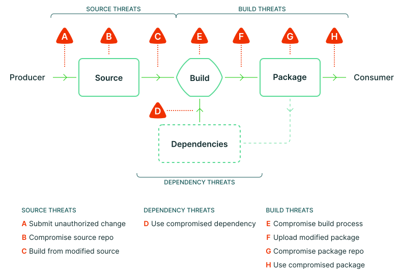

What follows is a comprehensive technical analysis of supply chain threats and
their corresponding mitigations in SLSA. For an introduction to the
supply chain threats that SLSA protects agains, see [Supply chain threats].

The examples on this page are meant to:

-   Explain the reasons for each of the SLSA [requirements](requirements.md).
-   Increase confidence that the SLSA requirements are sufficient to achieve the
    desired [level](levels.md) of integrity protection.
-   Help implementers better understand what they are protecting against so that
    they can better design and implement controls.

<article class="threats">

## Source threats

A source integrity threat is a potential for an adversary to introduce a change
to the source code that does not reflect the intent of the software producer.
This includes the threat of an authorized individual introducing an unauthorized
change---in other words, an insider threat.

SLSA v1.0 does not address source threats, but we anticipate doing so in a
[future version](future-directions.md#source-track). In the meantime, the
threats and potential mitigations listed here show how SLSA v1.0 can fit into a
broader supply chain security program.

### (A) Submit unauthorized change

An adversary introduces a change through the official source control management
interface without any special administrator privileges.

SLSA v1.0 does not address this threat, but it may be addressed in a [future
version](future-directions.md).

### (B) Compromise source repo

An adversary introduces a change to the source control repository through an
administrative interface, or through a compromise of the underlying
infrastructure.

SLSA v1.0 does not address this threat, but it may be addressed in a [future
version](future-directions.md).

### (C) Build from modified source

An adversary builds from a version of the source code that does not match the
official source control repository.

The mitigation here is to compare the provenance against expectations for the
package, which depends on SLSA Build L1 for provenance. (Threats against the
provenance itself are covered by (E) and (F).)

Build from unofficial fork of code (expectations)

*Threat:* Build using the expected CI/CD process but from an unofficial fork of
the code that may contain unauthorized changes.

*Mitigation:* Verifier requires the provenance's source location to match an
expected value.

*Example:* MyPackage is supposed to be built from GitHub repo `good/my-package`.
Instead, it is built from `evilfork/my-package`. Solution: Verifier rejects
because the source location does not match.

Build from unofficial branch or tag (expectations)

*Threat:* Build using the expected CI/CD process and source location, but
checking out an "experimental" branch or similar that may contain code not
intended for release.

*Mitigation:* Verifier requires that the provenance's source branch/tag matches
an expected value, or that the source revision is reachable from an expected
branch.

*Example:* MyPackage's releases are tagged from the `main` branch, which has
branch protections. Adversary builds from the unprotected `experimental` branch
containing unofficial changes. Solution: Verifier rejects because the source
revision is not reachable from `main`.

Build from unofficial build steps (expectations)

*Threat:* Build the package using the proper CI/CD platform but with unofficial
build steps.

*Mitigation:* Verifier requires that the provenance's build configuration source
matches an expected value.

*Example:* MyPackage is expected to be built by Google Cloud Build using the
build steps defined in the source's `cloudbuild.yaml` file. Adversary builds
with Google Cloud Build, but using custom build steps provided over RPC.
Solution: Verifier rejects because the build steps did not come from the
expected source.

Build from unofficial parameters (expectations)

*Threat:* Build using the expected CI/CD process, source location, and
branch/tag, but using a parameter that injects unofficial behavior.

*Mitigation:* Verifier requires that the provenance's external parameters all
match expected values.

*Example 1:* MyPackage is supposed to be built from the `release.yml` workflow.
Adversary builds from the `debug.yml` workflow. Solution: Verifier rejects
because the workflow parameter does not match the expected value.

*Example 2:* MyPackage's GitHub Actions Workflow uses `github.event.inputs` to
allow users to specify custom compiler flags per invocation. Adversary sets a
compiler flag that overrides a macro to inject malicious behavior into the
output binary. Solution: Verifier rejects because the `inputs` parameter was not
expected.

Build from modified version of code modified after checkout (expectations)

*Threat:* Build from a version of the code that includes modifications after
checkout.

*Mitigation:* Build service pulls directly from the source repository and
accurately records the source location in provenance.

*Example:* Adversary fetches from MyPackage's source repo, makes a local commit,
then requests a build from that local commit. Builder records the fact that it
did not pull from the official source repo. Solution: Verifier rejects because
the source repo does not match the expected value.

## Dependency threats

A dependency threat is a vector for an adversary to introduce behavior to an
artifact through external software that the artifact requires to function.

SLSA mitigates dependency threats when you verify your dependencies' SLSA
provenance.

### (D) Use compromised dependency

Use a compromised build dependency

*Threat:* The adversary injects malicious code into software required to build
the artifact.

*Mitigation:* N/A - This threat is out of scope of SLSA v1.0, though the build
provenance may list build dependencies on a best-effort basis for forensic
analysis. You may be able to mitigate this threat by pinning your build
dependencies, preferably by digest rather than version number. Alternatively,
you can [apply SLSA recursively](verifying-artifacts.md#step-3-optional-check-dependencies-recursively),
but we have not yet standardized how to do so.

*Example:* The artifact uses `libFoo` and requires its source code to compile.
The adversary compromises `libFoo`'s source repository and inserts malicious
code. When your artifact builds, it contains the adversary's malicious code.

Use a compromised runtime dependency

*Threat:* The adversary injects malicious code into software required to run the
artifact.

*Mitigation:* N/A - This threat is out of scope of SLSA v1.0. However, you can
mitigate this threat by verifying SLSA provenance for all of your runtime
dependencies that provide provenance.

*Example:* The artifact dynamically links `libBar` and requires a binary version
to run. The adversary compromises `libBar`'s build process and inserts malicious
code. When your artifact runs, it contains the adversary's malicious code.

## Build threats

A build integrity threat is a potential for an adversary to introduce behavior
to an artifact without changing its source code, or to build from a
source, dependency, and/or process that is not intended by the software
producer.

The SLSA Build track mitigates these threats when the consumer
[verifies artifacts](verifying-artifacts.md) against expectations, confirming
that the artifact they recieved was built in the expected manner.

### (E) Compromise build process

An adversary introduces an unauthorized change to a build output through
tampering of the build process; or introduces false information into the
provenance.

These threats are directly addressed by the SLSA Build track.

Forge values of the provenance (other than output digest) (Build L2+)

*Threat:* Generate false provenance and get the trusted control plane to sign
it.

*Mitigation:* At Build L2+, the trusted control plane [generates][authentic] all
information that goes in the provenance, except (optionally) the output artifact
hash. At Build L3+, this is [hardened][unforgeable] to prevent compromise even
by determined adversaries.

*Example 1 (Build L2):* Provenance is generated on the build worker, which the
adversary has control over. Adversary uses a malicious process to get the build
service to claim that it was built from source repo `good/my-package` when it
was really built from `evil/my-package`. Solution: Builder generates and signs
the provenance in the trusted control plane; the worker reports the output
artifacts but otherwise has no influence over the provenance.

*Example 2 (Build L3):* Provenance is generated in the trusted control plane,
but workers can break out of the container to access the signing material.
Solution: Builder is hardened to provide strong isolation against tenant
projects.

Forge output digest of the provenance (n/a)

*Threat:* The tenant-controlled build process sets output artifact digest
(`subject` in SLSA Provenance) without the trusted control plane verifying that
such an artifact was actually produced.

*Mitigation:* None; this is not a problem. Any build claiming to produce a given
artifact could have actually produced it by copying it verbatim from input to
output.[^preimage] (Reminder: Provenance is only a claim that a particular
artifact was *built*, not that it was *published* to a particular registry.)

*Example:* A legitimate MyPackage artifact has digest `abcdef` and is built
from source repo `good/my-package`. A malicious build from source repo
`evil/my-package` claims that it build artifact `abcdef` when it did not.
Solution: Verifier rejects because the source location does not match; the
forged digest is irrelevant.

[^preimage]: Technically this requires the artifact to be known to the
    adversary. If they only know the digest but not the actual contents, they
    cannot actually build the artifact without a [preimage attack] on the digest
    algorithm. However, even still there are no known concerns where this is a
    problem.

[preimage attack]: https://en.wikipedia.org/wiki/Preimage_attack

Compromise project owner (Build L2+)

*Threat:* An adversary gains owner permissions for the artifact's build project.

*Mitigation:* The build project owner must not have the ability to influence the
build process or provenance generation.

*Example:* MyPackage is built on Awesome Builder under the project "mypackage".
Adversary is an administrator of the "mypackage" project. Awesome Builder allows
administrators to debug build machines via SSH. An adversary uses this feature
to alter a build in progress.

Compromise other build (Build L3)

*Threat:* Perform a malicious build that alters the behavior of a benign
build running in parallel or subsequent environments.

*Mitigation:* Builds are [isolated] from one another, with no way for one to
affect the other or persist changes.

*Example 1:* A build service runs all builds for project MyPackage on
the same machine as the same Linux user. An adversary starts a malicious build
that listens for another build and swaps out source files, then starts a benign
build. The benign build uses the malicious build's source files, but its
provenance says it used benign source files. Solution: The build platform
changes architecture to isolate each build in a separate VM or similar.

*Example 2:* A build service uses the same machine for subsequent
builds. An adversary first runs a build that replaces the `make` binary with a
malicious version, then subsequently runs an otherwise benign build. Solution:
The builder changes architecture to start each build with a clean machine image.

Steal cryptographic secrets (Build L3)

*Threat:* Use or exfiltrate the provenance signing key or some other
cryptographic secret that should only be available to the build service.

*Mitigation:* Builds are [isolated] from the trusted build service control
plane, and only the control plane has [access][unforgeable] to cryptographic
secrets.

*Example:* Provence is signed on the build worker, which the adversary has
control over. Adversary uses a malicious process that generates false provenance
and signs it using the provenance signing key. Solution: Builder generates and
signs provenance in the trusted control plane; the worker has no access to the
key.

Poison the build cache (Build L3)

*Threat:* Add a malicious artifact to a build cache that is later picked up by a
benign build process.

*Mitigation:* Build caches must be [isolate][isolated] between builds to prevent
such cache poisoning attacks.

*Example:* Build system uses a build cache across builds, keyed by the hash of
the source file. Adversary runs a malicious build that creates a "poisoned"
cache entry with a falsified key, meaning that the value wasn't really produced
from that source. A subsequent build then picks up that poisoned cache entry.

Compromise build platform admin (verification)

*Threat:* An adversary gains admin permissions for the artifact's build platform.

*Mitigation:* The build platform must have controls in place to prevent and
detect abusive behavior from administrators (e.g. two-person approvals, audit
logging).

*Example:* MyPackage is built on Awesome Builder. Awesome Builder allows
engineers on-call to SSH into build machines to debug production issues. An
adversary uses this access to modify a build in progress. Solution: Consumers
do not accept provenance from the build platform unless they trust sufficient
controls are in place to prevent abusing admin privileges.

### (F) Upload modified package

An adversary uploads a package not built from the proper build process.

Build with untrusted CI/CD (expectations)

*Threat:* Build using an unofficial CI/CD pipeline that does not build in the
correct way.

*Mitigation:* Verifier requires provenance showing that the builder matched an
expected value.

*Example:* MyPackage is expected to be built on Google Cloud Build, which is
trusted up to Build L3. Adversary builds on SomeOtherBuildService, which is only
trusted up to Build L2, and then exploits SomeOtherBuildService to inject
malicious behavior. Solution: Verifier rejects because builder is not as
expected.

Upload package without provenance (Build L1)

*Threat:* Upload a package without provenance.

*Mitigation:* Verifier requires provenance before accepting the package.

*Example:* Adversary uploads a malicious version of MyPackage to the package
repository without provenance. Solution: Verifier rejects because provenance is
missing.

Tamper with artifact after CI/CD (Build L1)

*Threat:* Take a benign version of the package, modify it in some way, then
re-upload it using the original provenance.

*Mitigation:* Verifier checks that the provenance's `subject` matches the hash
of the package.

*Example:* Adversary performs a proper build, modifies the artifact, then
uploads the modified version of the package to the repository along with the
provenance. Solution: Verifier rejects because the hash of the artifact does not
match the `subject` found within the provenance.

Tamper with provenance (Build L2)

*Threat:* Perform a build that would not pass expectations, then modify the
provenance to make the expectations checks pass.

*Mitigation:* Verifier only accepts provenance with a valid [cryptographic
signature][authentic] or equivalent proving that the provenance came from an
acceptable builder.

*Example:* MyPackage is expected to be built by GitHub Actions from the
`good/my-package` repo. Adversary builds with GitHub Actions from the
`evil/my-package` repo and then modifies the provenance so that the source looks
like it came from `good/my-package`. Solution: Verifier rejects because the
cryptographic signature is no longer valid.

### (G) Compromise package repo

An adversary modifies the package on the package repository using an
administrative interface or through a compromise of the infrastructure.

De-list artifact

*Threat:* The package repository stops serving the artifact.

*Mitigation:* N/A - This threat is out of scope of SLSA v1.0.

De-list provenance

*Threat:* The package repository stops serving the provenance.

*Mitigation:* N/A - This threat is out of scope of SLSA v1.0.

### (H) Use compromised package

An adversary modifies the package after it has left the package repository, or
tricks the user into using an unintended package.

Typosquatting

*Threat:* Register a package name that is similar looking to a popular package
and get users to use your malicious package instead of the benign one.

*Mitigation:* **Mostly outside the scope of SLSA.** That said, the requirement
to make the source available can be a mild deterrent, can aid investigation or
ad-hoc analysis, and can complement source-based typosquatting solutions.

## Availability threats

An availability threat is a potential for an adversary to deny someone from
reading a source and its associated change history, or from building a package.

SLSA v1.0 does not address availability threats, though future versions might.

(A)(B) Delete the code

*Threat:* Perform a build from a particular source revision and then delete that
revision or cause it to get garbage collected, preventing anyone from inspecting
the code.

*Mitigation:* Some system retains the revision and its version control history,
making it available for inspection indefinitely. Users cannot delete the
revision except as part of a transparent legal or privacy process.

*Example:* An adversary submits malicious code to the MyPackage GitHub repo,
builds from that revision, then does a force push to erase that revision from
history (or requests that GitHub delete the repo.) This would make the revision
unavailable for inspection. Solution: Verifier rejects the package because it
lacks a positive attestation showing that some system, such as GitHub, ensured
retention and availability of the source code.

(D) A dependency becomes temporarily or permanently unavailable to the build process

*Threat:* Unable to perform a build with the intended dependencies.

*Mitigation:* **Outside the scope of SLSA.** That said, some solutions to
support hermetic and reproducible builds may also reduce the impact of this
threat.

## Verification threats

Threats that can compromise the ability to prevent or detect the supply chain
security threats above.

Tamper with expectations

*Threat:* Modify the expectations to accept something that would not otherwise
be accepted.

*Mitigation:* Changes to expectations require some form of authorization, such
as two-party review.

*Example:* Expectations for MyPackage only allows source repo `good/my-package`.
Adversary modifies the expectations to also accept `evil/my-package`, then
builds from that repo and uploads a malicious version of the package. Solution:
Expectation changes require two-party review.

Forge change metadata

*Threat:* Forge the change metadata to alter attribution, timestamp, or
discoverability of a change.

*Mitigation:* Source control platform strongly authenticates actor identity,
timestamp, and parent revisions.

*Example:* Adversary submits a git commit with a falsified author and timestamp,
and then rewrites history with a non-fast-forward update to make it appear to
have been made long ago. Solution: Consumer detects this by seeing that such
changes are not strongly authenticated and thus not trustworthy.

Exploit cryptographic hash collisions

*Threat:* Exploit a cryptographic hash collision weakness to bypass one of the
other controls.

*Mitigation:* Require cryptographically secure hash functions for commit
checksums and provenance subjects, such as SHA-256.

*Examples:* Construct a benign file and a malicious file with the same SHA-1
hash. Get the benign file reviewed and then submit the malicious file.
Alternatively, get the benign file reviewed and submitted and then build from
the malicious file. Solution: Only accept cryptographic hashes with strong
collision resistance.

</article>

<!-- Links -->

[authentic]: requirements.md#provenance-authentic
[exists]: requirements.md#provenance-exists
[isolated]: requirements.md#isolated
[unforgeable]: requirements.md#provenance-unforgeable
[service]: requirements.md#build-service
[supply chain threats]: threats-overview
