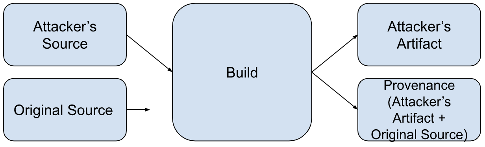
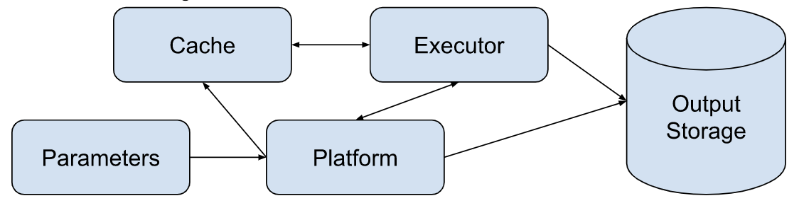

The provenance consumer is responsible for deciding whether they trust a builder to produce SLSA Build L3 provenance. However, assessing Build L3 capabilities requires information about a builder's construction and operating procedures that the consumer cannot glean from the provenance itself. To aid with such assessments, we provide a common threat model and builder model for reasoning about builders' security. We also provide a questionnaire that organizations can use to describe their builders to consumers along with sample answers that do and do not satisfy the SLSA Build L3 requirements.

## Threat Model

### Attacker Goal

The attacker's primary goal is to tamper with a build to create unexpected, vulnerable, or malicious behavior in the output artifact while avoiding detection. Their means of doing so is generating build provenance that does not faithfully represent the built artifact's origins or build process.

More formally, if a build with external parameters P would produce an artifact with binary hash X and a build with external parameters P' would produce an artifact with binary hash Y, they wish to produce provenance indicating a build with external parameters P produced an artifact with binary hash Y.

This diagram represents a successful attack:

Note: Platform abuse (e.g. running non-build workloads) and attacks against builder availability are out of scope of this document.

TODO: Align/cross-reference with SLSA Provenance Model.

TODO: Redraw diagrams in the style used by the rest of the site.

### Types of attackers

We consider three attacker profiles differentiated by the attacker's capabilities and privileges as related to the build they wish to subvert (the "target build").

TODO: Tie attack profiles into the rest of this page.

#### Project contributors

Capabilities:

-   Create builds on the build service. These are the attacker's controlled builds.
-   Modify one or more controlled builds' external parameters.
-   Modify one or more controlled builds' environments and run arbitrary code inside those environments.
-   Read the target build's source repo.
-   Fork the target build's source repo.
-   Modify a fork of the target build's source repo and build from it.

#### Project maintainer

Capabilities:

-   All listed under "low privilege".
-   Create new builds under the target build's project or identity.
-   Modify the target build's source repo and build from it.
-   Modify the target build's configuration.

#### Build service admin

Capabilities:

-   All listed under "low privilege" and "medium privilege".
-   Run arbitrary code on the build service.
-   Read and modify network traffic.
-   Access the control plane's cryptographic secrets.
-   Remotely access build executors (e.g. via SSH).

TODO: List other high-privilege capabilities.
TODO: Maybe differentiate between unilateral and non-unilateral privileges.

## Build Model

The build model consists of five components: parameters, the control plane, one or more build executors, a build cache, and output storage. The data flow between these components is shown in the diagram below.

TODO: Align with provenance and build models.

The following sections detail each element of the build model and prompts for assessing its ability to produce SLSA Build L3 provenance.

### External Parameters

External parameters are the external interface to the builder and include all inputs to the build process. Examples include the source to be built, the build definition/script to be executed, user-provided instructions to the control plane for how to create the build executor (e.g. which operating system to use), and any additional user-provided strings.

#### Prompts for Assessing External Parameters

-   How does the control plane process user-provided external parameters? Examples: sanitizing, parsing, not at all
-   Which external parameters are processed by the control plane and which are processed by the executor?
-   What sort of external parameters does the control plane accept for executor configuration?
-   How do you ensure that all external parameters are represented in the provenance?
-   How will you ensure that future design changes will not add additional external parameters without representing them in the provenance?

### Control Plane

The control plane is the build system component that orchestrates each independent build execution. It is responsible for setting up each build and cleaning up afterwards. At SLSA Build L2+ the control plane generates and signs provenance for each build performed on the build service. The control plane is operated by one or more administrators, who have privileges to modify the control plane.

#### Prompts for Assessing Control Planes

-   Administration
    -   What are the ways an employee can use privileged access to influence a build or provenance generation? Examples: physical access, terminal access, access to cryptographic secrets
    -   What controls are in place to detect or prevent the employee from abusing such access? Examples: two-person approvals, audit logging, workload identities
    -   Roughly how many employees have such access?
    -   How are privileged accounts protected? Examples: two-factor authentication, client device security policies
    -   What plans do you have for recovering from security incidents and system outages? Are they tested? How frequently?

-   Provenance generation
    -   How does the control plane observe the build to ensure the provenance's accuracy?
    -   Are there situations in which the control plane will not generate provenance for a completed build? What are they?

-   Development practices
    -   How do you track the control plane's software and configuration? Example: version control
    -   How do you build confidence in the control plane's software supply chain? Example: SLSA L3+ provenance, build from source
    -   How do you secure communications between builder components? Example: TLS with certificate transparency.
    -   Are you able to perform forensic analysis on compromised executors? How? Example: retain base images indefinitely

-   Creating executors
    -   How does the control plane share data with executors? Example: mounting a shared file system partition
    -   How does the control plane protect its integrity from executors? Example: not mount its own file system partitions on executors
    -   How does the control plane prevent executors from accessing its cryptographic secrets? Examples: dedicated secret storage, not mounting its own file system partitions on executors, hardware security modules

-   Managing cryptographic secrets
    -   How do you store the control plane's cryptographic secrets?
    -   Which parts of the organization have access to the control plane's cryptographic secrets?
    -   What controls are in place to detect or prevent employees abusing such access? Examples: two-person approvals, audit logging
    -   How are secrets protected in memory? Examples: secrets are stored in hardware security modules and backed up in secure cold storage
    -   How frequently are cryptographic secrets rotated? Describe the rotation process.
    -   What is your plan for remediating cryptographic secret compromise? How frequently is this plan tested?

### Executor

The build executor is the independent execution environment where the build takes place. Each executor must be isolated from the control plane and from all other executors, including executors running builds from the same build user or project. Build users are free to modify the environment inside the executor arbitrarily. Build executors must have a means to fetch input artifacts (source, dependencies, etc).

#### Prompts for Assessing Executors

-   Isolation technologies
    -   How are executors isolated from the control plane and each other? Examples: VMs, containers, sandboxed processes
    -   How have you hardened your executors against malicious tenants? Examples: configuration hardening, limiting attack surface
    -   How frequently do you update your isolation software?
    -   What is your process for responding to vulnerability disclosures? What about vulnerabilities in your dependencies?
    -   What prevents a malicious build from gaining persistence and influencing subsequent builds?

-   Creation and destruction
    -   What tools and environment are available in executors on creation? How were the elements of this environment chosen? Examples: A minimal Linux distribution with its package manager, OSX with HomeBrew
    -   How long could a compromised executor remain active in the build system?

-   Network access
    -   Are executors able to call out to remote execution? If so, how do you prevent them from tampering with the control plane or other executors over the network?
    -   Are executors able to open services on the network? If so, how do you prevent remote interference through these services?

### Cache

Builders may have zero or more caches to store frequently used dependencies. Build executors may have either read-only or read-write access to caches.

#### Prompts for Assessing Caches

-   What sorts of caches are available to build executors?
-   How are those caches populated?
-   How are cache contents validated before use?

### Output Storage

Output Storage holds built artifacts and their provenance. Storage may either be shared between build projects or allocated separately per-project.

#### Prompts for Assessing Output Storage

-   How do you prevent builds from reading or overwriting files that belong to another build? Example: authorization on storage
-   What processing, if any, does the control plane do on output artifacts?

## Builder Evaluation

Organizations can either self-attest to their answers or seek an audit/certification from a third party. Questionnaires for self-attestation should be published on the internet. Questionnaires for third-party certification need not be published. All provenance generated by L3+ builders must contain a non-forgeable attestation of the builder's L3+ capabilities with a limited validity period. Any secret materials used to prove the non-forgeability of the attestation must belong to the attesting party.

TODO: Add build system attestation spec
