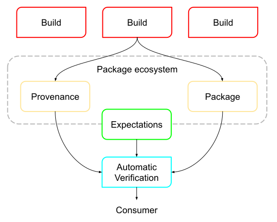

<!-- Note on updating docs:
* Using terms such as "developer," "maintainer," "producer," "author," and
  "publisher" interchangeably can cause confusion.
  *  For consistency: Whenever possible, default to "producer," in line with the
     model of producer--consumer--infrastructure provider. "Maintainer" is reserved
     for sections specifying the act of continuing to maintain a project after its
     creation, or when used in a less technical context where it is unlikely to cause
     confusion. Author is reserved for the act of making source code commits or
     reviews. Individual is used when the context's focus is specifying a single
     person (i.e., "an individual's workstation" or "compromised individual").
* Using terms such as "platform," "system," and "service" interchangeably can cause
  confusion.
  * For consistency: Whenever possible, default to "platform." Instead of using "service,"
    a reference to a "hosted platform" should be used. A reference to some specific
    software or tools internal to a platform can be made with "platform component" unless
    there is a more appropriate definition to use directly like "control plane." External
    self-described services and systems can continue to be called by these terms.
-->

Before diving into the [SLSA Levels](levels.md), we need to establish a core set
of terminology and models to describe what we're protecting.

## Software supply chain

SLSA's framework addresses every step of the software supply chain - the
sequence of steps resulting in the creation of an artifact. We represent a
supply chain as a [directed acyclic graph] of sources, builds, dependencies, and
packages. One artifact's supply chain is a combination of its dependencies'
supply chains plus its own sources and builds.

[directed acyclic graph]: https://en.wikipedia.org/wiki/Directed_acyclic_graph

| Term | Description | Example
| --- | --- | ---
| Artifact | An immutable blob of data; primarily refers to software, but SLSA can be used for any artifact. | A file, a git commit, a directory of files (serialized in some way), a container image, a firmware image.
| Attestation | An authenticated statement (metadata) about a software artifact or collection of software artifacts. | A signed [SLSA Provenance] file.
| Source | Artifact that was directly authored or reviewed by persons, without modification. It is the beginning of the supply chain; we do not trace the provenance back any further. | Git commit (source) hosted on GitHub (platform).
| [Build] | Process that transforms a set of input artifacts into a set of output artifacts. The inputs may be sources, dependencies, or ephemeral build outputs. | .travis.yml (process) run by Travis CI (platform).
| [Package] | Artifact that is "published" for use by others. In the model, it is always the output of a build process, though that build process can be a no-op. | Docker image (package) distributed on DockerHub (platform). A ZIP file containing source code is a package, not a source, because it is built from some other source, such as a git commit.
| Dependency | Artifact that is an input to a build process but that is not a source. In the model, it is always a package. | Alpine package (package) distributed on Alpine Linux (platform).

[build]: #build-model
[package]: #package-model
[SLSA Provenance]: /provenance/v1

### Roles

Throughout the specification, you will see reference to the following roles
that take part in the software supply chain. Note that in practice a role may
be filled by more than one person or an organization. Similarly, a person or
organization may act as more than one role in a particular software supply
chain.

| Role | Description | Examples
| --- | --- | ---
| Producer | A party who creates software and provides it to others. Producers are often also consumers. | An open source project's maintainers. A software vendor.
| Verifier | A party who inspect an artifact's provenance to determine the artifact's authenticity. | A business's software ingestion system. A programming language ecosystem's package registry.
| Consumer | A party who uses software provided by a producer. The consumer may verify provenance for software they consume or delegate that responsibility to a separate verifier. | A developer who uses open source software distributions. A business that uses a point of sale system.
| Infrastructure provider | A party who provides software or services to other roles. | A package registry's maintainers. A build platform's maintainers.

### Build model

We model a build as running on a multi-tenant *build platform*, where each
execution is independent.

1.  A tenant invokes the build by specifying *external parameters* through an
    *interface*, either directly or via some trigger. Usually, at least one of
    these external parameters is a reference to a *dependency*. (External
    parameters are literal values while dependencies are artifacts.)
2.  The build platform's *control plane* interprets these external parameters,
    fetches an initial set of dependencies, initializes a *build environment*,
    and then starts the execution within that environment.
3.  The build then performs arbitrary steps, which might include fetching
    additional dependencies, and then produces one or more *output* artifacts.
    The steps within the build environment are under the tenant's control.
    The build platform isolates build environments from one another to some
    degree (which is measured by the SLSA Build Level).
4.  Finally, for SLSA Build L2+, the control plane outputs *provenance*
    describing this whole process.

Notably, there is no formal notion of "source" in the build model, just external
parameters and dependencies. Most build platforms have an explicit "source"
artifact to build from, which is often a git repository; in the build model, the
reference to this artifact is an external parameter while the artifact itself is
a dependency.

For examples of how this model applies to real-world build platforms, see [index
of build types](/provenance/v1#index-of-build-types).

| Primary Term | Description
| --- | ---
| Platform | System that allows tenants to run builds. Technically, it is the transitive closure of software and services that must be trusted to faithfully execute the build. It includes software, hardware, people, and organizations.
| Admin | A privileged user with administrative access to the platform, potentially allowing them to tamper with builds or the control plane.
| Tenant | An untrusted user that builds an artifact on the platform. The tenant defines the build steps and external parameters.
| Control plane | Build platform component that orchestrates each independent build execution and produces provenance. The control plane is managed by an admin and trusted to be outside the tenant's control.
| Build | Process that converts input sources and dependencies into output artifacts, defined by the tenant and executed within a single build environment on a platform.
| Steps | The set of actions that comprise a build, defined by the tenant.
| Build environment | The independent execution context in which the build runs, initialized by the control plane. In the case of a distributed build, this is the collection of all such machines/containers/VMs that run steps.
| Build caches | An intermediate artifact storage managed by the platform that maps intermediate artifacts to their explicit inputs. A build may share build caches with any subsequent build running on the platform.
| External parameters | The set of top-level, independent inputs to the build, specified by a tenant and used by the control plane to initialize the build.
| Dependencies | Artifacts fetched during initialization or execution of the build process, such as configuration files, source artifacts, or build tools.
| Outputs | Collection of artifacts produced by the build.
| Provenance | Attestation (metadata) describing how the outputs were produced, including identification of the platform and external parameters.

Ambiguous terms to avoid

-   *Build recipe:* Could mean *external parameters,* but may include concrete
    steps of how to perform a build. To avoid implementation details, we don't
    define this term, but always use "external parameters" which is the
    interface to a build platform. Similar terms are *build configuration
    source* and *build definition*.
-   *Builder:* Usually means *build platform*, but might be used for *build
    environment*, the user who invoked the build, or a build tool from
    *dependencies*. To avoid confusion, we always use "build platform". The only
    exception is in the [provenance](/provenance/v1), where `builder` is used as
    a more concise field name.

### Package model

Software is distributed in identifiable units called <dfn>packages</dfn>
according to the rules and conventions of a <dfn>package ecosystem</dfn>.
Examples of formal ecosystems include [Python/PyPA](https://www.pypa.io),
[Debian/Apt](https://wiki.debian.org/DebianRepository/Format), and
[OCI](https://github.com/opencontainers/distribution-spec), while examples of
informal ecosystems include links to files on a website or distribution of
first-party software within a company.

Abstractly, a consumer locates software within an ecosystem by asking a
<dfn>package registry</dfn> to resolve a mutable <dfn>package name</dfn> into an
immutable <dfn>package artifact</dfn>.[^label] To <dfn>publish</dfn> a package
artifact, the software producer asks the registry to update this mapping to
resolve to the new artifact. The registry represents the entity or entities with
the power to alter what artifacts are accepted by consumers for a given package
name. For example, if consumers only accept packages signed by a particular
public key, then it is access to that public key that serves as the registry.

The package name is the primary security boundary within a package ecosystem.
Different package names represent materially different pieces of
software---different owners, behaviors, security properties, and so on.
Therefore, **the package name is the primary unit being protected in SLSA**.
It is the primary identifier to which consumers attach expectations.

[^label]: This resolution might include a version number, label, or some other
    selector in addition to the package name, but that is not important to SLSA.

| Term | Description
| ---- | -----------
| Package | An identifiable unit of software intended for distribution, ambiguously meaning either an "artifact" or a "package name". Only use this term when the ambiguity is acceptable or desirable.
| Package artifact | A file or other immutable object that is intended for distribution.
| Package ecosystem | A set of rules and conventions governing how packages are distributed, including how clients resolve a package name into one or more specific artifacts.
| Package manager client | Client-side tooling to interact with a package ecosystem.
| Package name | 
The primary identifier for a mutable collection of artifacts that all represent different versions of the same software. This is the primary identifier that consumers use to obtain the software.
A package name is specific to an ecosystem + registry, has a maintainer, is more general than a specific hash or version, and has a "correct" source location. A package ecosystem may group package names into some sort of hierarchy, such as the Group ID in Maven, though SLSA does not have a special term for this.
| Package registry | An entity responsible for mapping package names to artifacts within a packaging ecosystem. Most ecosystems support multiple registries, usually a single global registry and multiple private registries.
| Publish [a package] | Make an artifact available for use by registering it with the package registry. In technical terms, this means associating an artifact to a package name. This does not necessarily mean making the artifact fully public; an artifact may be published for only a subset of users, such as internal testing or a closed beta.

Ambiguous terms to avoid

-   *Package repository:* Could mean either package registry or package name,
    depending on the ecosystem. To avoid confusion, we always use "repository"
    exclusively to mean "source repository", where there is no ambiguity.
-   *Package manager* (without "client"): Could mean either package ecosystem,
    package registry, or client-side tooling.

### Mapping to real-world ecosystems

Most real-world ecosystems fit the package model above but use different terms.
The table below attempts to document how various ecosystems map to the SLSA
Package model. There are likely mistakes and omissions; corrections and
additions are welcome!

<!-- Please keep this list sorted alphabetically within each section. -->

<table>
  <tr>
    <th>Package ecosystem
    <th>Package registry
    <th>Package name
    <th>Package artifact
  <tr>
    <td colspan=4><em>Languages</em>
  <tr>
    <td><a href="https://doc.rust-lang.org/cargo/appendix/glossary.html">Cargo</a> (Rust)
    <td><a href="https://doc.rust-lang.org/cargo/appendix/glossary.html#registry">Registry</a>
    <td><a href="https://doc.rust-lang.org/cargo/appendix/glossary.html#crate">Crate name</a>
    <td><a href="https://doc.rust-lang.org/cargo/appendix/glossary.html#artifact">Artifact</a>
  <tr>
    <td><a href="http://neilb.org/2015/09/05/cpan-glossary.html">CPAN</a> (Perl)
    <td>Upload server
    <td>Distribution
    <td>Release (or Distribution)
  <tr>
    <td><a href="https://go.dev/ref/mod">Go</a>
    <td><a href="https://go.dev/ref/mod#glos-module-proxy">Module proxy</a>
    <td><a href="https://go.dev/ref/mod#glos-module-path">Module path</a>
    <td><a href="https://go.dev/ref/mod#glos-module">Module</a>
  <tr>
    <td><a href="https://maven.apache.org/glossary">Maven</a> (Java)
    <td>Repository
    <td>Group ID + Artifact ID
    <td>Artifact
  <tr>
    <td><a href="https://www.npmjs.com/">npm</a> (JavaScript)
    <td><a href="https://docs.npmjs.com/about-the-public-npm-registry">Registry</a>
    <td><a href="https://docs.npmjs.com/package-name-guidelines">Package Name</a>
    <td><a href="https://docs.npmjs.com/about-packages-and-modules">Package</a>
  <tr>
    <td><a href="https://docs.microsoft.com/en-us/nuget/nuget-org/overview-nuget-org">NuGet</a> (C#)
    <td>Host
    <td>Project
    <td>Package
  <tr>
    <td><a href="https://packaging.python.org/en/latest/specifications/binary-distribution-format/#file-name-convention">PyPA</a> (Python)
    <td><a href="https://packaging.python.org/en/latest/glossary/#term-Package-Index">Index</a>
    <td><a href="https://packaging.python.org/en/latest/glossary/#term-Project">Project Name</a>
    <td><a href="https://packaging.python.org/en/latest/glossary/#term-Distribution-Package">Distribution</a>
  <tr>
    <td colspan=4><em>Operating systems</em>
  <tr>
    <td><a href="https://wiki.debian.org/Teams/Dpkg">Dpkg </a> (e.g. Debian)
    <td><em>?</em>
    <td>Package name
    <td>Package
  <tr>
    <td><a href="https://docs.flatpak.org/en/latest/introduction.html#terminology">Flatpak</a>
    <td>Repository
    <td>Application
    <td>Bundle
  <tr>
    <td><a href="https://docs.brew.sh/Manpage">Homebrew</a> (e.g. Mac)
    <td>Repository (Tap)
    <td>Package name (Formula)
    <td>Binary package (Bottle)
  <tr>
    <td><a href="https://wiki.archlinux.org/title/Pacman">Pacman</a> (e.g. Arch)
    <td>Repository
    <td>Package name
    <td>Package
  <tr>
    <td><a href="https://rpm.org">RPM</a> (e.g. Red Hat)
    <td>Repository
    <td>Package name
    <td>Package
  <tr>
    <td><a href="https://nixos.org/manual/nix">Nix</a> (e.g. <a href="https://nixos.org/">NixOS</a>)
    <td>Repository (e.g. <a href="https://github.com/NixOS/nixpkgs">Nixpkgs</a>) or <a href="https://nixos.org/manual/nix/stable/glossary.html#gloss-binary-cache">binary cache</a>
    <td><a href="https://nixos.org/manual/nix/stable/language/derivations.html">Derivation name</a>
    <td><a href="https://nixos.org/manual/nix/stable/language/derivations.html">Derivation</a> or <a href="https://nixos.org/manual/nix/stable/glossary.html#gloss-store-object">store object</a>
  <tr>
    <td colspan=4><em>Storage systems</em>
  <tr>
    <td><a href="https://cloud.google.com/storage/docs/key-terms">GCS</a>
    <td><em>n/a</em>
    <td>Object name
    <td>Object
  <tr>
    <td><a href="https://github.com/opencontainers/distribution-spec/blob/main/spec.md#definitions">OCI</a>/Docker
    <td>Registry
    <td>Repository
    <td>Object
  <tr>
    <td colspan=4><em>Meta</em>
  <tr>
    <td><a href="https://deps.dev/glossary">deps.dev</a>: <a href="https://deps.dev/glossary#system">System</a>
    <td><a href="https://deps.dev/glossary#packaging-authority">Packaging authority</a>
    <td><a href="https://deps.dev/glossary#package">Package</a>
    <td><em>n/a</em>
  <tr>
    <td><a href="https://github.com/package-url/purl-spec/blob/master/PURL-SPECIFICATION.rst">purl</a>: type
    <td>Namespace
    <td>Name
    <td><em>n/a</em>
</table>

Notes:

-   Go uses a significantly different distribution model than other ecosystems.
    In go, the package name is a source repository URL. While clients can fetch
    directly from that URL---in which case there is no "package" or
    "registry"---they usually fetch a zip file from a *module proxy*. The module
    proxy acts as both a builder (by constructing the package artifact from
    source) and a registry (by mapping package name to package artifact). People
    trust the module proxy because builds are independently reproducible and a
    *checksum database* guarantees that all clients receive the same artifact
    for a given URL.

### Verification model

Verification in SLSA is performed in two ways. Firstly, the build platform is
certified to ensure conformance with the requirements at the level claimed by
the build platform. This certification should happen on a recurring cadence with
the outcomes published by the platform operator for their users to review and
make informed decisions about which builders to trust.

Secondly, artifacts are verified to ensure they meet the producer defined
expectations of where the package source code was retrieved from and on what
build platform the package was built.

| Term         | Description
|--------------|----
| Expectations | A set of constraints on the package's provenance metadata. The package producer sets expectations for a package, whether explicitly or implicitly.
| Provenance verification | Artifacts are verified by the package ecosystem to ensure that the package's expectations are met before the package is used.
| Build platform certification | [Build platforms are certified](verifying-systems.md) for their conformance to the SLSA requirements at the stated level.

The examples below suggest some ways that expectations and verification may be
implemented for different, broadly defined, package ecosystems.

Example: Small software team

| Term | Example
| ---- | -------
| Expectations | Defined by the producer's security personnel and stored in a database.
| Provenance verification | Performed automatically on cluster nodes before execution by querying the expectations database.
| Build platform certification | The build platform implementer follows secure design and development best practices, does annual penetration testing exercises, and self-certifies their conformance to SLSA requirements.

Example: Open source language distribution

| Term | Example
| ---- | -------
| Expectations | Defined separately for each package and stored in the package registry.
| Provenance verification | The language distribution registry verifies newly uploaded packages meet expectations before publishing them. Further, the package manager client also verifies expectations prior to installing packages.
| Build platform certification | Performed by the language ecosystem packaging authority.

