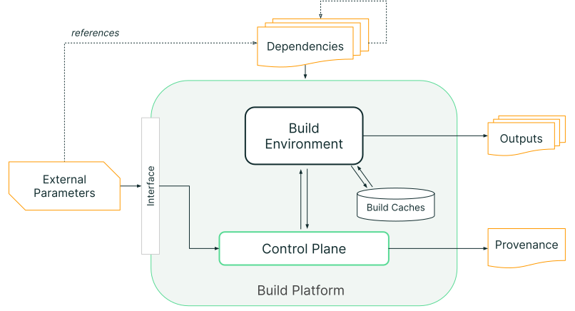

One of SLSA's guiding [principles](principles.md) is to "trust platforms, verify
artifacts". However, consumers cannot trust platforms to produce Build L3
artifacts and provenance unless they have some proof that the provenance is
[unforgeable](requirements.md#provenance-unforgeable) and the builds are
[isolated](requirements.md#isolated).

This page describes the parts of a build platform that consumers SHOULD assess
and provides sample questions consumers can ask when assessing a build platform.
See also [Threats & mitigations](threats.md) and the
[build model](terminology.md#build-model).

## Threats

### Adversary goal

The SLSA Build track defends against an adversary whose primary goal is to
inject unofficial behavior into a package artifact while avoiding detection.
Remember that [verifiers](verifying-artifacts.md) only accept artifacts whose
provenance matches expectations. To bypass this, the adversary tries to either
(a) tamper with a legitimate build whose provenance already matches
expectations, or (b) tamper with an illegitimate build's provenance to make it
match expectations.

More formally, if a build with external parameters P would produce an artifact
with binary hash X and a build with external parameters P' would produce an
artifact with binary hash Y, they wish to produce provenance indicating a build
with external parameters P produced an artifact with binary hash Y.

See threats [D], [E], [F], and [G] for examples of specific threats.

Note: Platform abuse (e.g. running non-build workloads) and attacks against
builder availability are out of scope of this document.

### Adversary profiles

Consumers SHOULD also evaluate the build platform's ability to defend against the
following types of adversaries.

1.  Project contributors, who can:
    -   Create builds on the build platform. These are the adversary's controlled
        builds.
    -   Modify one or more controlled builds' external parameters.
    -   Modify one or more controlled builds' environments and run arbitrary
        code inside those environments.
    -   Read the target build's source repo.
    -   Fork the target build's source repo.
    -   Modify a fork of the target build's source repo and build from it.
2.  Project maintainer, who can:
    -   Do everything listed under "project contributors".
    -   Create new builds under the target build's project or identity.
    -   Modify the target build's source repo and build from it.
    -   Modify the target build's configuration.
3.  Build platform administrators, who can:
    -   Do everything listed under "project contributors" and "project
        maintainers".
    -   Run arbitrary code on the build platform.
    -   Read and modify network traffic.
    -   Access the control plane's cryptographic secrets.
    -   Remotely access build environments (e.g. via SSH).

[D]: threats.md#d-external-build-parameters
[E]: threats.md#e-build-process
[F]: threats.md#f-artifact-publication
[G]: threats.md#g-distribution-channel

## Build platform components

Consumers SHOULD consider at least these five elements of the
[build model](terminology.md#build-model) when assessing build platforms for SLSA
conformance: external parameters, control plane, build environments, caches,
and outputs.

The following sections detail these elements of the build model and give prompts
for assessing a build platform's ability to produce SLSA Build L3 provenance. The
assessment SHOULD take into account the security model used to identify the
transitive closure of the `builder.id` for the [provenance model], specifically
around the platform's boundaries, actors, and interfaces.

### External parameters

External parameters are the external interface to the builder and include all
inputs to the build process. Examples include the source to be built, the build
definition/script to be executed, user-provided instructions to the
control plane for how to create the build environment (e.g. which operating
system to use), and any additional user-provided strings.

#### Prompts for assessing external parameters

-   How does the control plane process user-provided external parameters?
    Examples: sanitizing, parsing, not at all
-   Which external parameters are processed by the control plane and which are
    processed by the build environment?
-   What sort of external parameters does the control plane accept for
    build environment configuration?
-   How do you ensure that all external parameters are represented in the
    provenance?
-   How will you ensure that future design changes will not add additional
    external parameters without representing them in the provenance?

### Control plane

The control plane is the build platform component that orchestrates each
independent build execution. It is responsible for setting up each build and
cleaning up afterwards. At SLSA Build L2+ the control plane generates and signs
provenance for each build performed on the build platform. The control plane is
operated by one or more administrators, who have privileges to modify the
control plane.

#### Prompts for assessing the control plane

-   Administration
    -   What are the ways an employee can use privileged access to influence a
        build or provenance generation? Examples: physical access, terminal
        access, access to cryptographic secrets
    -   What controls are in place to detect or prevent the employee from
        abusing such access? Examples: two-person approvals, audit logging,
        workload identities
    -   Roughly how many employees have such access?
    -   How are privileged accounts protected? Examples: two-factor
        authentication, client device security policies
    -   What plans do you have for recovering from security incidents and platform
        outages? Are they tested? How frequently?

-   Provenance generation
    -   How does the control plane observe the build to ensure the provenance's
        accuracy?
    -   Are there situations in which the control plane will not generate
        provenance for a completed build? What are they?

-   Development practices
    -   How do you track the control plane's software and configuration?
        Example: version control
    -   How do you build confidence in the control plane's software supply
        chain? Example: SLSA L3+ provenance, build from source
    -   How do you secure communications between builder components? Example:
        TLS with certificate transparency.
    -   Are you able to perform forensic analysis on compromised build
        environments? How? Example: retain base images indefinitely

-   Creating build environments
    -   How does the control plane share data with build environments? Example:
        mounting a shared file system partition
    -   How does the control plane protect its integrity from build
        environments? Example: not mount its own file system partitions on
        build environments
    -   How does the control plane prevent build environments from accessing its
        cryptographic secrets? Examples: dedicated secret storage, not mounting
        its own file system partitions to build environments, hardware security
        modules

-   Managing cryptographic secrets
    -   How do you store the control plane's cryptographic secrets?
    -   Which parts of the organization have access to the control plane's
        cryptographic secrets?
    -   What controls are in place to detect or prevent employees abusing such
        access? Examples: two-person approvals, audit logging
    -   How are secrets protected in memory? Examples: secrets are stored in
        hardware security modules and backed up in secure cold storage
    -   How frequently are cryptographic secrets rotated? Describe the rotation
        process.
    -   What is your plan for remediating cryptographic secret compromise? How
        frequently is this plan tested?

### Build environment

The build environment is the independent execution context where the build
takes place. In the case of a distributed build, the build environment is the
collection of all execution contexts that run build steps. Each build
environment must be isolated from the control plane and from all other build
environments, including those running builds from the same tenant or project.
Tenants are free to modify the build environment arbitrarily. Build
environments must have a means to fetch input artifacts (source, dependencies,
etc).

#### Prompts for assessing build environments

-   Isolation technologies
    -   How are build environments isolated from the control plane and each
        other? Examples: VMs, containers, sandboxed processes
    -   How is separation achieved between trusted and untrusted processes?
    -   How have you hardened your build environments against malicious tenants?
        Examples: configuration hardening, limiting attack surface
    -   How frequently do you update your isolation software?
    -   What is your process for responding to vulnerability disclosures? What
        about vulnerabilities in your dependencies?
    -   What prevents a malicious build from gaining persistence and influencing
        subsequent builds?

-   Creation and destruction
    -   What operating system and utilities are available in build environments
        on creation? How were these elements chosen? Examples: A minimal Linux
        distribution with its package manager, OSX with HomeBrew
    -   How long could a compromised build environment remain active in the
        build platform?

-   Network access
    -   Are build environments able to call out to remote execution? If so, how
        do you prevent them from tampering with the control plane or other build
        environments over the network?
    -   Are build environments able to open services on the network? If so, how
        do you prevent remote interference through these services?

### Cache

Builders may have zero or more caches to store frequently used dependencies.
Build environments may have either read-only or read-write access to caches.

#### Prompts for assessing caches

-   What sorts of caches are available to build environments?
-   How are those caches populated?
-   How are cache contents validated before use?

### Output storage

Output Storage holds built artifacts and their provenance. Storage may either be
shared between build projects or allocated separately per-project.

#### Prompts for assessing output storage

-   How do you prevent builds from reading or overwriting files that belong to
    another build? Example: authorization on storage
-   What processing, if any, does the control plane do on output artifacts?

## Builder evaluation

Organizations can either self-attest to their answers or seek certification from
a third-party auditor. Evidence for self-attestation should be published on
the internet and can include information such as the security model defined as
part of the provenance. Evidence submitted for third-party certification need not
be published.
