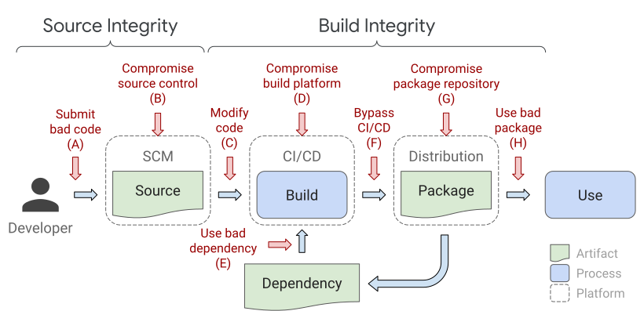

# Threats and Mitigations

## (A1) Submit bad code without review

### Directly submit without review

*Threat:* Submit bad code to the source repository without another person
reviewing.

*Mitigation:* Source repository requires two-person approval for all changes.

### Review own change through a sock puppet account

*Threat:* Propose a change using one account and then approve it using another
account.

*Mitigation:* Source repository requires approval from two different, trusted
persons. If the proposer is trusted, only one approval is needed; otherwise two
approvals are needed. The owning organization maps accounts to trusted persons
to accounts.

### Use a robot account to submit change

*Threat:* Exploit a robot account that has the ability to submit changes without
two-person review.

*Mitigation:* **TBD** - Some sort of requirements on locking down robot
accounts.

*Example:* A file within the source repository is automatically generated by a
robot, which is allowed to submit without review. Adversary compromises the
robot and submits a malicious change without review.

### Abuse review exceptions

*Threat:* Exploit a review exception to submit a bad change without review.

*Mitigation:* **TBD**

*Example:* Source repository requires two-person review on all changes except
for "documentation changes," defined as only touching files ending with `.md` or
`.html`. Adversary submits a malicious executable named `evil.md` without review
using this exception, and then builds a malicious package containing this
executable. This would pass the policy because the source repository is correct,
and the source repository does require two-person review.

## (A2) Evade code review requirements

### Modify code after review

*Threat:* Modify the code after it has been reviewed but before submission.

*Mitigation:* Source control platform invalidates approvals whenever the
proposed change is modified.

*Example:* Source repository requires two-person review on all changes.
Adversary sends a "good" pull request to a peer, who approves it. Adversary then
modifies it to contain "bad" code before submitting.

### Submit a change that is unreviewable

*Threat:* Send a change that is meaningless for a human to review, such as a
change from one cryptographic hash to another, that looks benign but is actually
malicious.

*Mitigation:*
[Informed review](https://slsa.dev/requirements#two-person-reviewed)

### Copy a reviewed change to another context

*Threat:* Get a change reviewed in one context and then transfer it to a
different context.

*Mitigation:* Approvals are context-specific.

*Example:* MyPackage's source repository requires two-person review. Adversary
forks the repo, submits a change in the fork with review from a colluding
colleague (who is not trusted by MyPackage), then merges the change back into
the upstream repo. The merge still requires review, even though the fork was
reviewed.

### Compromise another account

*Threat:* Compromise one or more trusted accounts and use those to submit and
review own changes.

*Mitigation:* Source control platform verifies two-factor authentication, which
increases the difficulty of compromising accounts.

### Hide bad change behind good one

*Threat:* Request review for a series of two commits, X and Y, where X is bad
and Y is good. Reviewer thinks they are approving only the final Y state whereas
they are also implicitly approving X.

*Mitigation:* Only the version that is actually reviewed is the one that is
approved. Any intermediate revisions don't count as being reviewed.

*Example:* Adversary sends a pull request containing malicious commit X and
benign commit Y that undoes X. In the pull request UI, reviewer only reviews and
approves "changes from all commits", which is a delta from HEAD to Y; they don't
see X. Adversary then builds from the malicious revision X. Policy does not
accept this because the version X is not considered reviewed.

## (A3) Code review bypasses that are out of scope of SLSA

### Collude with another trusted person

*Threat:* Two trusted persons collude to author and approve a bad change.

*Mitigation:* **Outside the scope of SLSA.**

### Trick reviewer into approving bad code

*Threat:* Construct a change that looks benign but is actually malicious, a.k.a.
"bugdoor."

*Mitigation:* **Outside the scope of SLSA.**

### Reviewer blindly approves changes

*Threat:* Reviewer approves changes without actually reviewing, a.k.a. "rubber
stamping."

*Mitigation:* **Outside the scope of SLSA.**

## (B) Compromise source control system

### Project owner bypasses controls

*Threat:* Project owners may abuse their privilege to bypass controls.

*Mitigation:* Project owners are subject to same controls.

*Example:* GitHub project owner pushes a change without review, even though
GitHub branch protection is enabled. Solution: Enable the "Include
Administrators" option for the branch protection.

### Project owner disables controls

*Threat:* Project owner disables controls without review, performs a malicious
action, then re-enables controls.

*Mitigation:* TBD. Maybe such changes require two-person review and notify other
organization members?

*Example:* GitHub project owner disables "Include Administrators", pushes a
change without review, then re-enables "Include Administrators".

### Platform admin abuses privileges

*Threat:* Platform administrator abuses their privileges to bypass controls or
to push a malicious version of the software.

*Mitigation:* Common requirements - details TBD.

*Example 1:* GitHostingService employee uses an internal tool to push changes to
the MyPackage source repo.

*Example 2:* GitHostingService employee uses pushes a malicious version of the
server to serve malicious versions of MyPackage sources to a specific CI/CD
client but the regular version to everyone else, in order to hide tracks.

*Example 3:* GitHostingService employee uses pushes a malicious version of the
server that includes a backdoor allowing specific users to bypass branch
protections. Adversary then uses this backdoor to submit a change to MyPackage
without review.

### Exploit vulnerability in SCM

*Threat:* Exploit a vulnerability in the implementation of the source code
management system to bypass controls.

*Mitigation:* **Outside the scope of SLSA.**

## (C) Modify code after source control

### Build from unofficial fork of code

*Threat:* Build using the expected CI/CD process but from an unofficial fork of
the code that may contain unauthorized changes.

*Mitigation:* Policy requires the provenance's source location to match an
expected value.

*Example:* MyPackage is supposed to be built from GitHub repo `good/my-package`.
Instead, it is built from `evilfork/my-package`. Policy rejects because the
source location does not match.

### Build from unofficial branch or tag

*Threat:* Build using the expected CI/CD process and source location, but
checking out an "experimental" branch or similar that may contain code not
intended for release.

*Mitigation:* Policy requires that the provenance's source branch/tag matches an
expected value, or that the source revision is reachable from an expected
branch.

*Example:* MyPackage's releases are tagged from the `main` branch, which has
branch protections. Adversary builds from the unprotected `experimental` branch
containing unofficial changes. Policy rejects because the source revision is not
reachable from `main`.

### Build from unofficial build steps

*Threat:* Build the package using the proper CI/CD platform but with unofficial
build steps.

*Mitigation:* Policy requires that the provenance's build configuration source
matches an expected value.

*Example:* MyPackage is expected to be built by Google Cloud Build using the
build steps defined in the source's `cloudbuild.yaml` file. Adversary builds
with Google Cloud Build, but using custom build steps provided over RPC. Policy
rejects because the build steps did not come from the expected source.

### Build from unofficial entry point

*Threat:* Build using the expected CI/CD process, source location, and
branch/tag, but using a target or entry point that is not intended for release.

*Mitigation:* Policy requires that the provenance's build entry point matches an
expected value.

*Example:* MyPackage is supposed to be built from the `release` workflow.
Adversary builds from the `debug` workflow. Policy rejects because the entry
point does not match.

### Use build parameter to inject behavior

*Threat:* Build using the expected CI/CD process, source location, branch/tag,
and entry point, but adding a build parameter that injects bad behavior into the
output.

*Mitigation:* Policy only allows known-safe parameters.

*Example:* MyPackage's GitHub Actions Workflow uses `github.event.inputs` to
allow users to specify custom compiler flags per invocation. Adversary sets a
compiler flag that overrides a macro to inject malicious behavior into the
output binary. Policy rejects because it does not allow any `inputs`.

### Build from modified version of code modified after checkout

*Threat:* Build from a version of the code that includes modifications after
checkout.

*Mitigation:* Build service pulls directly from the source repository and
accurately records the source location in provenance.

*Example:* Adversary fetches from MyPackage's source repo, makes a local commit,
then requests a build from that local commit. Builder records the fact that it
did not pull from the official source repo. Policy rejects because the source
repo is not as expected.

## (D) Compromise build platform

### Compromise build environment of subsequent build

*Threat:* Perform a "bad" build that persists a change in the build environment,
then run a subsequent "good" build using that environment.

*Mitigation:* Builder ensures that each build environment is ephemeral, with no
way to persist changes between subsequent builds.

*Example:* Build service uses the same machine for subsequent builds. Adversary
first runs a build that installs replaces the `make` binary with a malicious
version, then runs a subsequent build that otherwise would pass the policy.

### Compromise parallel build

*Threat:* Perform a "bad" build that alters the behavior of another "good" build
running in parallel.

*Mitigation:* Builds are isolated from one another, with no way for one to
affect the other.

*Example:* Build service runs all builds for project for project MyPackage on
the same machine as the same Linux user. Adversary starts a "bad" build that
listens for the "good" build and swaps out source files, then starts a "good"
build that would otherwise pass the policy.

### Steal cryptographic secrets

*Threat:* Use or exfiltrate the provenance signing key or some other
cryptographic secret that should only be available to the build service.

*Mitigation:* Builds are isolated from the trusted build service control plane,
and only the control plane has access to cryptographic secrets.

*Example:* Provence is signed on the build worker, which the adversary has
control over. Adversary uses a malicious process that generates false provenance
and signs it using the provenance signing key. A better solution would be to
have the trusted control plane generate and sign provenance.

### Set values of the provenance

*Threat:* Generate false provenance and get the trusted control plane to sign
it.

*Mitigation:* Trusted control plane generates all information that goes in the
provenance, except (optionally) the output artifact hash.

*Example:* Provenance is generated on the build worker, which the adversary has
control over. Adversary uses a malicious process to get the build service to
claim that it was built from source repo `good/my-package` when it was really
built from `evil/my-package`.

### Poison the build cache

*Threat:* Add a "bad" artifact to a build cache that is later picked up by a
"good" build process.

*Mitigation:* **TBD**

*Example:* Build system uses a build cache across builds, keyed by the hash of
the source file. Adversary runs a malicious build that creates a "poisoned"
cache entry with a falsified key, meaning that the value wasn't really produced
from that source. A subsequent build then picks up that poisoned cache entry.

### Project owner

**TODO:** - similar to Source (do the same threats apply here?)

### Platform admin

**TODO:** - similar to Source

## (E) Use a bad dependency

**TODO:** fill this out

## (F) Bypass CI/CD

### Build with untrusted CI/CD

*Threat:* Build using an unofficial CI/CD pipeline that does not build in the
correct way.

*Mitigation:* Policy requires provenance showing that the builder matched an
expected value.

*Example:* MyPackage is expected to be built on Google Cloud Build, which is
trusted up to SLSA 4. Adversary builds on SomeOtherBuildService, which is only
trusted up to SLSA 2, and then exploits SomeOtherBuildService to inject bad
behavior. Policy rejects because builder is not as expected.

### Upload package without provenance

*Threat:* Upload a package without provenance.

*Mitigation:* Policy requires provenance showing that the package came from the
expected CI/CD pipeline.

*Example:* Adversary uploads a malicious version of MyPackage to the package
repository without provenance. Policy rejects because provenance is missing.

### Tamper with artifact after CI/CD

*Threat:* Take a good version of the package, modify it in some way, then
re-upload it using the original provenance.

*Mitigation:* Policy requires provenance matching that the hash of the package.

*Example:* Adversary performs a proper build, modifies the artifact, then
uploads the modification version of the package repository along with the
provenance. Policy rejects because the hash of the artifact does not match the
`subject` found within the provenance.

### Tamper with provenance

*Threat:* Perform a build that would not otherwise pass the policy, then modify
the provenance to make the policy checks pass.

*Mitigation:* Policy only accepts provenance that was cryptographically signed
by the public key corresponding to an acceptable builder.

*Example:* MyPackage is expected to be built by GitHub Actions from the
`good/my-package` repo. Adversary builds with GitHub Actions from the
`evil/my-package` repo and then modifies the provenance so that the source looks
like it came from `good/my-package`. Policy rejects because the cryptographic
signature is no longer valid.

## (G) Compromise package repository

**TODO:** fill this out

## (H) Use a bad package

### Typosquatting

*Threat:* Register a package name that is similar looking to a popular package
and get users to use your malicious package instead of the benign one.

*Mitigation:* **Outside the scope of SLSA.**

## Things that don't fit well in current picture

### Tamper with policy

*Threat:* Modify the policy to accept something that would not otherwise be
accepted.

*Mitigation:* Policies themselves must meet SLSA 4, including two-party review.

*Example:* Policy for MyPackage only allows source repo `good/my-package`.
Adversary modifies the policy to also accept `evil/my-package`, then builds from
that repo and uploads a bad version of the package.

### Delete the code

*Threat:* Perform a build from a particular source revision and then delete that
revision or cause it to get garbage collected, preventing anyone from inspecting
the code.

*Mitigation:* Some system retains the revision and its version control history,
making it available for inspection indefinitely. Users cannot delete the
revision except as part of a transparent legal or privacy process.

*Example:* Adversary submits bad code to the MyPackage GitHub repo, builds from
that revision, then does a force push to erase that revision from history (or
requests GitHub to delete the repo.) This would make the revision unavailable
for inspection. Policy prevents this by requiring a positive attestation showing
that some system, such as GitHub, ensures retention and availability.

### Forge change metadata

*Threat:* Forge the change metadata to alter attribution, timestamp, or
discoverability of a change.

*Mitigation:* Source control platform strongly authenticates actor identity,
timestamp, and parent revisions.

*Example:* Adversary submits a git commit with a falsified author and timestamp,
and then rewrites history with a non-fast-forward update to make it appear to
have been made long ago. Consumer detects this by seeing that such changes are
not strongly authenticated and thus not trustworthy.

### Exploit cryptographic hash collisions

*Threat:* Exploit a cryptographic hash collision weakness to bypass one of the
other controls.

*Mitigation:* Require cryptographically secure hash functions for code review
and provenance, such as SHA-256.

*Examples:* Construct a "good" file and a "bad" file with the same SHA-1 hash,
get the "good" one reviewed and then submit the "bad" one, or submit the "good"
one and build from the "bad" one.
