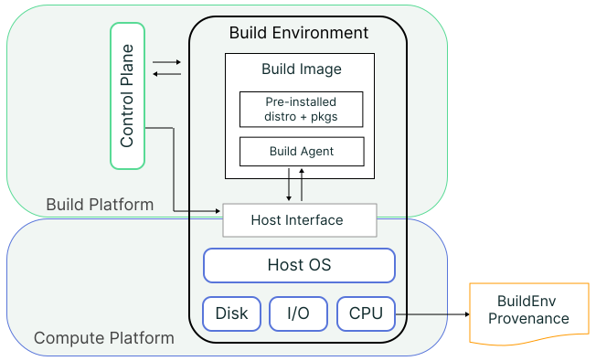

## Rationale

Today's hosted [build platforms] play a central role in an artifact's supply
chain. Whether it's a public cloud-hosted service like GitHub Actions or an
internal enterprise CI/CD system, the build platform has a privileged level of
access to artifacts and sensitive operations during a build (e.g., access to
producer secrets, provenance signing).

This central and privileged role makes hosted build platforms an attractive
target for supply chain attackers. Similarly, cloud providers are big companies
with complex infrastructure that is not immune to compromise.

Even with strong economic and reputational incentives to mitigate these risks,
it's very challenging to implement and operate fully secure build platforms because
they are made up of many layers of interconnected components and subsystems.
Platforms today provide limited abilities to scope the context of trust, or
to continuously validate components over time when using their services.

The SLSA Build Environment track aims to address these issues by making it
possible to validate the integrity and trace the provenance of core **build
platform components**.

## Track overview

The SLSA Build Environment (BuildEnv) track describes increasing levels of
integrity and transparency of a build's execution context. In this track,
provenance describes how a build image was created, how the hosted build
platform deployed a build image in its environment, and the compute
platform they used.

| Track/Level | Requirements | Focus | Trust Root
| ----------- | ------------ | ----- | ----------
| [BuildEnv L0] | (none) | (n/a) | (n/a)
| [BuildEnv L1] | Signed build image provenance exists | Tampering during build image distribution | Signed build image provenance
| [BuildEnv L2] | Attested build environment setup | Tampering during the build environment lifecycle | The compute platform's host interface
| [BuildEnv L3] | Hardware-attested build environment execution | Tampering via compute platform software | The compute platform's hardware

> :warning:
> The Build Environment track L1+ currently requires a [hosted] build platform.
> A future version of this track may generalize requirements to cover bare-metal
> build environments.

> :grey_exclamation:
> We may consider the addition of an L4 to the Build Environment track, which
> covers hardware-attested runtime integrity checking during a build.

### Relationship with the SLSA Build track

The [Build track] defines requirements for the provenance that is produced for the build artifacts.
Trustworthiness of the build process largely depends on the trustworthiness of the [build environment] the build runs in.

However, the Build track assumes full trust in the [build environment], and provides no requirements to
verify its integrity. The BuildEnv track intends to close this gap
through an approach that enhances the transparency of the build environment in a way that
complements the Build track.

### Build environment model

The Build Environment (BuildEnv) track expands upon the
[build model](terminology#build-model) by explicitly separating the
[build image](terminology#build-image) and [compute platform](#compute-platform) from the
abstract [build environment](#build-environment) and [build platform](terminology#platform).
Specifically, the BuildEnv track defines the following roles, components, and concepts:

| Primary Term | Description
| --- | ---
| Build ID | An immutable identifier assigned uniquely to a specific execution of a tenant's build. In practice, the build ID may be an identifier, such as a UUID, associated with the build execution.
| Build image | The template for a build environment, such as a VM or container image. Individual components of a build image include the root filesystem, pre-installed guest OS and packages, the build executor, and the build agent.
| Build image producer | The party that creates and distributes build images. In practice, the build image producer may be the hosted build platform or a third party in a bring-your-own (BYO) build image setting.
| Build agent | A build platform-provided program that interfaces with the build platform's control plane from within a running build environment. The build agent is also responsible for executing the tenant’s build definition, i.e., running the build. In practice, the build agent may be loaded into the build environment after instantiation, and may consist of multiple components. All build agent components must be measured along with the build image.
| Build environment admission | As a performance measure, build platforms often have a process of admitting build environments, after they have been booted, into a pool of resources ready for a build request.
| Build dispatch | The process of assigning a tenant's build to a pre-deployed build environment on a hosted build platform.
| Build request | The process of a tenant sending a request to a hosted build platform to execute the build definition. In practice, the build request may be sent automatically after events like a new pull reuquests, or triggered manually by the tenant.
| Compute platform | The compute system and infrastructure underlying a build platform, i.e., the host system (hypervisor and/or OS) and hardware. In practice, the compute platform and the build platform may be managed by the same or distinct organizations.
| Host interface | The component in the compute platform that the hosted build platform uses to request resources for deploying new build environments, i.e., the VMM/hypervisor or container orchestrator.
| Boot process | In the context of builds, the process of loading and executing the layers of firmware and/or software needed to start up a build environment on the host compute platform.
| Measurement | The cryptographic hash of some component or system state in the build environment, including software binaries, configuration, or initialized run-time data.
| Quote | (Virtual) hardware-signed data that contains one or more (virtual) hardware-generated measurements. Quotes may additionally include nonces for replay protection, firmware information, or other platform metadata. (Based on the definition in [section 9.5.3.1](https://trustedcomputinggroup.org/wp-content/uploads/TPM-2.0-1.83-Part-1-Architecture.pdf) of the TPM 2.0 spec)
| Reference value | A specific measurement used as the good known value for a given build environment component or state.

**TODO:** Disambiguate similar terms (e.g., image, build job, build executor/runner)

#### Build environment lifecycle

This diagram outlines the lifecycle of a build environment from the creation of
the build image to its setup and execution.

flowchart LR
      BuildImage>Build Image] ---> |Setup|Setup[[Build Environment]]
      Setup[[Build Environment]] ---> |Dispatch|Dispatch[[Build Environment]]
      Dispatch[[Build Environment]] ---> |Execution|Build[(Build)]

A typical build environment will go through the following lifecycle:

1.  *Build image creation*: A [build image producer](#build-image-producer)
    creates different [build images](#build-image) through a dedicated build
    process. For the SLSA BuildEnv track, the build image producer outputs
    [provenance](terminology#provenance) describing this process.
2.  *Build image distribution*: A build image producer distributes the build
    image and makes it available for usage on
    [hosted build platforms](terminology#platform).
3.  *Build environment setup*: A hosted build platform typically sets up a
    build environment in two steps.

    i.  *Boot process*: The control plane calls into the [host
    interface](#host-interface) to
    boot a new instance of a build environment from a given build image.

    ii.  *Build environment admission*: The booted build environment is admitted
    into the pool managed by the control plane. The [build agent](#build-agent)
    waits for an incoming [build request](#build-request).

    For the SLSA BuildEnv track, the host interface in the compute platform
    attests to the integrity of the environment's initial state during its
    [boot process](#boot-process). The trusted control plane validates this
    attestation during the [build environment
    admission](#build-environment-admission) step.
4.  *Build dispatch*: When the tenant [requests a new build](#build-request),
    the hosted build platform assigns the build to an already-set up build
    environment.
    For the SLSA BuildEnv track, the build platform attests to the binding
    between a build environment and [build ID](#build-id).
5.  *Build execution*: Finally, the build agent within the environment executes
    the tenant's build definition.

### Build environment threats

A [build environment] could be compromised at any stage of its lifecycle. The
SLSA BuildEnv levels incrementally address several classes of threats to the
build environment.

For example threats, refer to the [Build Threats] section.

### Build image distribution threats

An attacker may make unauthorized modifications to the build image during build
distribution, i.e., in between image creation and consumption (e.g., pulling
the image from a shared registry) by the build platform. This tampering
may occur on the registry or as the build image is transmitted (potentially via
untrusted channels).

[BuildEnv L1] addresses threats that can happen during build image distribution
by requiring that build images be created following the SLSA Build track.
[BuildEnv L1] also assumes full trust in the build platform including the
underlying [compute platform] (e.g., public cloud provider).

### Build environment setup threats

An attacker may tamper with the bootstrapping process of the build environment
to instantiate a build environment with compromised boot components (e.g., UEFI
firmware). If an attacker manages to compromise build platform admin
credentials, these can be used to gain malicious access to the build environment
via installed compute platform maintenance software. While such software is
typically used for providing remote admin access to the build environment
using compute platform APIs, it can also be used to modify components
during the build environment's instantiation, admission or dispatch stages.

These threats cannot be mitigated by only checking a build image's SLSA Build
Provenance because they take advantage of the time window between the check
and when the running build environment is booted and used in a build
(i.e., a so-called Time-of-check-to-Time-of-use, or TOCTTOU, attack).

[BuildEnv L2] addresses these threats by requiring that the build environment's
integrity be verified at every stage of its lifecycle. This, in turn, relies on
evidence provided by the compute platform's host interface showing the build
environment's pre-build state. In essence, BuildEnv L2 provides transparency
of the lifecycle's integrity of a build environment.

The compute platform is fully trusted at [BuildEnv L2] as the level relies on
the host interface to perform a build environment's measurements. It
remains the responsibility of the build image producer to disable/uninstall any
admin interfaces that could be misused by an attacker.

### Build environment execution threats

Attackers may seek to compromise a build platform's runtime infrastructure, and
thereby any builds it executes, or circumvent any build environment integrity
checks, through vulnerable/malicious software within the compute platform or its
host interface. These threats may also arise from compromised compute platform
admin credentials that would allow direct access to compute platform software.
These threats cannot be mitigated by the approaches used at L1 and L2.

[BuildEnv L3] reduces the compute platform attack surface through the use of
hardware-based attestation, commonly provided by trusted execution environments
(TEEs). The [AMD SEV-SNP/Intel TDX threat model] describes how this level of
trust reduction can be achieved through the use of memory encryption and
integrity checking, as well as remote attestation with cryptographic keys that
are certified by the compute platform's hardware manufacturer.

[BuildEnv L3] therefore extends a build environment's lifecycle integrity to
to its execution. That is, L3 requires *hardware-attested* evidence that the
build environment was instantiated from the expected build image and is running
within a legitimate hardware environment supporting the above integrity
properties, bringing transparency to the compute platform.

See the [AMD SEV-SNP/Intel TDX threat model] for a more detailed list of compute
platform level threats.

#### Trusted components and track scope

The BuildEnv track assumes full trust in the following components. Risks that
are out of scope may be considered in a future version of the BuildEnv or
other SLSA track.

The [build agent] and [control plane] are trusted at all levels because they
*attest* and *verify*, respectively, the integrity of the build environment.

-   Reducing trust in the control plane is out of scope, and would require
    measures like removing back-door access to the build environment (e.g., via
    SSH).
-   The control plane provides input data to the build environment (i.e., build
    request message). Mitiating security risks associated with compromised
    inputs are also out of scope.

The software that ships with the build image or is installed at runtime is
trusted at all levels, but may be optionally verified for enhanced integrity
checking at higher levels of the BuildEnv track.

-   Vulnerabilities in the software that is legitimally included in the build
    image are out of scope.
-   Addressing attempts to circumvent the integrity protections provided by the
    BuildEnv track by malicious software with privileged access within the build
    environment is also out of scope.
-   Build image producers should manage vulnerabilities in the image components
    to reduce the risks of such attacks, e.g. by using the SLSA Dependency track
    and hardening images with mandatory access control (MAC) policies.
-   The control plane may perform additional analysis of build image supply
    chain information like SBOM as part of build environment bootstrapping.
-   As the build agent running within the build environment is typically
    authenticated by the control plane in practice, this track deems checking
    the agent's integrity as sufficient during authentication. As with other
    build environment software, vulnerability detection in the build agent is
    out of scope.

Physical and side-channel attacks on the build or compute platform, including
any trusted execution hardware, are out of scope.

## BuildEnv levels

The primary purpose of the Build Environment (BuildEnv) track is to enable
auditing that a build was run in the expected [execution context].
It is not uncommon for the build platforms to rely on public cloud providers to
manage the compute resources that power build environments. This in turn
significantly expands the attack surface because added compute platform
dependencies become part of the trusted computing base ([TCB]).

The lowest level only requires SLSA [Build L2] Provenance to
exist for the [build image], while higher levels incrementally reduce the TCB
size of the build environment, and provide increased integrity checking of the
build environment.

Hence, the highest levels of the BuildEnv track introduce further requirements
for hardware-based hardening of the [compute platform] aimed at reducing the
TCB of a build environment.

Software producers and third-party auditors can check attestations generated
by the [build image producer] and build platform against the expected
properties for a given build environment. This enables any party to detect
[several classes] of supply chain threats originating in the build
environment.

As in the Build track, the exact implementation of this track is determined
by the build platform implementer, whether they are a commercial CI/CD service
or enterprise organization. While this track describes general minimum
requirements, this track does not dictate the following
implementation-specific details: the type of build environment, accepted
attestation formats, the type of technologies used to meet L3 requirements,
how attestations are distributed, how build environments are identified, and
what happens on failure.

<section id="environment-l0">

### BuildEnv L0: No guarantees

<dl class="as-table">
<dt>Summary<dd>

No requirements---L0 represents the lack of any sort of build environment
provenance.

<dt>Intended for<dd>

Development or test builds of software that are built and run on a local
machine, such as unit tests.

<dt>Requirements<dd>

n/a

<dt>Benefits<dd>

n/a

</dl>
</section>

<section id="buildenv-l1">

### BuildEnv L1: Signed build image provenance exists

<dl class="as-table">
<dt>Summary<dd>

The build image (i.e., VM or container image) used to instantiate the build
environment has SLSA Build Provenance showing how the image was built.

<dt>Intended for<dd>

Build platforms and organizations wanting to ensure a baseline level of
integrity for build environments at the time of build image distribution.

<dt>Requirements<dd>

-   Build Image Producer:
    -   MUST automatically generate SLSA [Build L2] or higher
    Provenance for created build images (i.e., VM or container images).
    -   MUST allow independent automatic verification of a build image's [SLSA
    Build Provenance].

    *Note*: If the build image artifact cannot be published, for
    example due to intellectual property concerns, an attestation asserting the
    expected hash value of the build image MUST be generated and distributed
    instead (e.g., using [SCAI] or a [Release Attestation]). If the full Build
    Provenance document cannot be disclosed, a Simple Verification Result ([SVR])
    attestation asserting the build image's SLSA Provenance MUST be distributed instead.

-   Build Platform:
    -   MUST meet SLSA [Build L2] requirements.
    -   Prior to the setup of a new build environment, the SLSA Build Provenance for
    the selected build image MUST be automatically verified.
    A signed attestation to the result of the SLSA Build Provenance verification
    MAY be generated and distributed (e.g., via an [SVR]).

<dt>Benefits<dd>

Provides evidence that a build image was built from the advertised
source and build process.

</dl>

</section>
<section id="buildenv-l2">

### BuildEnv L2: Attested build environment setup

<dl class="as-table">
<dt>Summary<dd>

The build environment is measured and authenticated by the compute platform
upon instantiation, attesting to the integrity of the initial state
of the environment prior to executing a build.

<dt>Intended for<dd>

Organizations wanting to ensure that their build started from
a clean, known good state.

<dt>Requirements<dd>

All of [BuildEnv L1], plus:

-   Build Image Producer Requirements:
    -   Build images MUST be created via a SLSA [Build L3] or higher build
    process.
    -   MUST make available signed [reference values] of initial build image
    components for validation by the build platform's control plane (e.g.,
    via the image's SLSA Provenance, or [SCAI]). The specific set of
    measured components is determined by the build platform's implementation;
    we provide implementation examples (TBD) for guidance.

-   Build Platform Requirements:
    -   MUST meet SLSA [Build L3] requirements.
    -   The build agent MUST support the following functionality:
        -   Upon completion of the [boot process]: Interface automatically
        with the host interface to obtain a signed attestation with the build
        environment's initial state.
        -   During [build dispatch]: Automatically generate a signed attestation
        that binds the build environment's boot process attestation to the
        assigned build ID (e.g., using [SCAI]).
        -   Make available boot process and dispatch attestations for validation
        by the control plane.
        -   The attestation mechanism is determined by the build and compute
        platforms' implementation; we provide implementation examples (TBD) for
        guidance.
    -   Prior to [build environment admission]: The control plane MUST verify
    automatically the build agent's integrity and the build environment's boot
    process attestation.
    -   Prior to [build dispatch]: The control plane MUST verify automatically
    the attestation binding the booted build environment to the assigned build
    ID.
    -   Signed attestations to the results of the pre-setup build image SLSA
    Build Provenance, build environment admission and build dispatch
    verification steps MUST be generated and distributed (e.g., via an [SVR]).

-   Compute Platform Requirements:
    -   The [host interface] MUST be capable of generating [signed quotes] for
    the build environment's system state.
    In a VM-based environment, this MUST be achieved by enabling a feature
    like [vTPM], or equivalent, in the hypervisor.
    For container-based environments, the container orchestrator MAY need
    modifications to produce these attestations.
    -   The host interface MUST validate the measurements of the build image
    components against their signed references values during the build
    environment's boot process.
    In a VM-based environment, this MUST be achieved by enabling a process
    like [Secure Boot], or equivalent, in the hypervisor.
    For container-based environments, the container orchestrator MAY need
    modifications to perform these checks.[^1]

<dt>Benefits<dd>

Provides evidence that a build environment deployed by a hosted build
platform was instantiated from the expected build image and is at the
expected initial state, even in the face of a build platform-level
adversary.

</dl>

</section>
<section id="buildenv-l3">

### BuildEnv L3: Hardware-attested build environment execution

<dl class="as-table">
<dt>Summary<dd>

The initial state of the host interface is measured
and authenticated by trusted hardware, attesting to the integrity
properties of the build environment's underlying compute stack.

<dt>Intended for<dd>

Organizations wanting strong assurances that their build ran on
a good known, high-integrity execution environment, without needing to
place full trust in the compute platform.

<dt>Requirements<dd>

All of [BuildEnv L2], plus:

-   Build Platform Requirements:
    -   The build agent MUST support the following functionality:
        -   Upon completion of the [boot process]: Interface automatically
        with the compute platform's *trusted hardware* component to obtain
        a signed attestation with the build environment's initial state,
        *including the host interface*.
        -   During [build dispatch]: Generate a signed attestation binding
        the build environment's boot process attestation to the assigned
        build ID *and* the trusted hardware (e.g., using [SCAI]).
        -   After the build completes: Include the control plane's setup
        verification SVRs in the resulting SLSA Build L3 Provenance.
        -   The attestation mechanism is determined by the build and compute
        platforms' implementation; we provide implementation examples (TBD)
        for guidance.
    -   Prior to [build dispatch]: The control plane MUST verify automatically
    the attestation binding the booted build environment to the assigned build
    ID *and* the trusted hardware.
    -   MAY provide capabilities to enable tenants to perform build environment
    remote attestation using a third-party verifier.

-   Compute Platform Requirements:
    -   MUST have trusted hardware capabilities, i.e., built-in physical
    hardware features for generating measurements and quotes for its system
    state. This MAY be achieved using a feature like [TPM], or equivalent; a
    [trusted execution environment] is STRONGLY RECOMMENDED.
    -   MUST enable validation of the host interface's initial state against
    its reference value(s) by the build platform's control plane.

<dt>Benefits<dd>

Provides hardware-authenticated evidence that a build ran in the expected
high-integrity environment, even in the face of compromised compute platform
software.

</dl>

</section>

<!-- Footnotes -->

[^1]: Since containers are executed as processes on the host platform they do not contain a traditional bootloader that starts up the execution context.

<!-- Link definitions -->

[AMD SEV-SNP]: https://www.amd.com/en/developer/sev.html
[AMD SEV-SNP/Intel TDX threat model]: https://www.kernel.org/doc/Documentation/security/snp-tdx-threat-model.rst
[Build track]: build-track-basics.md
[Build L1]: build-track-basics.md#build-l1
[Build L2]: build-track-basics.md#build-l2
[Build L3]: build-track-basics.md#build-l3
[BuildEnv L0]: #buildenv-l0
[BuildEnv L1]: #buildenv-l1
[BuildEnv L2]: #buildenv-l2
[BuildEnv L3]: #buildenv-l3
[Control plane]: terminology.md#control-plane
[Intel TDX]: https://www.intel.com/content/www/us/en/developer/tools/trust-domain-extensions/overview.html
[Release Attestation]: https://github.com/in-toto/attestation/blob/main/spec/predicates/release.md
[SCAI]: https://github.com/in-toto/attestation/blob/main/spec/predicates/scai.md
[Secure Boot]: https://wiki.debian.org/SecureBoot#What_is_UEFI_Secure_Boot.3F
[SLSA Build Provenance]: provenance.md
[SVR]: https://github.com/in-toto/attestation/blob/main/spec/predicates/svr.md
[TCB]: https://csrc.nist.gov/glossary/term/trusted_computing_base
[TPM]: https://trustedcomputinggroup.org/resource/tpm-library-specification/
[VSA]: verification_summary.md
[build image]: #build-image
[confidential computing]: https://confidentialcomputing.io/wp-content/uploads/sites/10/2023/03/Common-Terminology-for-Confidential-Computing.pdf
[execution context]: terminology.md#build-environment
[hosted]: build-requirements.md#isolation-strength
[boot process]: #boot-process
[build agent]: #build-agent
[build dispatch]: #build-dispatch
[build environment]: terminology.md#build-environment
[build environment admission]: #build-environment-admission
[build image producer]: #build-image-producer
[build platform]: terminology.md#platform
[build platforms]: terminology.md#platform
[Build Threats]: threats.md#build-threats
[compute platform]: #compute-platform
[host interface]: #host-interface
[measurement]: #measurement
[paravisor]: https://openvmm.dev/
[provenance]: terminology.md#provenance
[signed quotes]: #quote
[reference values]: #reference-value
[several classes]: #build-environment-threats
[vTPM]: https://trustedcomputinggroup.org/about/what-is-a-virtual-trusted-platform-module-vtpm/
